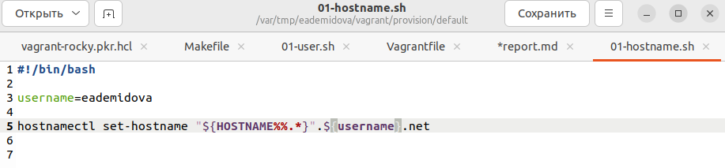
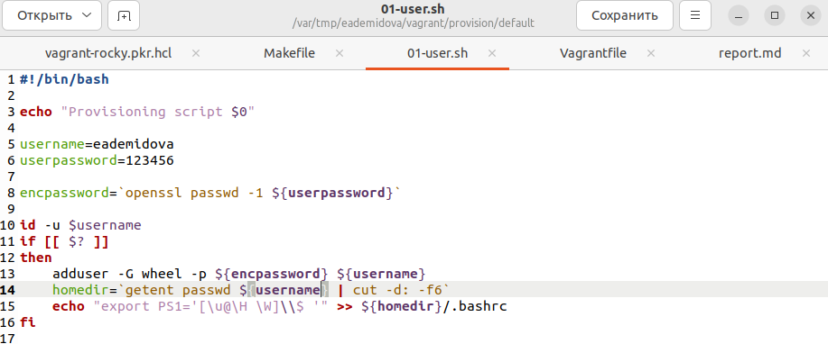
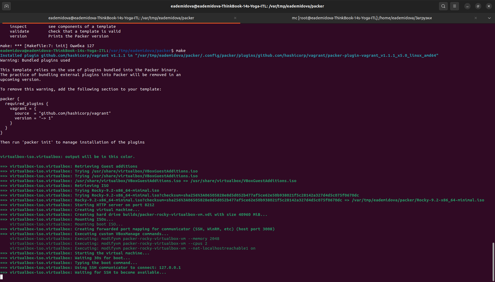
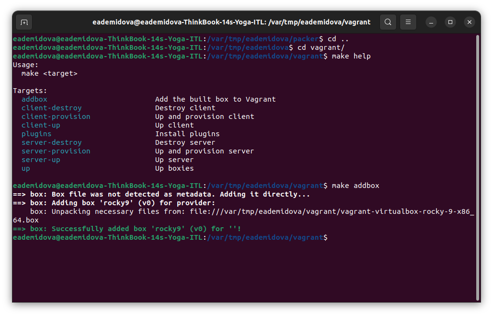
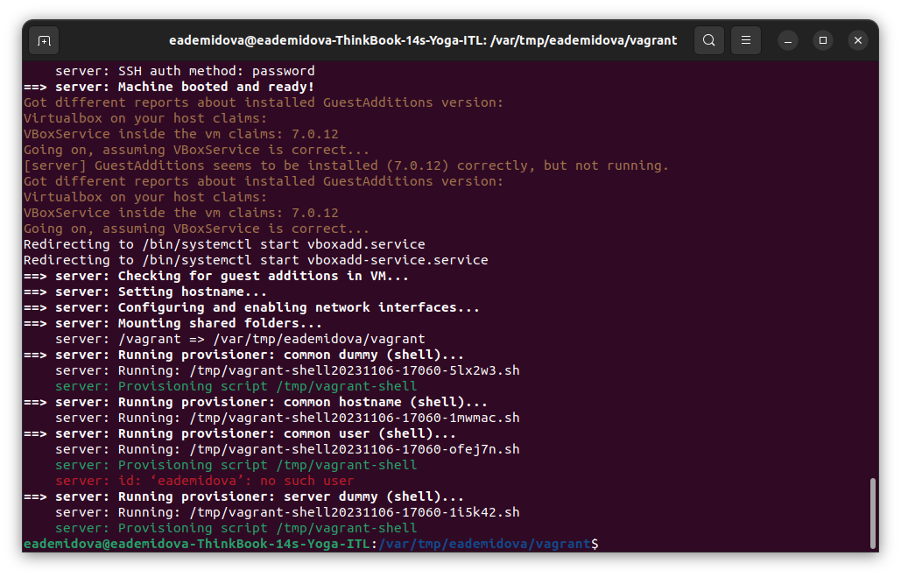
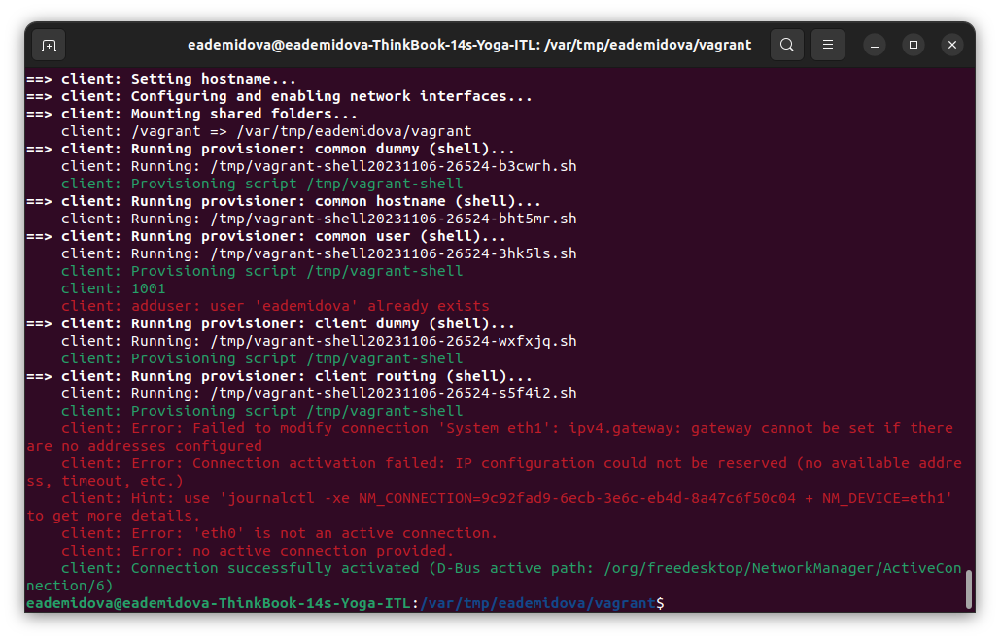
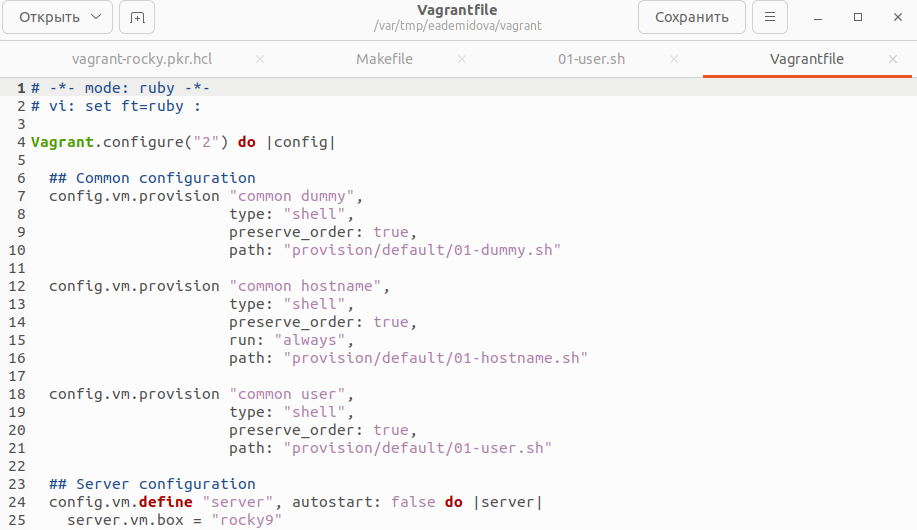
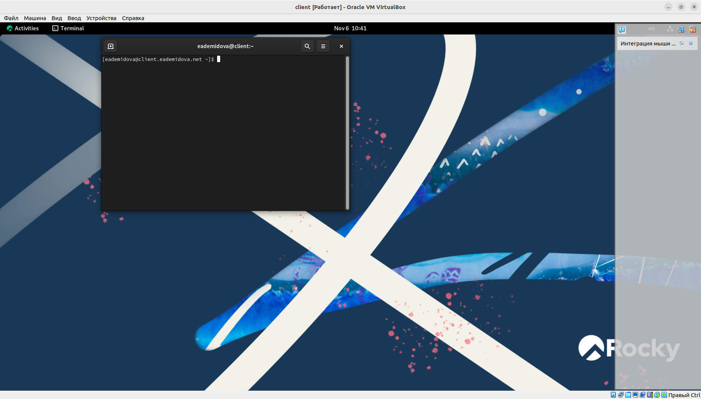

---
## Front matter
lang: ru-RU
title: Лабораторная работа №1
subtitle: Подготовка лабораторного стенда
author:
  - Демидова Е. А.
institute:
  - Российский университет дружбы народов, Москва, Россия
date: 8 ноября 2023 

## i18n babel
babel-lang: russian
babel-otherlangs: english

## Formatting pdf
toc: false
toc-title: Содержание
slide_level: 2
aspectratio: 169
section-titles: true
theme: metropolis
header-includes:
 - \metroset{progressbar=frametitle,sectionpage=progressbar,numbering=fraction}
 - '\makeatletter'
 - '\beamer@ignorenonframefalse'
 - '\makeatother'
---

# Вводная часть

## Цель работы

Целью данной работы является приобретение практических навыков установки Rocky Linux на виртуальную машину с помощью инструмента Vagrant.

## Задание

1. Сформируйте box-файл с дистрибутивом Rocky Linux для VirtualBox.
2. Запустите виртуальные машины сервера и клиента и убедитесь в их работоспособности.
3. Внесите изменения в настройки загрузки образов виртуальных машин server и client, добавив пользователя с правами администратора и изменив названия хостов.
4. Скопируйте необходимые для работы с Vagrant файлы и box-файлы виртуальных машин на внешний носитель. Используя эти файлы, вы можете попробовать развернуть виртуальные машины на другом компьютере.

# Выполнение лабораторной работы

## Конфигурационные файлы

```
mkdir -p /var/tmp/user_name/packer
mkdir -p /var/tmp/user_name/vagran
```

Файлы: vagrant-rocky.pkr.hc, ks.cfg, Vagrantfile, Makefile. 

## Конфигурационные файлы

В каталогах default, server и client разместим скриптзаглушку 01-dummy.sh

```
#!/bin/bash
echo "Provisioning script $0"
```

## Конфигурационные файлы

В каталоге default разместим заранее подготовленный скрипт 01-user.sh по изменению названия виртуальной машины:

{#fig:001 width=70%}

## Конфигурационные файлы

В каталоге default разместим заранее подготовленный скрипт 01-hostname.sh по изменению названия виртуальной машины:

{#fig:002 width=70%}

## Развёртывание лабораторного стенда на ОС Linux

Перейдем в каталог с проектом:
```
cd /var/tmp/user_name/packer
```
В терминале наберем
```
makе help
```

## Развёртывание лабораторного стенда на ОС Linux

{#fig:003 width=70%}

## Развёртывание лабораторного стенда на ОС Linux

{#fig:004 width=70%}

## Развёртывание лабораторного стенда на ОС Linux

{#fig:005 width=70%}

## Развёртывание лабораторного стенда на ОС Linux

{#fig:006 width=70%}

## Развёртывание лабораторного стенда на ОС Linux

{#fig:007 width=70%}

## Развёртывание лабораторного стенда на ОС Linux

{#fig:008 width=70%}

## Внесение изменений в настройки внутреннего окружения виртуальной машины

{#fig:009 width=70%}

## Внесение изменений в настройки внутреннего окружения виртуальной машины

{#fig:010 width=70%}

## Внесение изменений в настройки внутреннего окружения виртуальной машины

{#fig:011 width=70%}

## Внесение изменений в настройки внутреннего окружения виртуальной машины

{#fig:012 width=70%}

## Внесение изменений в настройки внутреннего окружения виртуальной машины

{#fig:013 width=70%}

# Заключение

## Выводы

В результате выполнения данной работы были приобретены практические навыки установки Rocky Linux на виртуальную машину с помощью инструмента Vagrant.