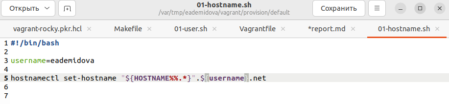
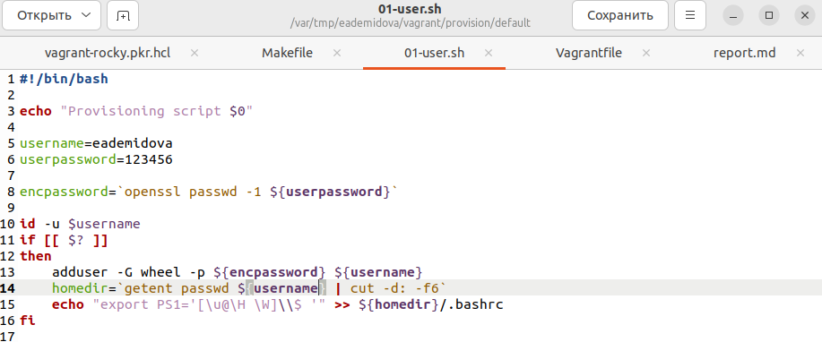
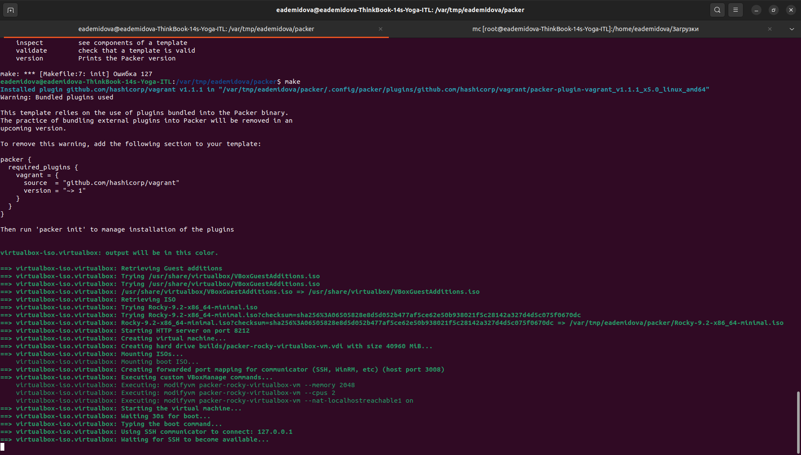
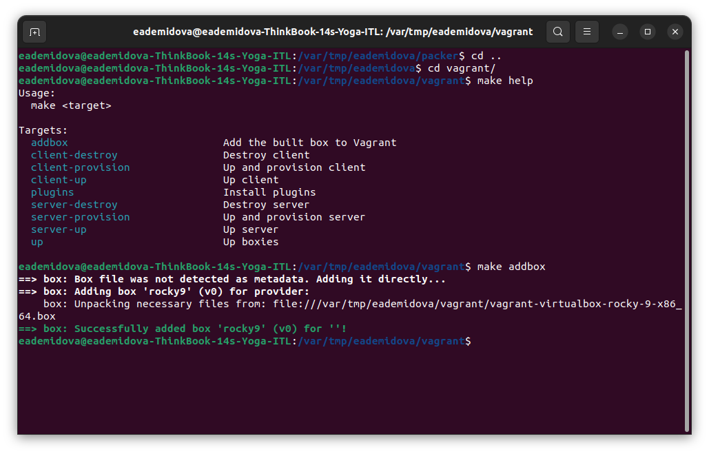
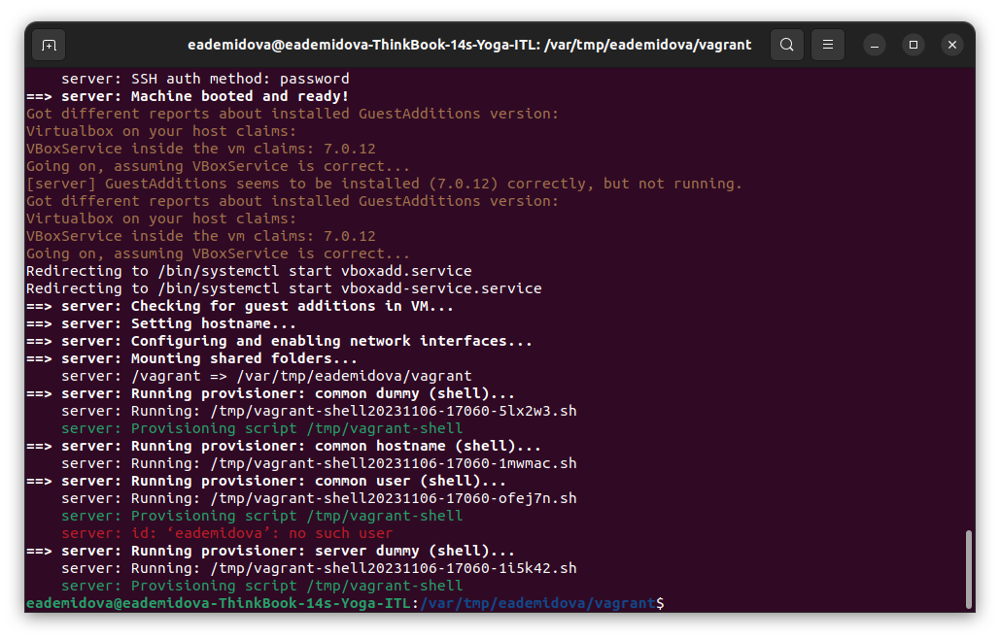
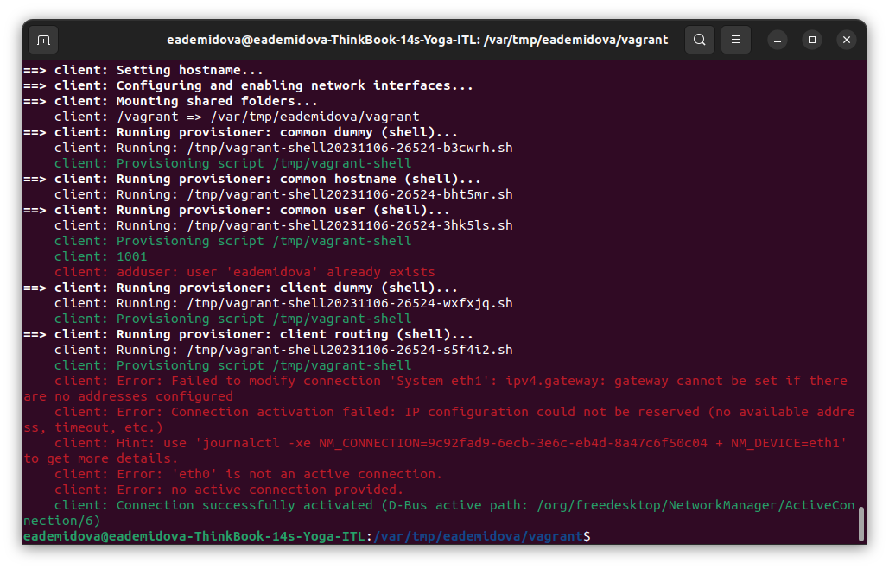
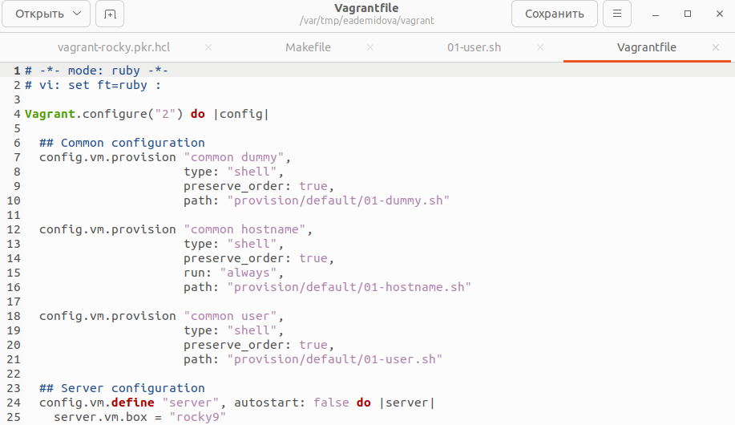
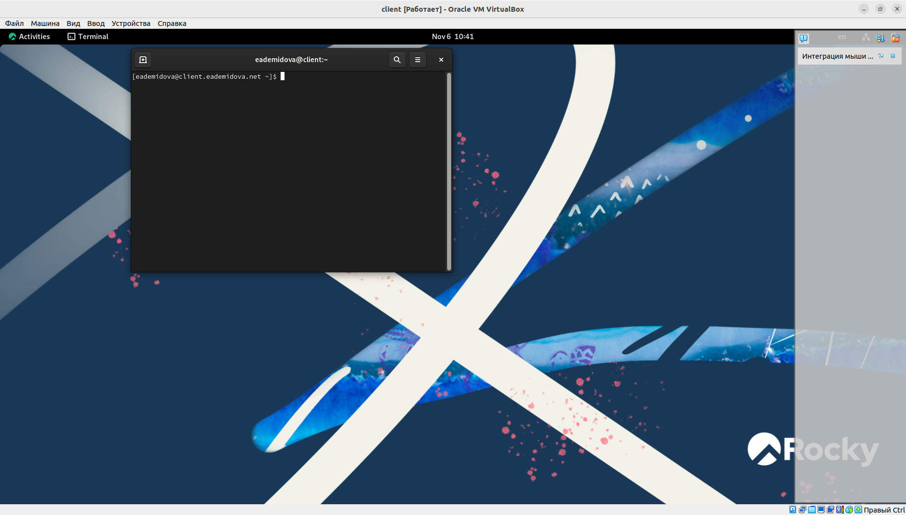

---
## Front matter
title: "Лабораторная работа №1"
subtitle: "Подготовка лабораторного стенда"
author: "Демидова Екатерина Алексеевна"

## Generic otions
lang: ru-RU
toc-title: "Содержание"

## Bibliography
bibliography: bib/cite.bib
csl: pandoc/csl/gost-r-7-0-5-2008-numeric.csl

## Pdf output format
toc: true # Table of contents
toc-depth: 2
lof: true # List of figures
lot: false # List of tables
fontsize: 12pt
linestretch: 1.5
papersize: a4
documentclass: scrreprt
## I18n polyglossia
polyglossia-lang:
  name: russian
  options:
	- spelling=modern
	- babelshorthands=true
polyglossia-otherlangs:
  name: english
## I18n babel
babel-lang: russian
babel-otherlangs: english
## Fonts
mainfont: PT Serif
romanfont: PT Serif
sansfont: PT Sans
monofont: PT Mono
mainfontoptions: Ligatures=TeX
romanfontoptions: Ligatures=TeX
sansfontoptions: Ligatures=TeX,Scale=MatchLowercase
monofontoptions: Scale=MatchLowercase,Scale=0.9
## Biblatex
biblatex: true
biblio-style: "gost-numeric"
biblatexoptions:
  - parentracker=true
  - backend=biber
  - hyperref=auto
  - language=auto
  - autolang=other*
  - citestyle=gost-numeric
## Pandoc-crossref LaTeX customization
figureTitle: "Рис."
tableTitle: "Таблица"
listingTitle: "Листинг"
lofTitle: "Список иллюстраций"
lotTitle: "Список таблиц"
lolTitle: "Листинги"
## Misc options
indent: true
header-includes:
  - \usepackage{indentfirst}
  - \usepackage{float} # keep figures where there are in the text
  - \floatplacement{figure}{H} # keep figures where there are in the text
---

# Цель работы

Целью данной работы является приобретение практических навыков установки Rocky Linux на виртуальную машину с помощью инструмента Vagrant.

# Задание

1. Сформируйте box-файл с дистрибутивом Rocky Linux для VirtualBox
2. Запустите виртуальные машины сервера и клиента и убедитесь в их работоспособности.
3. Внесите изменения в настройки загрузки образов виртуальных машин server и client, добавив пользователя с правами администратора и изменив названия хостов 
4. Скопируйте необходимые для работы с Vagrant файлы и box-файлы виртуальных машин на внешний носитель. Используя эти файлы, вы можете попробовать развернуть виртуальные машины на другом компьютере.

# Выполнение лабораторной работы

Перед началом работы с Vagrant создадим каталог в /var/tmp с помощью команд:

```
mkdir -p /var/tmp/user_name/packer
mkdir -p /var/tmp/user_name/vagran
```
В созданном рабочем каталоге разместим образ варианта операционной системы Rocky Linux и в этом же каталоге разместим подготовленные заранее для работы с Vagrant файлы: vagrant-rocky.pkr.hc, ks.cfg, Vagrantfile, Makefile. 

В этом же каталоге создадим каталог provision с подкаталогами default, server
и client, в которых будут размещаться скрипты, изменяющие настройки внутреннего окружения базового (общего) образа виртуальной машины, сервера или клиента соответственно.
В каталогах default, server и client разместим заранее подготовленный скриптзаглушку 01-dummy.sh следующего содержания:

```
#!/bin/bash
echo "Provisioning script $0"
```
В каталоге default разместим заранее подготовленный скрипт 01-user.sh по изменению названия виртуальной машины следующего содержания(рис. @fig:001):

{#fig:001 width=70%}

В каталоге default разместим заранее подготовленный скрипт 01-hostname.sh по изменению названия виртуальной машины следующего содержания(рис. @fig:002):

{#fig:002 width=70%}

Перейдем в каталог с проектом:
```
cd /var/tmp/user_name/packer
```
В терминале наберем
```
makе help
```
Посмотрим перечень указанных в Makefile целей и краткое описание их действий.

Для формирования box-файла с дистрибутивом Rocky Linux для VirtualBox в терминале наберем `make`(рис. @fig:003):

{#fig:003 width=70%}

Начался процесс скачивания, распаковки и установки драйверов VirtualBox и дистрибутива ОС на виртуальную машину.

После завершения процесса автоматического развёртывания образа виртуальной машины в каталоге /var/tmp/user_name/vagrant временно появился каталог builds с промежуточными файлами .vdi, .vmdk и .ovf, которые затем автоматически будут преобразованы в box-файл сформированного образа: vagrant-virtualbox-rocky-9-x86_64.box.

Для регистрации образа виртуальной машины в Vagrant в терминале в каталоге /var/tmp/user_name/vagrant наберем `make addbox`(рис. @fig:004):

{#fig:004 width=70%}

Это позволит на основе конфигурации, прописанной в файле Vagrantfile, сформировать box-файлы образов двух виртуальных машин — сервера и клиента с возможностью их параллельной или индивидуальной работы.

Запустим виртуальную машину Server, введя `make server-up`(рис. @fig:005, @fig:006):

{#fig:005 width=70%}

{#fig:006 width=70%}

Запустим виртуальную машину Client, введя `make client-up`(рис. @fig:007, @fig:008):

{#fig:007 width=70%}

{#fig:008 width=70%}

Затем выключим обе виртуальные машины и внесем изменения в настройки внутреннего окружения виртуальной машины.

Для отработки созданных скриптов во время загрузки виртуальных машин убедимся, что в конфигурационном файле Vagrantfile до строк с конфигурацией сервера имеется следующая запись(рис. @fig:009):

{#fig:009 width=70%}

Зафиксируем внесённые изменения для внутренних настроек виртуальных машин, введя в терминале `make server-provision`, а затем `make client-provision`(рис. @fig:010, @fig:011):

{#fig:010 width=70%}

{#fig:011 width=70%}

Залогинемся на сервере и клиенте под созданным пользователем.Убедимся, что в терминале приглашение отображается в виде eademidova@server.eademidova.net на сервере и в виде eademidova@client.eademidova.net на клиенте(рис. @fig:012, @fig:013):

{#fig:012 width=70%}

{#fig:013 width=70%}

# Выводы

В результате выполнения данной работы были приобретены практические навыки установки Rocky Linux на виртуальную машину с помощью инструмента Vagrant.

