---
## Front matter
lang: ru-RU
title: Лабораторная работа №2
subtitle: Настройка DNS-сервера
author:
  - Демидова Е. А.
institute:
  - Российский университет дружбы народов, Москва, Россия
date: 8 ноября 2023 

## i18n babel
babel-lang: russian
babel-otherlangs: english

## Formatting pdf
toc: false
toc-title: Содержание
slide_level: 2
aspectratio: 169
section-titles: true
theme: metropolis
header-includes:
 - \metroset{progressbar=frametitle,sectionpage=progressbar,numbering=fraction}
 - '\makeatletter'
 - '\beamer@ignorenonframefalse'
 - '\makeatother'
---

# Вводная часть

## Цель работы

Приобретение практических навыков по установке и конфигурированию DNS-сервера, усвоение принципов работы системы доменных имён.

## Задание

1. Установите на виртуальной машине server DNS-сервер bind и bind-utils.
2. Сконфигурируйте на виртуальной машине server кэширующий DNS-сервер.
3. Сконфигурируйте на виртуальной машине server первичный DNS-сервер.
4. При помощи утилит dig и host проанализируйте работу DNS-сервера.
5. Напишите скрипт для Vagrant, фиксирующий действия по установке и конфигурированию DNS-сервера во внутреннем окружении виртуальной машины server. Соответствующим образом внесите изменения в Vagrantfile

# Выполнение лабораторной работы

## Установка DNS-сервера

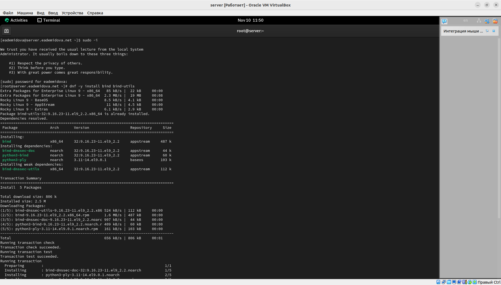{#fig:001 width=70%}

## Установка DNS-сервера

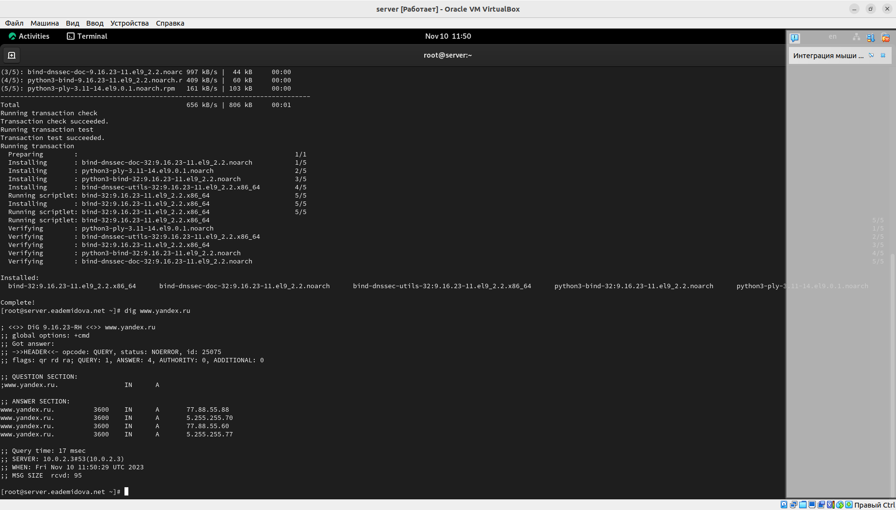{#fig:002 width=70%}

## Конфигурирование кэширующего DNS-сервера

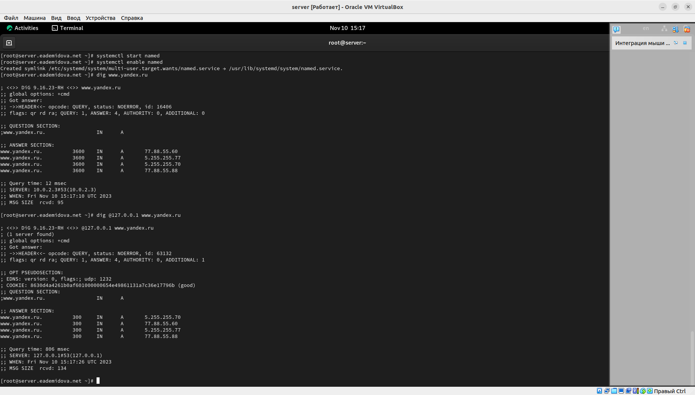{#fig:003 width=70%}

## Конфигурирование кэширующего DNS-сервера

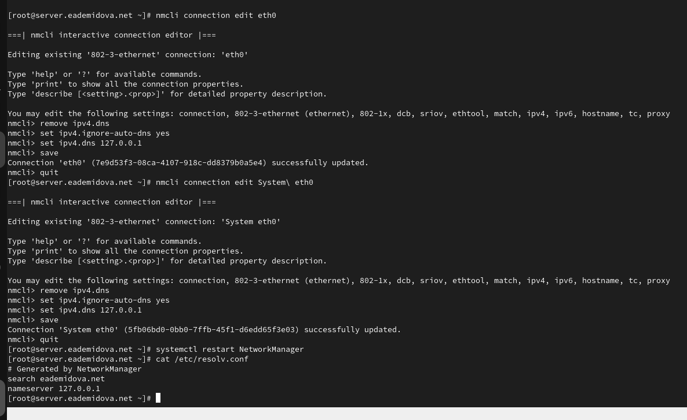{#fig:004 width=70%}

## Конфигурирование кэширующего DNS-сервера

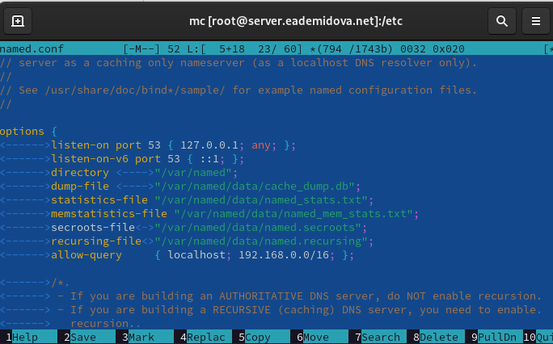{#fig:005 width=70%}

## Конфигурирование кэширующего DNS-сервера

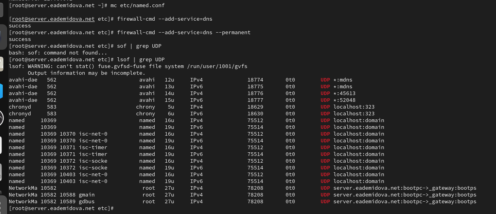{#fig:006 width=70%}

## Конфигурирование кэширующего DNS-сервера при наличии фильтрации DNS-запросов маршрутизаторами

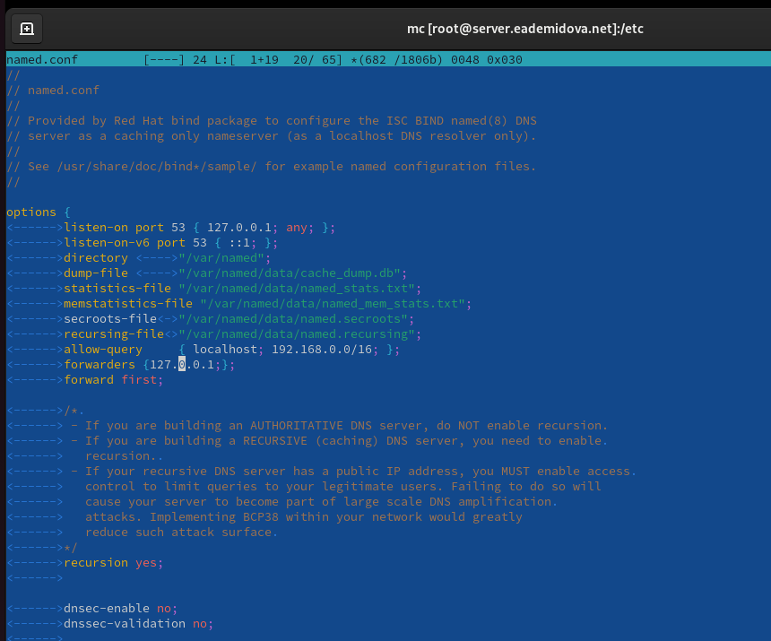{#fig:007 width=55%}

## Конфигурирование первичного DNS-сервера

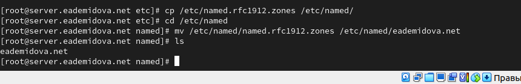{#fig:008 width=70%}

## Конфигурирование первичного DNS-сервера

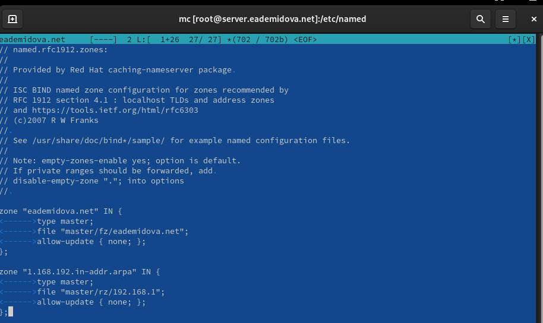{#fig:009 width=70%}

## Конфигурирование первичного DNS-сервера

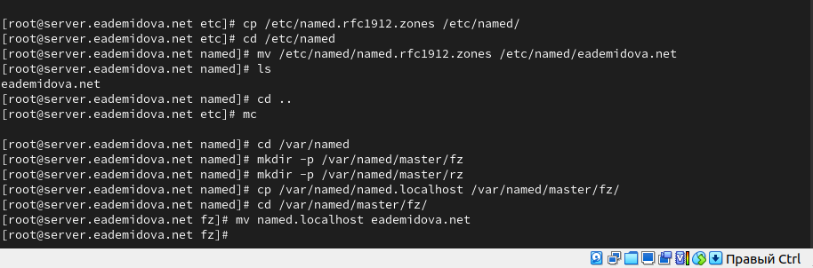{#fig:010 width=70%}

## Конфигурирование первичного DNS-сервера

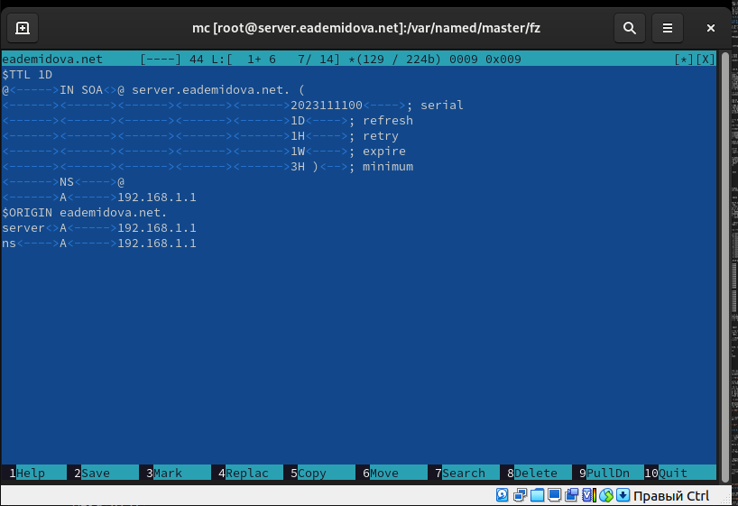{#fig:011 width=70%}

## Конфигурирование первичного DNS-сервера

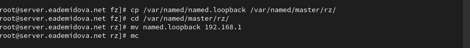{#fig:012 width=70%}

## Конфигурирование первичного DNS-сервера

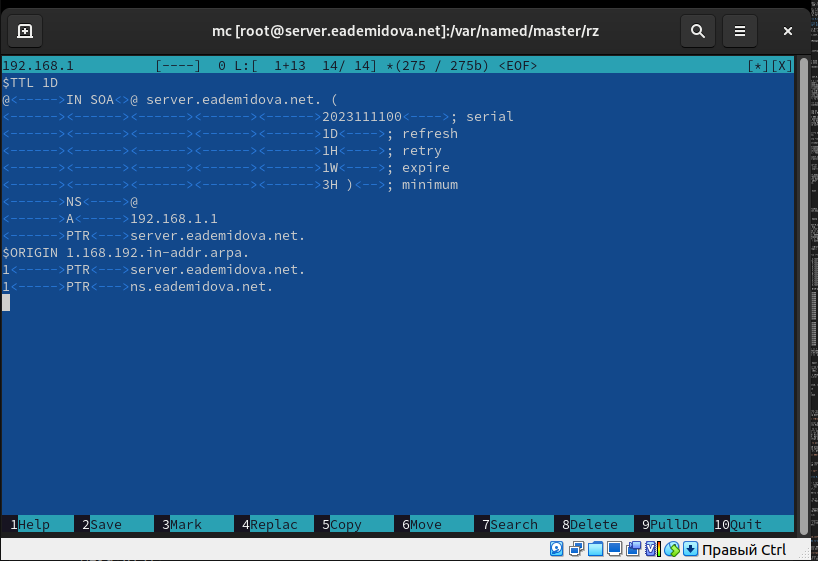{#fig:013 width=70%}

## Конфигурирование первичного DNS-сервера

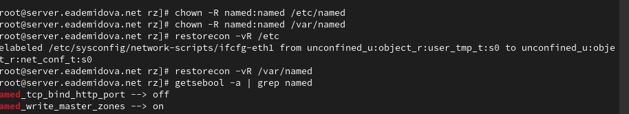{#fig:014 width=70%}

## Конфигурирование первичного DNS-сервера

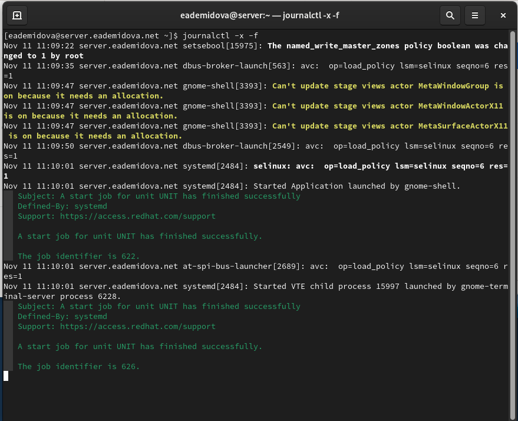{#fig:015 width=60%}

## Конфигурирование первичного DNS-сервера

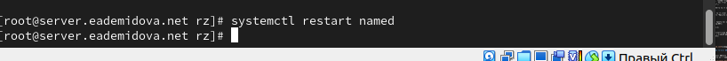{#fig:016 width=70%}

## Анализ работы DNS-сервера

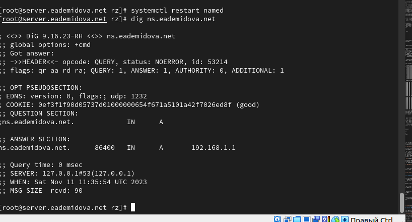{#fig:017 width=70%}

## Анализ работы DNS-сервера

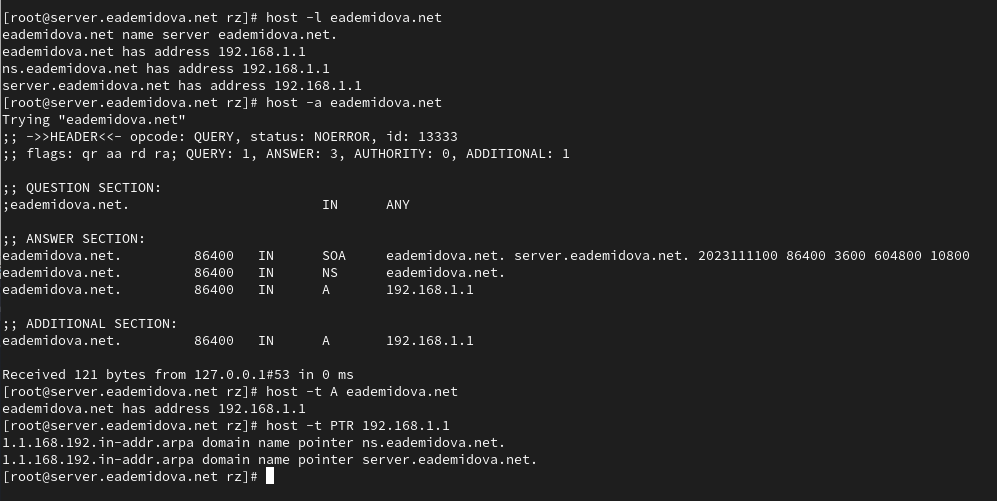{#fig:018 width=70%}

## Внесение изменений в настройки внутреннего окружения виртуальной машины

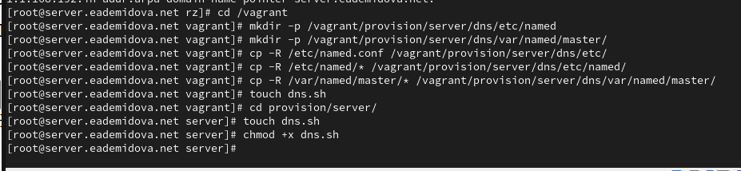{#fig:019 width=70%}

## Внесение изменений в настройки внутреннего окружения виртуальной машины

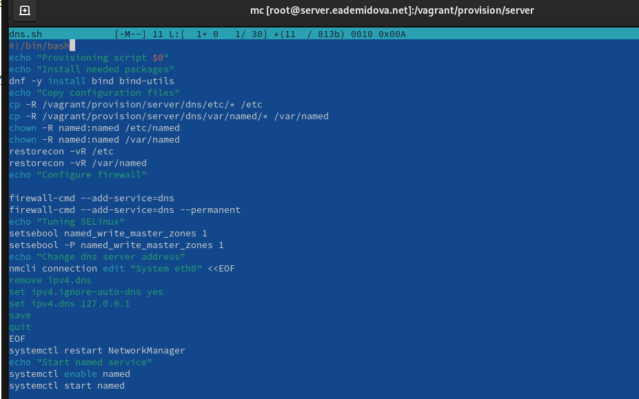{#fig:020 width=70%}

## Внесение изменений в настройки внутреннего окружения виртуальной машины

{#fig:018 width=70%}

# Заключение

## Выводы

В результате выполнения данной работы были приобретены практические навыки по установке и конфигурированию DNS-сервера, усвоение принципов работы системы доменных имён.