---
## Front matter
title: "Лабораторная работа №2"
subtitle: "Настройка DNS-сервера"
author: "Демидова Екатерина Алексеевна"

## Generic otions
lang: ru-RU
toc-title: "Содержание"

## Bibliography
bibliography: bib/cite.bib
csl: pandoc/csl/gost-r-7-0-5-2008-numeric.csl

## Pdf output format
toc: true # Table of contents
toc-depth: 2
lof: true # List of figures
lot: false # List of tables
fontsize: 12pt
linestretch: 1.5
papersize: a4
documentclass: scrreprt
## I18n polyglossia
polyglossia-lang:
  name: russian
  options:
	- spelling=modern
	- babelshorthands=true
polyglossia-otherlangs:
  name: english
## I18n babel
babel-lang: russian
babel-otherlangs: english
## Fonts
mainfont: PT Serif
romanfont: PT Serif
sansfont: PT Sans
monofont: PT Mono
mainfontoptions: Ligatures=TeX
romanfontoptions: Ligatures=TeX
sansfontoptions: Ligatures=TeX,Scale=MatchLowercase
monofontoptions: Scale=MatchLowercase,Scale=0.9
## Biblatex
biblatex: true
biblio-style: "gost-numeric"
biblatexoptions:
  - parentracker=true
  - backend=biber
  - hyperref=auto
  - language=auto
  - autolang=other*
  - citestyle=gost-numeric
## Pandoc-crossref LaTeX customization
figureTitle: "Рис."
tableTitle: "Таблица"
listingTitle: "Листинг"
lofTitle: "Список иллюстраций"
lotTitle: "Список таблиц"
lolTitle: "Листинги"
## Misc options
indent: true
header-includes:
  - \usepackage{indentfirst}
  - \usepackage{float} # keep figures where there are in the text
  - \floatplacement{figure}{H} # keep figures where there are in the text
---

# Цель работы

Приобретение практических навыков по установке и конфигурированию DNS-сервера, усвоение принципов работы системы доменных имён.

# Задание

1. Установите на виртуальной машине server DNS-сервер bind и bind-utils.
2. Сконфигурируйте на виртуальной машине server кэширующий DNS-сервер.
3. Сконфигурируйте на виртуальной машине server первичный DNS-сервер.
4. При помощи утилит dig и host проанализируйте работу DNS-сервера.
5. Напишите скрипт для Vagrant, фиксирующий действия по установке и конфигурированию DNS-сервера во внутреннем окружении виртуальной машины server. Соответствующим образом внесите изменения в Vagrantfile

# Выполнение лабораторной работы

## Установка DNS-сервера

Загрузим нашу операционную систему и перейдем в рабочий каталог с проектом:
```
cd /var/tmp/eademidova/vagran
```
Затем запустим виртуальную машину server:
```
make server-up
```

На виртуальной машине server войдем под созданным в предыдущей работе
пользователем и откроем терминал. Перейдем в режим суперпользователя и установим bind и bind-utils(рис. @fig:001):

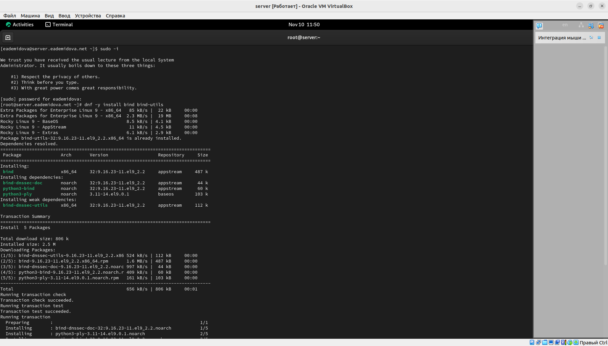{#fig:001 width=70%}

C помощью утилиты dig сделаем запрос к DNS-адресу www.yandex.ru(рис. @fig:002):

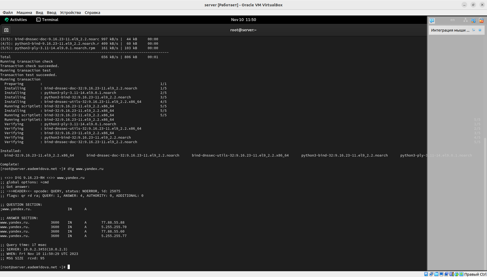{#fig:002 width=70%}

Проанализируем вывод:

HEADER — отображает информацию о версии утилиты, ID запроса, полученных ошибках и использованных флагах вывода, о количестве запросов, обращений к DNS-серверу.

В нашем случае версия утилиты Dig 9.16.23-RH, затем написан адрес, к которому мы делаем запрос. В следующей строке указаны глобальные опции, используемые командой, у нас это cmd+, говорящая, что нужно отображать аргументы при анализе. В следующей строке указан код операции(opcode) как запрос(QUERY), статус ьез ошибок и ID процесса -- 25075. В следующей страке указаны флаги qr(указывающий, что мы производим запрос), rd{сервер не авторитетный, поэтому он выполнит рекурсивный запрос, чтобы найти ответ}. ra(указывает, что сервер поддерживает рекурсивный запрос), количество запросов -- 1, ответов -- 4, сервер не авторитетный(указано 0).

QUESTION SECTION — секция, которая отображает текущий запрос. В ней указан адрес, которому производится запрос, указан тип ресурсной записи А(адрес IPv4),

ANSWER SECTION — секция, в которой отображается результат обработки созданного запроса (в данном случае это IP-адрес домена). Также можно увидеть адрес, тип ресурсной записи, адреса домена, описано 4 запроса. Затем указано время зпасроса -- 17 мс, адрес сервера, дата запроса и размер запроса.

## Конфигурирование кэширующего DNS-сервера

### Конфигурирование кэширующего DNS-сервера при отсутствии фильтрации DNS-запросов маршрутизаторами

В отчёте проанализируем построчно содержание файлов /etc/resolv.conf, /etc/named.conf, /var/named/named.ca, /var/named/named.localhost, /var/named/named.loopback.

Рассмотрим /etc/resolv.conf. В нём указано имя сервера и его адрес:

```
# Generated by NetworkManager
search eademidova.net
nameserver 10.0.2.3
```

Рассмотрим /etc/named.conf(анализ указан комментариями к строкам):
```
//
// named.conf
//
// Provided by Red Hat bind package to configure the ISC BIND named(8) DNS
// server as a caching only nameserver (as a localhost DNS resolver only).
//
// See /usr/share/doc/bind*/sample/ for example named configuration files.
//

\\ опции
options {
	listen-on port 53 { 127.0.0.1; };  \\ адрес IPv4 DNS-порта, с которого идет запрос
	listen-on-v6 port 53 { ::1; }; \\ \\ адрес IPv6 порта, с которого идет запрос
	directory 	"/var/named"; \\ путь к директории
	dump-file 	"/var/named/data/cache_dump.db"; \\путь к файлу с кэшем дамп памяти
	statistics-file "/var/named/data/named_stats.txt"; \\ путь к файлу статистики
	memstatistics-file "/var/named/data/named_mem_stats.txt"; \\ путь к файлу, где записано отслеживание использование памяти
	secroots-file	"/var/named/data/named.secroots"; \\ путь к файлу, в который сервер выводит security roots
	recursing-file	"/var/named/data/named.recursing"; \\ путь к файлу, который выводит запросы, которые в данный момент рекурсивны

  \\ разрешение запросов локальному хосту
	allow-query     { localhost; };

	/* 
	 - If you are building an AUTHORITATIVE DNS server, do NOT enable recursion.
	 - If you are building a RECURSIVE (caching) DNS server, you need to enable 
	   recursion. 
	 - If your recursive DNS server has a public IP address, you MUST enable access 
	   control to limit queries to your legitimate users. Failing to do so will
	   cause your server to become part of large scale DNS amplification 
	   attacks. Implementing BCP38 within your network would greatly
	   reduce such attack surface 
	*/
  \\рекурсия задана
	recursion yes;
  \\ проверка безопасности dns задана
	dnssec-validation yes;

	managed-keys-directory "/var/named/dynamic"; \\ задает директорию ключей управления
	geoip-directory "/usr/share/GeoIP"; \\ задает директорию, содержащую GeoIP

	pid-file "/run/named/named.pid"; \\ Указывает путь к файлу, в который сервер записывает свой идентификатор процесса
	session-keyfile "/run/named/session.key"; \\ Указывает путь к файлу, в котором записан сеансовый ключ TSIG

	/* https://fedoraproject.org/wiki/Changes/CryptoPolicy */
	include "/etc/crypto-policies/back-ends/bind.config";
};

\\ channel связывает методы вывода, параметры формата и уровни серьезности с именем, которое затем можно использовать с фразой категории для выбора способа регистрации различных классов сообщений.

logging {
        channel default_debug {
                file "data/named.run";
                severity dynamic; \\ указана динамическая серьезность, сервер имен  будет регистрировать сообщения, соответствующие его уровню отладки.
        };
};

\\ класс зоны IN, тип hint

zone "." IN { 
	type hint;
	file "named.ca";
};

\\ подключение файлов

include "/etc/named.rfc1912.zones"; 
include "/etc/named.root.key";

```

Рассмотрим содержимое файла /var/named/named.ca:

```
; <<>> DiG 9.11.3-RedHat-9.11.3-3.fc27 <<>> +bufsize=1200 +norec @a.root-servers.net \\ указана версия dig
; (2 servers found) \\ количество найденных серверов
;; global options: +cmd \\ глобальная опция
;; Got answer: \\ получен ответ
;; ->>HEADER<<- opcode: QUERY, status: NOERROR, id: 46900 \\ тип сообщения запрос, выполнен без ошибок, указана id
;; flags: qr aa; QUERY: 1, ANSWER: 13, AUTHORITY: 0, ADDITIONAL: 27 \\ выславлен флаг qr - запрос и aa - authoritative answer, сделан один ответ, получено 13 ответов

;; OPT PSEUDOSECTION: \\псевдораздел(часть раздела additional)
; EDNS: version: 0, flags:; udp: 1472 \\ версия EDNSб флаги и размер UDP пакета
;; QUESTION SECTION:
;.				IN	NS
\\  раздел с полученными ответами
;; ANSWER SECTION:
.			518400	IN	NS	a.root-servers.net. \\ указан  NS — запись, содержащая адрес сервера имен, обслуживающего указанную зону
.			518400	IN	NS	b.root-servers.net.
.			518400	IN	NS	c.root-servers.net.
.			518400	IN	NS	d.root-servers.net.
.			518400	IN	NS	e.root-servers.net.
.			518400	IN	NS	f.root-servers.net.
.			518400	IN	NS	g.root-servers.net.
.			518400	IN	NS	h.root-servers.net.
.			518400	IN	NS	i.root-servers.net.
.			518400	IN	NS	j.root-servers.net.
.			518400	IN	NS	k.root-servers.net.
.			518400	IN	NS	l.root-servers.net.
.			518400	IN	NS	m.root-servers.net.

\\  В этом разделе мы получаем IP-адреса серверов имен из предыдущего раздела
;; ADDITIONAL SECTION:
a.root-servers.net.	518400	IN	A	198.41.0.4 \\ A - указаны адреса версии 4
b.root-servers.net.	518400	IN	A	199.9.14.201
c.root-servers.net.	518400	IN	A	192.33.4.12
d.root-servers.net.	518400	IN	A	199.7.91.13
e.root-servers.net.	518400	IN	A	192.203.230.10
f.root-servers.net.	518400	IN	A	192.5.5.241
g.root-servers.net.	518400	IN	A	192.112.36.4
h.root-servers.net.	518400	IN	A	198.97.190.53
i.root-servers.net.	518400	IN	A	192.36.148.17
j.root-servers.net.	518400	IN	A	192.58.128.30
k.root-servers.net.	518400	IN	A	193.0.14.129
l.root-servers.net.	518400	IN	A	199.7.83.42
m.root-servers.net.	518400	IN	A	202.12.27.33
a.root-servers.net.	518400	IN	AAAA	2001:503:ba3e::2:30 \\ Aффф - указаны адреса версии 6
b.root-servers.net.	518400	IN	AAAA	2001:500:200::b
c.root-servers.net.	518400	IN	AAAA	2001:500:2::c
d.root-servers.net.	518400	IN	AAAA	2001:500:2d::d
e.root-servers.net.	518400	IN	AAAA	2001:500:a8::e
f.root-servers.net.	518400	IN	AAAA	2001:500:2f::f
g.root-servers.net.	518400	IN	AAAA	2001:500:12::d0d
h.root-servers.net.	518400	IN	AAAA	2001:500:1::53
i.root-servers.net.	518400	IN	AAAA	2001:7fe::53
j.root-servers.net.	518400	IN	AAAA	2001:503:c27::2:30
k.root-servers.net.	518400	IN	AAAA	2001:7fd::1
l.root-servers.net.	518400	IN	AAAA	2001:500:9f::42
m.root-servers.net.	518400	IN	AAAA	2001:dc3::35

;; Query time: 24 msec \\ время запроса
;; SERVER: 198.41.0.4#53(198.41.0.4) \\ адрес сервера
;; WHEN: Thu Apr 05 15:57:34 CEST 2018 \\дата запроса
;; MSG SIZE  rcvd: 811 \\ размер сообщения

```

Рассмотрим содержимое файлв /var/named/named.loopback. В нём указаны:

- Запись начала полномочий (SOA), которая указывает начало зоны и включает имя хоста, на котором находится файл данных name.local.
- Запись сервера имен (NS), идентифицирующая главный и подчиненные серверы имен DNS. 
- Указаны адреса IPv4 и IPv6 локального хоста.
- PTR-запись для локального хоста

```
$TTL 1D
@	IN SOA	@ rname.invalid. (
					0	; serial
					1D	; refresh
					1H	; retry
					1W	; expire
					3H )	; minimum
	NS	@
	A	127.0.0.1
	AAAA	::1
	PTR	localhost.

```

Запустим DNS-сервер, включим запуск DNS-сервера в автозапуск при загрузке системы.
Проанализируем отличие в выведенной на экран информации при выполнении команд
dig www.yandex.ru и dig @127.0.0.1 www.yandex.ru(рис. @fig:003):

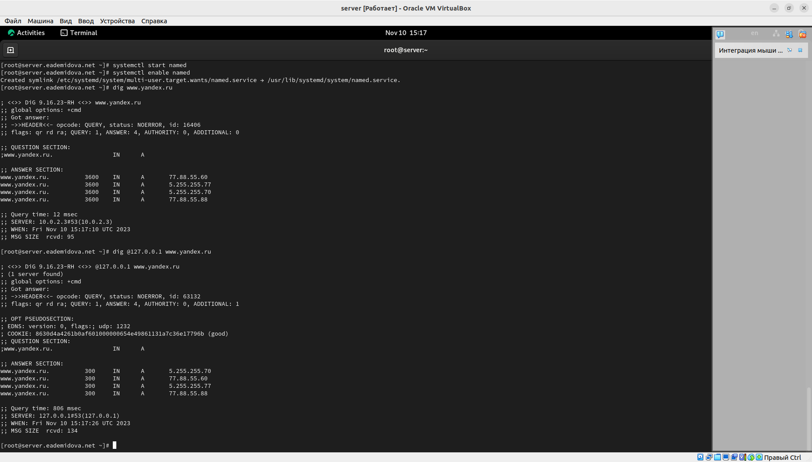{#fig:003 width=70%}

При указании опрашиваемого адреса в строке с адресом сервера написан адрес, который указывали, также указаны куки. Время запроса увеличивается.

Сделаем DNS-сервер сервером по умолчанию для хоста server и внутренней виртуальной сети. Для этого требуется изменить настройки сетевого соединения eth0 в NetworkManager, переключив его на работу с внутренней сетью и указав для него в качестве DNS-сервера по умолчанию адрес 127.0.0.1, затем сделаем тоже самое для соединения System eth0. Затем запустим NetworkManager и проверим наличие изменений в файле etc/resolv.conf(адрес сервера изменился на заданный нами)(рис. @fig:004):

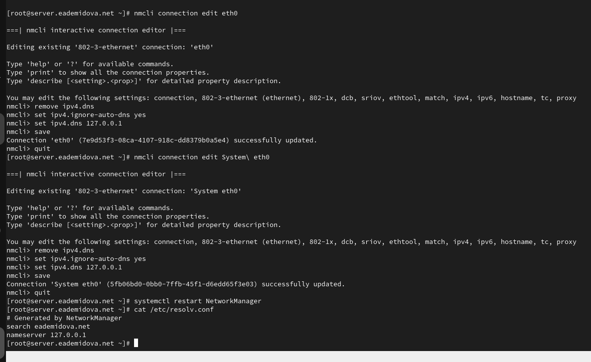{#fig:004 width=70%}

Требуется настроить направление DNS-запросов от всех узлов внутренней сети, включая запросы от узла server, через узел server. Для этого внесем изменения в файл /etc/named.conf(рис. @fig:005):

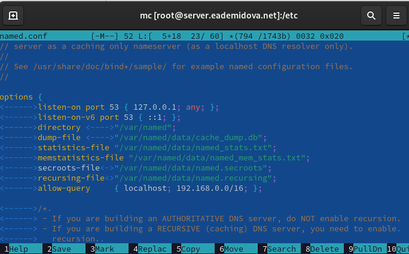{#fig:005 width=70%}


Внесем изменения в настройки межсетевого экрана узла server, разрешив работу с DNS и убедимся, что DNS-запросы идут через узел server, который прослушивает порт 53(@fig:006):

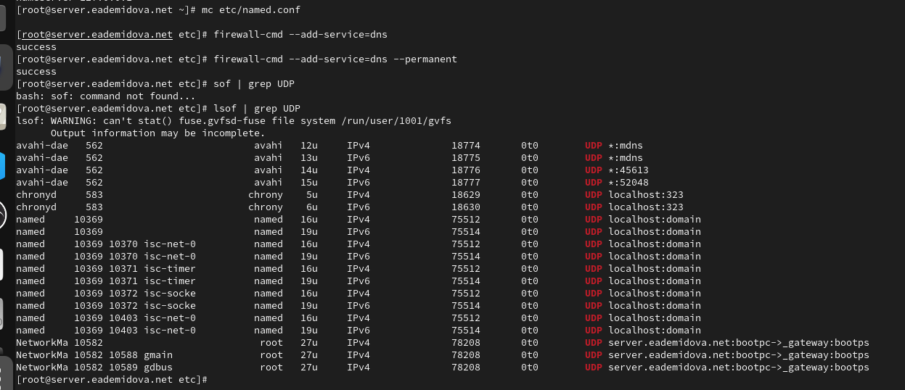{#fig:006 width=70%}

### Конфигурирование кэширующего DNS-сервера при наличии фильтрации DNS-запросов маршрутизаторами

В случае возникновения в сети ситуации, когда DNS-запросы от сервера фильтруются сетевым оборудованием, следует добавить перенаправление DNS-запросов на конкретный вышестоящий DNS-сервер. Для этого в конфигурационный файл named.conf в секцию options следует добавить:
```
forwarders { список DNS-серверов };
forward first;
```
Текущий список DNS-серверов можно получить, введя на локальном хосте (на котором
развёртывается образ виртуальной машины) следующую команду:
```
cat /etc/resolv.conf
```
Мы получили следующие данные для конфигурационного файла named.conf виртуальной машины server(рис. @fig:007):
```
forwarders { 127.0.0.1;};
forward first;
```
Кроме того, возможно вышестоящий DNS-сервер может не поддерживать технологию DNSSEC, тогда следует в конфигурационном файле named.conf указать следующие
настройки(рис. @fig:007):
```
dnssec-enable no;
dnssec-validation no;
```

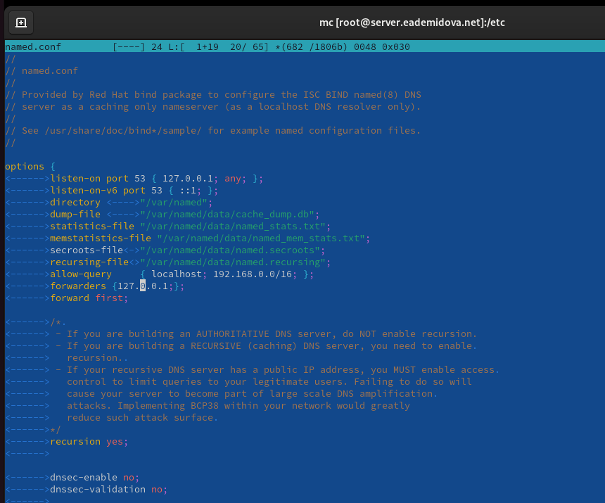{#fig:007 width=70%}

### Конфигурирование первичного DNS-сервера


Скопируем шаблон описания DNS-зон named.rfc1912.zones из каталога /etc в каталог /etc/named и переименуеме его в eademidova.net ( @fig:008):

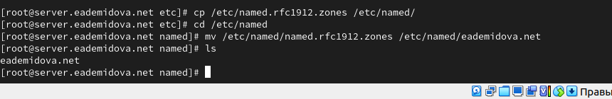{#fig:008 width=70%}

Включим файл описания зоны /etc/named/eademidova.net в конфигурационном файле DNS /etc/named.conf, добавив в нём в конце строку:
```
include "/etc/named/user.net";
```
Внесём изменения в файл eademidova.net(рис. @fig:009):

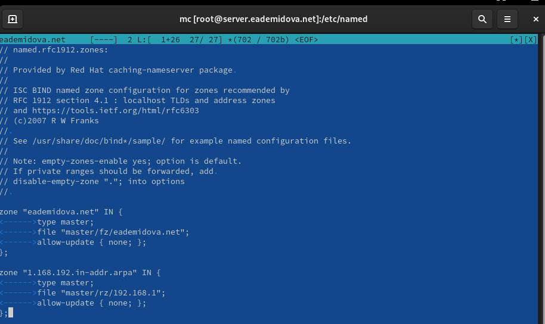{#fig:009 width=70%}

В каталоге /var/named создадим подкаталоги master/fz и master/rz, в которых будут располагаться файлы прямой и обратной зоны соответственно, а затем скопируем шаблон прямой DNS-зоны named.localhost из каталога /var/named в каталог /var/named/master/fz и переименуем его в eademidova.net(рис. @fig:010):

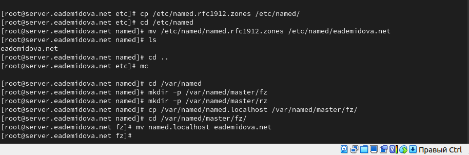{#fig:010 width=70%}

Изменим файл /var/named/master/fz/user.net, указав необходимые DNS-записи для прямой зоны(рис. @fig:011):

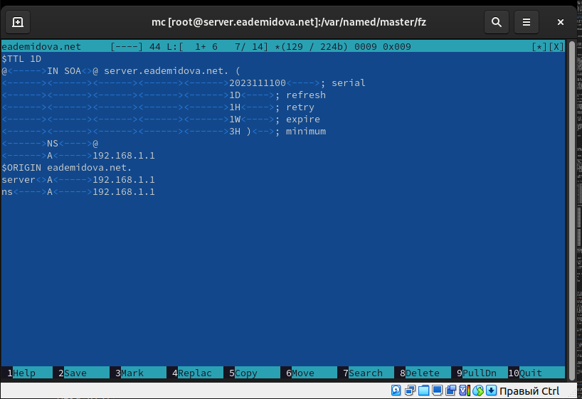{#fig:011 width=70%}

Скопируем шаблон обратной DNS-зоны named.loopback из каталога /var/named в каталог /var/named/master/rz и переименуем его в 192.168.1(рис. @fig:012):

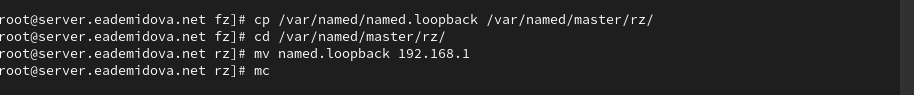{#fig:012 width=70%}

Изменим файл /var/named/master/fz/user.net, указав необходимые DNS-записи для прямой зоны(рис. @fig:013):

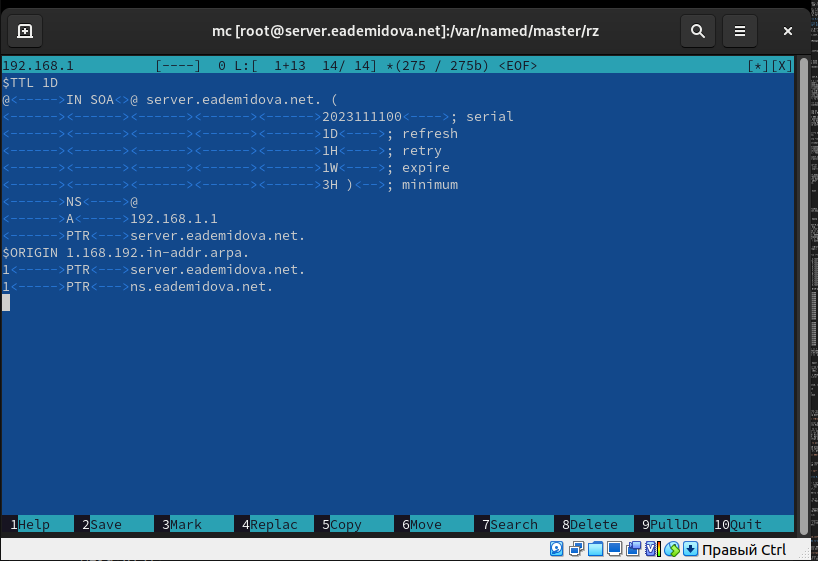{#fig:013 width=70%}

После изменения доступа к конфигурационным файлам named корректно восстановим специальные метки безопасности в SELinux, затем проверим состояние переключателей(рис. @fig:014)

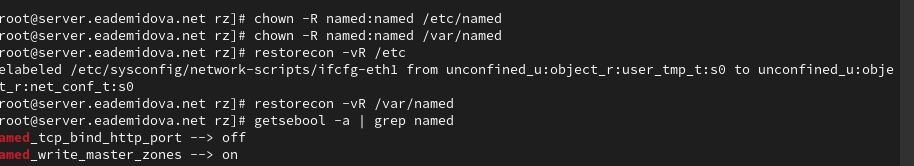{#fig:014 width=70%}

Во дополнительном терминале запустим в режиме реального времени расширенный лог системных сообщений, чтобы проверить корректность работы системы(@fig:015):

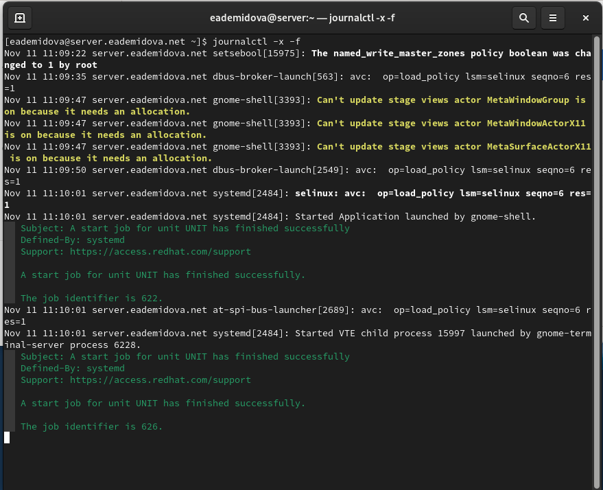{#fig:015 width=70%}

Перезапустим  DNS-сервер(@fig:016):

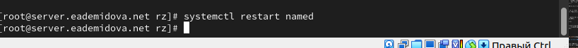{#fig:016 width=70%}

### Анализ работы DNS-сервера

При помощи утилиты dig получим описание DNS-зоны с сервера ns.eademidova.net(@fig:017):

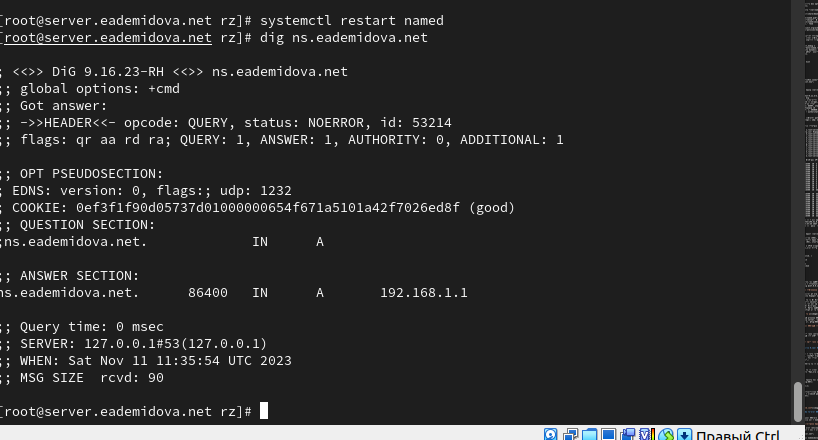{#fig:017 width=70%}

При помощи утилиты host проанализируем корректность работы DNS-сервера, можно увидеть, что все внесённые нами изменения в работу сервера учтены(@fig:018):

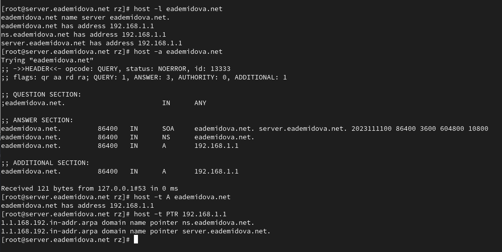{#fig:018 width=70%}

### Внесение изменений в настройки внутреннего окружения виртуальной машины

На виртуальной машине server перейдем в каталог для внесения изменений в настройки внутреннего окружения /vagrant/provision/server/, создадим в нём каталог dns, в который поместим в соответствующие каталоги конфигурационные файлы DNS, а затем в каталоге /vagrant/provision/server создадим исполняемый файл dns.sh(@fig:019):

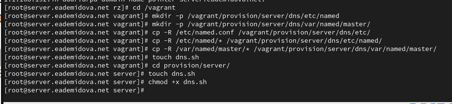{#fig:019 width=70%}

Запишем в dns.sh следующий скрипт(@fig:020):

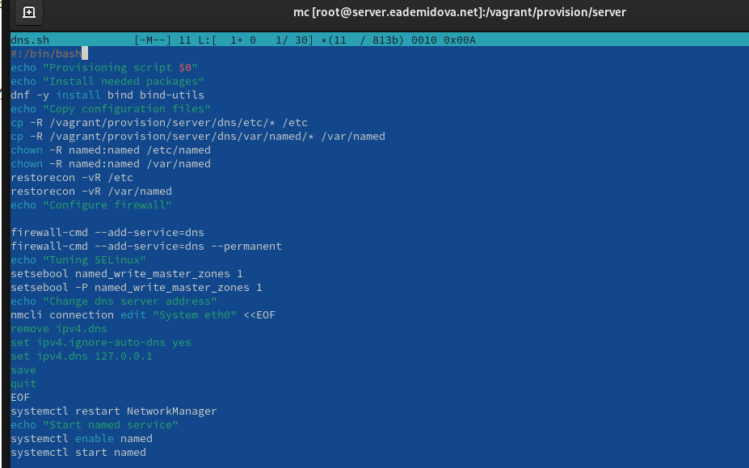{#fig:020 width=70%}

Для отработки созданного скрипта во время загрузки виртуальной машины server в конфигурационном файле Vagrantfile добавим в разделе конфигурации для сервера(@fig:021):

{#fig:018 width=70%}

# Контрольные вопросы

1. Что такое DNS?

Система доменных имён (Domain Name System, DNS) — распределённая система (распределённая база данных), ставящая в соответствие доменному имени хоста (компьютера или другого сетевого устройства) IP-адрес, и наоборот.

2. Каково назначение кэширующего DNS-сервера?

Кэширующий DNS-сервер получает рекурсивные запросы от клиентов и выполняет их с помощью нерекурсивных запросов к авторитативным серверам.

3. Чем отличается прямая DNS-зона от обратной?

Прямая DNS зона - зона хранения записей соответствия доменного имени ip адресу. Обратная DNS зона - зона хранения записей соответствия ip адреса доменному имени.

4. В каких каталогах и файлах располагаются настройки DNS-сервера? Кратко охарактеризуйте, за что они отвечают.

В каталоге /etc хранится файл named.conf, в котором есть информация об опциях сервера, его разрешениях, настройках безопасности и подключены файлы зон. В каталоге /named хранится файл описания DNS-зон, также в каталоге /var/named хранится файл named.loopback, описывающий обратную зону, и файл named.localhost, описывающий прямую зону.

5. Что указывается в файле resolv.conf?

В этом файле указывается имя сервера и его адрес, например:

```
# Generated by NetworkManager
search eademidova.net
nameserver 10.0.2.3
```

6. Какие типы записи описания ресурсов есть в DNS и для чего они используются?

Основные типы ресурсных записей (Resource Records):

- A-запись — задает преобразование имени хоста в IP-адрес.
- MX-запись — определяет почтовый ретранслятор для доменного имени, т.е. узел, который обработает или передаст дальше почтовые сообщения, предназначенные адресату в указанном домене. При наличии нескольких MX-записей сначала происходит попытка доставить почту на ретранслятор с наименьшим приоритетом.
- NS-записи — определяют DNS-серверы, которые являются авторитативными для данной зоны.
- CNAME-запись — определяет отображение псевдонима в каноническое имя узла.
- SRV-запись — позволяет получить имя для искомой службы, а также протокол, по которому эта служба работает.
- TXT-запись — содержит общую текстовую информацию. Эти записи могут использоваться в любых целях, например, для указания месторасположения хоста.
- AAAA-запись — задает преобразование имени хоста в IPV6-адрес.
- SSHFP-запись — используется для хранения слепка ключей SSH в DNS.

7. Для чего используется домен in-addr.arpa?

Домен in-addr.arpa используется для всех сетей TCP/IP, основанным на адресации протокола Интернета 4 (IPv4).

8. Для чего нужен демон named?

Демон named отвечает на запросы об именах машин и их IP-адресах. Если named не знает ответа на какой-либо запрос, он опрашивает другие серверы и помещает их ответы в кэш. Этот демон, кроме того, отвечает за выполнение зонных пересылок, обеспечивающих копирование данных между серверами одного домена. Запросы демона named используют протокол UDP и порт 53. Если объем ответов превышает 512 байтов, то для их доставки используется протокол TCP. В зонных пересылках между серверами также применяется протокол TCP.

9. В чём заключаются основные функции slave-сервера и master-сервера?

Главный (master) — хранит и управляет ресурсными записями (описанием) доменной зоны. К главному серверу может быть подключено множество ведомых; ведомый (slave) — получает и хранит информацию о доменных зонах с главного сервера. На ведомом сервере невозможно изменить описание доменной зоны.

10. Какие параметры отвечают за время обновления зоны?

SOA-запись (Start of Authority) — начальная запись зоны, которая указывает местоположение эталонной записи о домене. Она хранит параметр TTL – время, в течение которого информация будет кешироваться другими DNS-серверами. Также параметр Refresh – время (в секундах) ожидания ответа вторичного DNS перед запросом SOA-записи с первичных серверов. По истечении данного времени вторичный DNS обращается к первичному для получения копии текущей SOA-записи. Первичный DNS-сервер выполняет этот запрос. Вторичный DNS-сервер сравнивает полученный серийный номер зоны с имеющимся. Если они отличаются, то осуществляется запрос к первичному DNS-серверу на трансфер зоны. И Expire – время (в секундах), в течение которого вторичный DNS будет пытаться завершить синхронизацию зоны с первичным. Если это время истечет до того, как синхронизация закончится, то зона на вторичном DNS-сервере перестанет обслуживать запросы об этой зоне.

11. Как обеспечить защиту зоны от скачивания и просмотра?

Можно делать следующее для защиты данных DNS доменов с помощью DNSSEC:

- Подписывать зоны или удалить подпись в соответствии со спецификациями DNSSEC
- (Необязательно) Указывать индивидуальные настройки для создания ключей
- Получать уведомления
- Просматривать и копировать записи ресурсов DS
- Просматривать и копировать наборы записей ресурсов DNSKEY.


12. Какая запись RR применяется при создании почтовых серверов?

Заппись MX (от англ. mail exchanger) — тип DNS-записи, предназначенный для маршрутизации электронной почты с использованием протокола SMTP. 

13. Как протестировать работу сервера доменных имён?

Для этого можно воспользоваться командой nslookup, которая позволяет получить информацию о DNS-записях для заданного домена или IP-адреса. 

14. Как запустить, перезапустить или остановить какую-либо службу в системе?

- systemctl restart named - перезапустить DNS-сервер
- systemctl stop named - перезапустить DNS-сервер
- systemctl start named - перезапустить DNS-сервер


15. Как посмотреть отладочную информацию при запуске какого-либо сервиса или служ-
бы?

В дополнительном терминале запуститm в режиме реального времени расширенный лог системных сообщений:

```
journalctl -x -f
```

16. Где храниться отладочная информация по работе системы и служб? Как её посмотреть?

Журналы службы находятся в директории “/var/log/” в виде обычных текстовых файлов.

17. Как посмотреть, какие файлы использует в своей работе тот или иной процесс? Приведите пример.

lsof -- есокращение от LiSt of Open Files, утилита эта служит для вывода информации о том, какие файлы используются теми или иными процессами. 

Пример использования с командой grep(@fig:022):

{#fig:022 width=70%}

18. Приведите примеры по изменению сетевого соединения при помощи командного интерфейса nmcli.

Два примера о изменению сетевого соединения при помощи командного интерфейса nmcli(рис. @fig:022):

{#fig:022 width=70%}

19. Что такое SELinux?

SELinux (англ. Security-Enhanced Linux — Linux с улучшенной безопасностью) — реализация системы принудительного контроля доступа, которая может работать параллельно с классической избирательной системой контроля доступа. 

20. Что такое контекст (метка) SELinux?

SELinux — это система принудительного управления доступом, что означает, что каждый процесс имеет метку (label). Каждый файл, каталог и системный объект так же имеют метки. Правила политики управляют доступом между промаркированными процессами и объектами.

Контекст безопасности — это совокупность всех атрибутов, которые связаны с объектами и субъектами

21. Как восстановить контекст SELinux после внесения изменений в конфигурационные
файлы?

После изменения доступа к конфигурационным файлам named требуется корректно восстановить их метки в SELinux:
```
restorecon -vR /etc
restorecon -vR /var/named
```
Для проверки состояния переключателей SELinux, относящихся к named, надо ввести:
```
getsebool -a | grep named
```
При необходимости дать named разрешение на запись в файлы DNS-зоны:
```
setsebool named_write_master_zones 1
setsebool -P named_write_master_zones 1
```

22. Как создать разрешающие правила политики SELinux из файлов журналов, содержащих сообщения о запрете операций?

Чтобы создать необходимые политики:

  1. Создайте новый файл с исходным кодом политики SELinux (.te файл). Данный файл определяет ограничения, относящиеся к описываемому модулю.
  2. При необходимости отредактируйте сгенерированный исходный файл политики [module_name].te, а затем, используя утилиту checkmodule, создайте бинарное представление (.mod файл) исходного файла локальной политики.
  3. Создайте устанавливаемый модуль политики (.pp файл) с помощью утилиты semodule_package.
  4. Для установки созданного модуля политики воспользуйтесь утилитой semodule.

23. Что такое булевый переключатель в SELinux?

Булевый переключатель в SELinux - это параметр, который управляет разрешениями безопасности на уровне SELinux. Он может быть включен (true) или выключен (false) и используется для разрешения или запрещения определенных действий.

24. Как посмотреть список переключателей SELinux и их состояние?

Для просмотра списка переключателей SELinux и их состояния можно использовать команду "semanage boolean -l" в терминале.

25. Как изменить значение переключателя SELinux?

Чтобы изменить значение переключателя SELinux, можно использовать команду "setsebool". Например, для включения переключателя с именем "httpd_can_network_connect" можно выполнить команду "setsebool -P httpd_can_network_connect 1". Здесь -P указывает, что изменение должно быть постоянным (постоянно сохраняться после перезагрузки).

# Выводы

В результате выполнения данной работы были приобретены практические навыки по установке и конфигурированию DNS-сервера, усвоение принципов работы системы доменных имён.

