---
## Front matter
lang: ru-RU
title: Лабораторная работа №3
subtitle: Настройка DHCP-сервера
author:
  - Демидова Е. А.
institute:
  - Российский университет дружбы народов, Москва, Россия
date: 12 ноября 2023 

## i18n babel
babel-lang: russian
babel-otherlangs: english

## Formatting pdf
toc: false
toc-title: Содержание
slide_level: 2
aspectratio: 169
section-titles: true
theme: metropolis
header-includes:
 - \metroset{progressbar=frametitle,sectionpage=progressbar,numbering=fraction}
 - '\makeatletter'
 - '\beamer@ignorenonframefalse'
 - '\makeatother'
---

# Вводная часть

## Цель работы

Приобретение практических навыков по установке и конфигурированию DHCP-сервера.

## Задание

1. Установите на виртуальной машине server DHCP-сервер.
2. Настройте виртуальную машину server в качестве DHCP-сервера для виртуальной внутренней сети.
3. Проверьте корректность работы DHCP-сервера в виртуальной внутренней сети путём запуска виртуальной машины client и применения соответствующих утилит диагностики.
4. Настройте обновление DNS-зоны при появлении в виртуальной внутренней сети новых узлов.
5. Проверьте корректность работы DHCP-сервера и обновления DNS-зоны в виртуальной
внутренней сети путём запуска виртуальной машины client и применения соответствующих утилит диагностики.
6. Напишите скрипт для Vagrant, фиксирующий действия по установке и настройке DHCP-сервера во внутреннем окружении виртуальной машины server. Соответствующим Ыобразом внести изменения в Vagrantfile.

# Выполнение лабораторной работы

## Установка DHCP-сервера

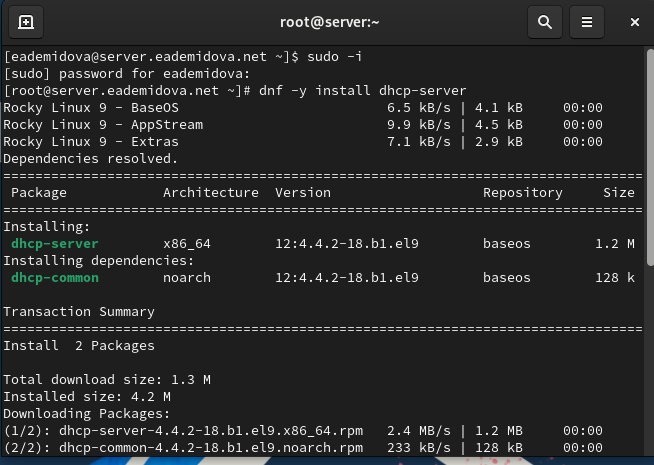{#fig:001 width=70%}

## Конфигурирование DHCP-сервера

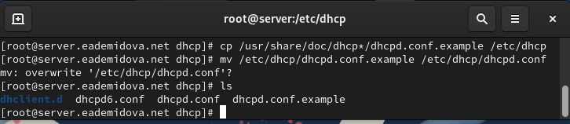{#fig:002 width=70%}

## Конфигурирование DHCP-сервера

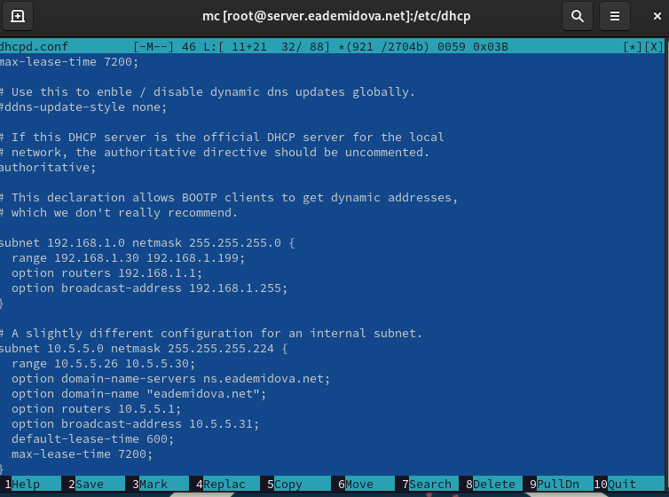{#fig:003 width=60%}

## Конфигурирование DHCP-сервера

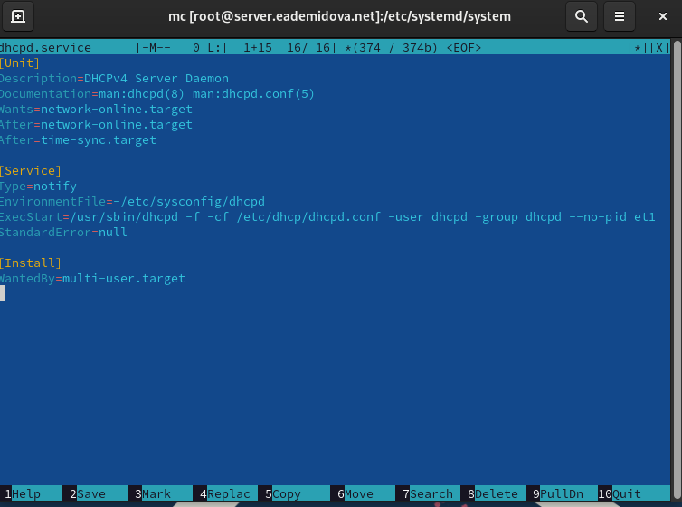{#fig:004 width=60%}

## Конфигурирование DHCP-сервера

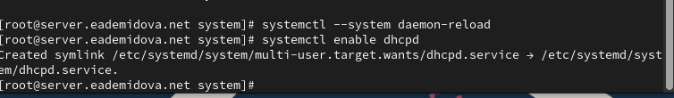{#fig:005 width=70%}

## Конфигурирование DHCP-сервера

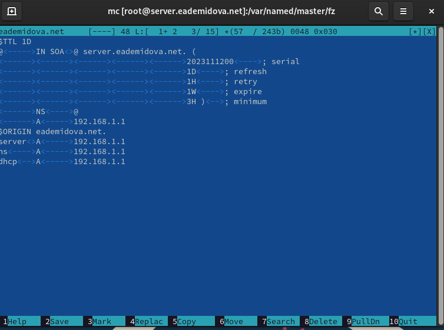{#fig:006 width=60%}

## Конфигурирование DHCP-сервера

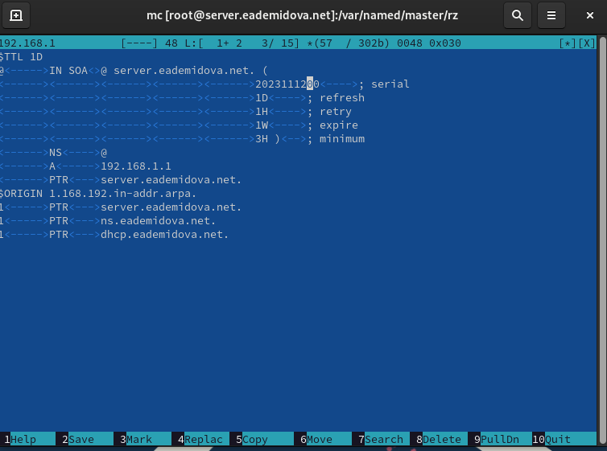{#fig:007 width=60%}

## Конфигурирование DHCP-сервера

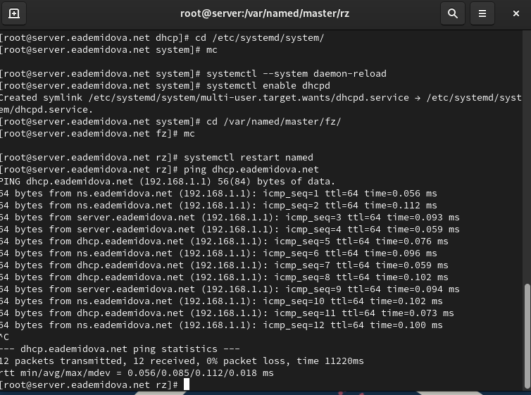{#fig:008 width=60%}

## Конфигурирование DHCP-сервера

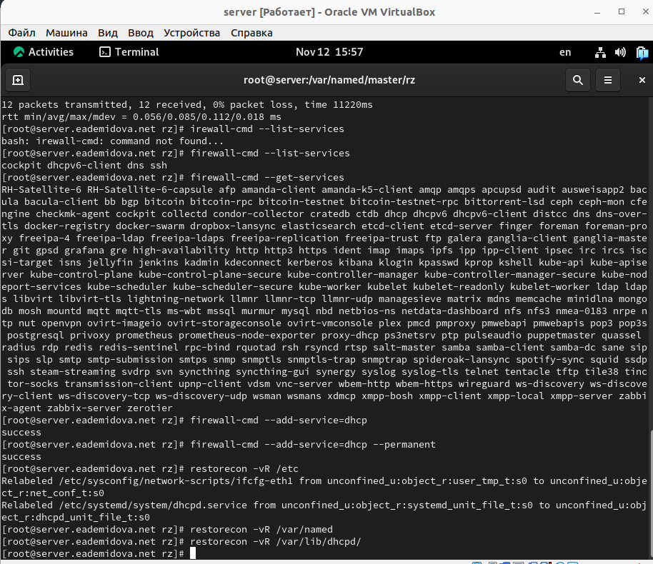{#fig:009 width=55%}

## Конфигурирование DHCP-сервера

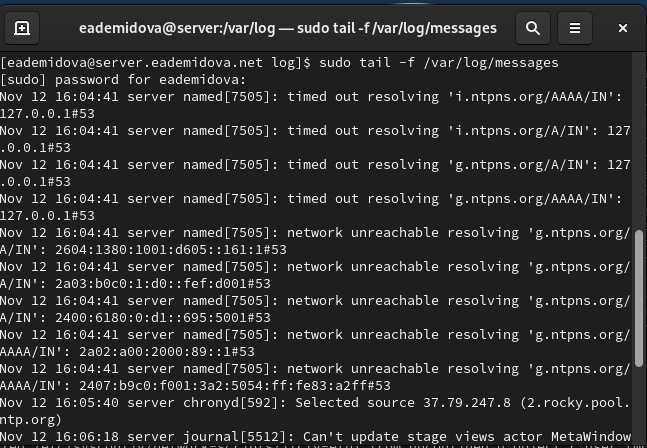{#fig:010 width=70%}

## Конфигурирование DHCP-сервера

{#fig:011 width=70%}

## Анализ работы DHCP-сервера

```
cd /var/tmp/user_name/vagrant/provision/client
touch 01-routing.sh
chmod +x 01-routing.sh
```

## Анализ работы DHCP-сервера

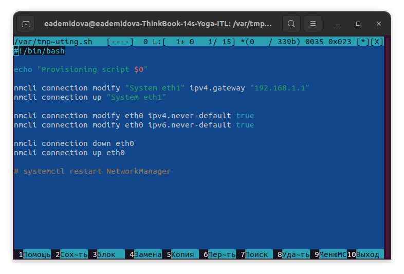{#fig:012 width=70%}

## Анализ работы DHCP-сервера

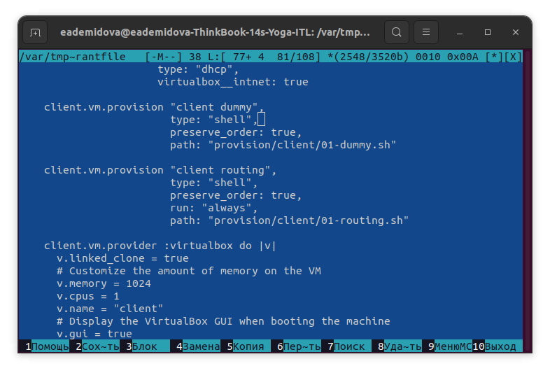{#fig:013 width=70%}

## Анализ работы DHCP-сервера

```
make client-provision
```

## Анализ работы DHCP-сервера

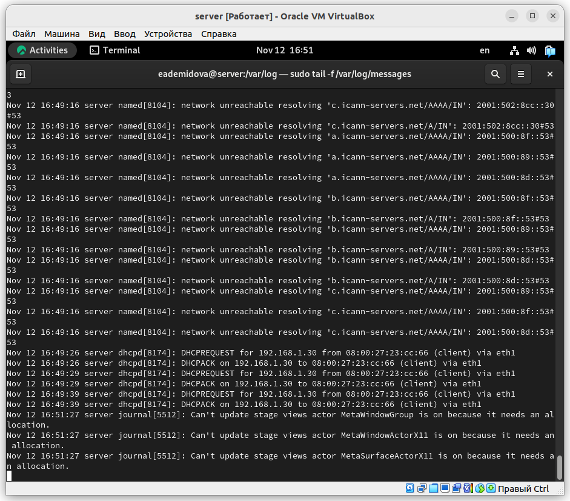{#fig:014 width=50%}

Также информацию о работе DHCP-сервера можно наблюдать в файле /var/lib/dhcpd/dhcpd.leases.

## Анализ работы DHCP-сервера

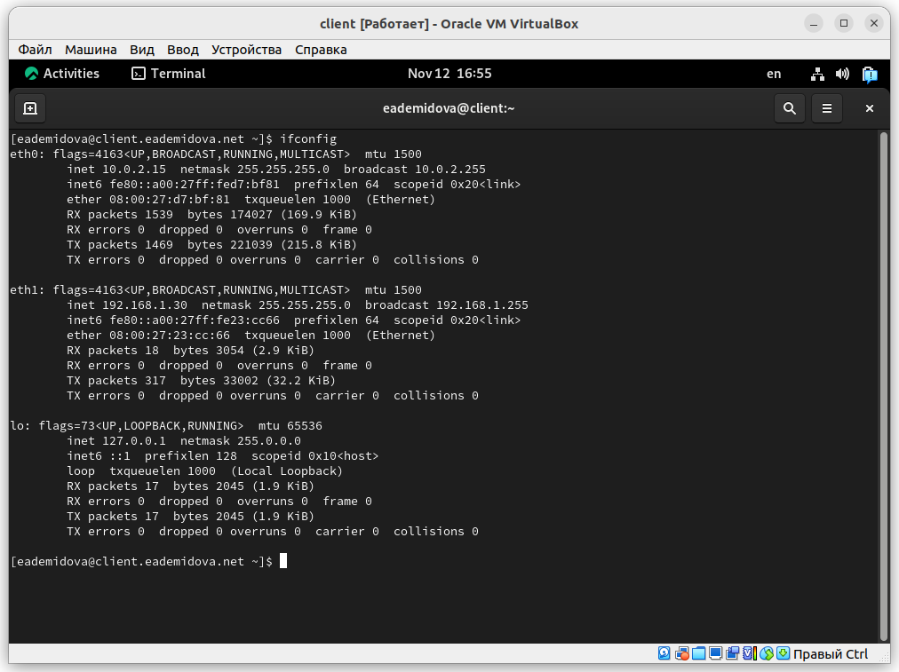{#fig:015 width=60%}

## Настройка обновления DNS-зоны

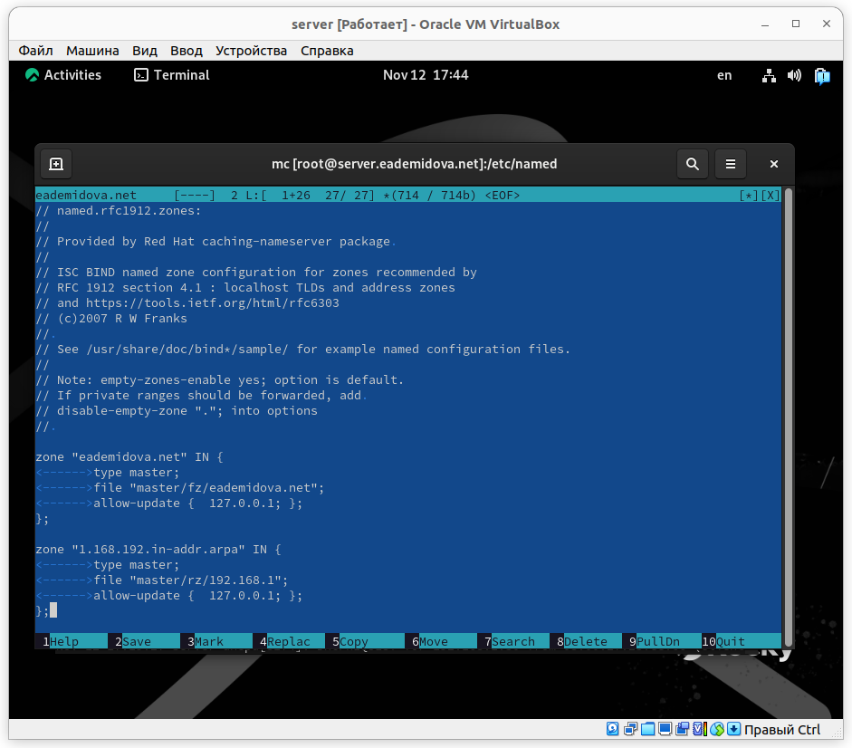{#fig:016 width=50%}

## Настройка обновления DNS-зоны

Затем перезапустим  DNS-сервер командой:

```
systemctl restart named
```
## Настройка обновления DNS-зоны

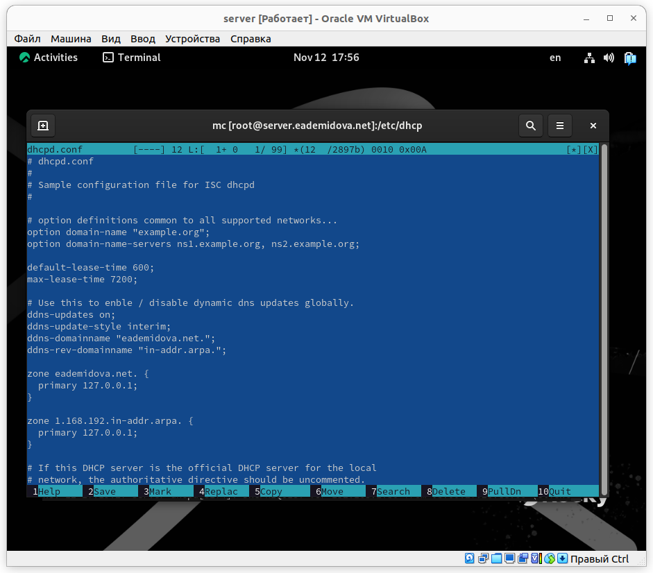{#fig:017 width=50%}

## Настройка обновления DNS-зоны

{#fig:018 width=70%}

## Анализ работы DHCP-сервера после настройки обновления DNS-зоны

С помощью утилиты dig убедимся в наличии DNS-записи о клиенте в прямой DNS-зоне:

```
dig @192.168.1.1 client.eademidova.net
```

## Внесение изменений в настройки внутреннего окружения виртуальной машины

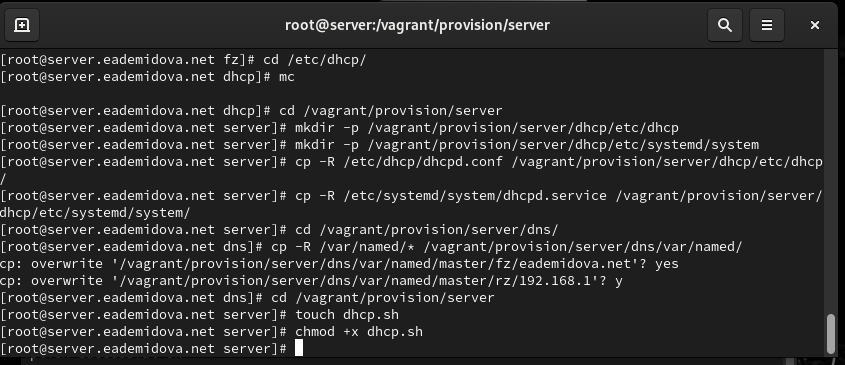{#fig:019 width=70%}

## Внесение изменений в настройки внутреннего окружения виртуальной машины

Запишем в dhcp.sh следующий скрипт:

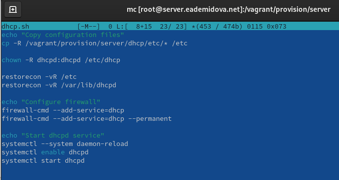{#fig:020 width=70%}

## Внесение изменений в настройки внутреннего окружения виртуальной машины

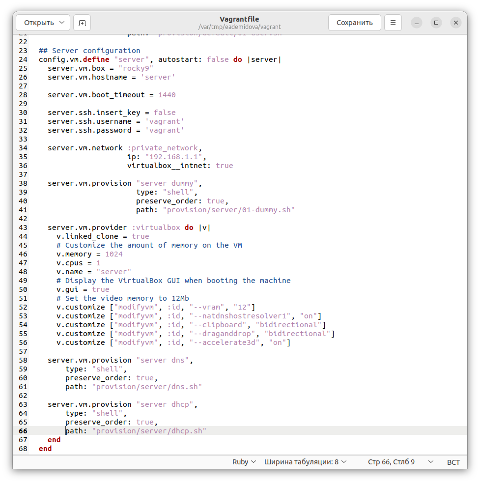{#fig:021 width=50%}

# Заключение

## Выводы

В результате выполнения данной работы были приобретены практические навыки по установке и конфигурированию DHCP-сервера.