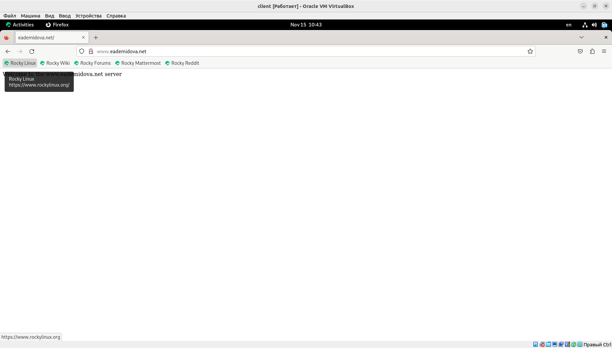
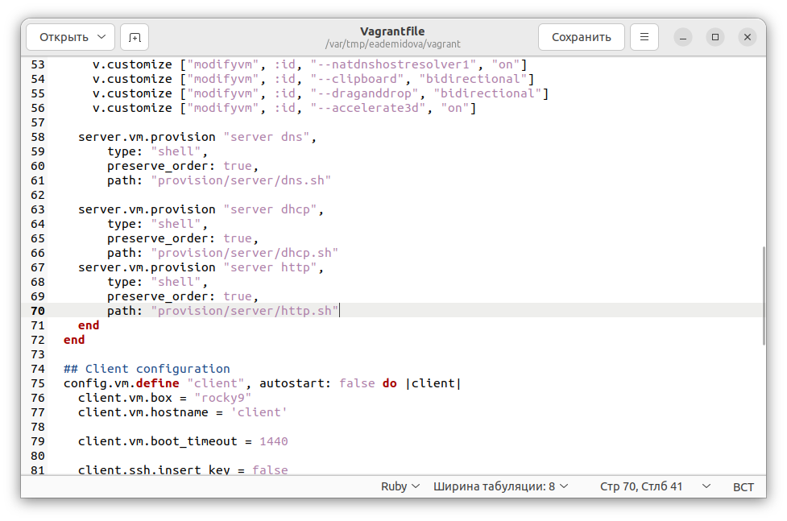

---
## Front matter
lang: ru-RU
title: Лабораторная работа №4
subtitle: Базовая настройка HTTP-сервера Apache
author:
  - Демидова Е. А.
institute:
  - Российский университет дружбы народов, Москва, Россия
date: 17 ноября 2023 

## i18n babel
babel-lang: russian
babel-otherlangs: english

## Formatting pdf
toc: false
toc-title: Содержание
slide_level: 2
aspectratio: 169
section-titles: true
theme: metropolis
header-includes:
 - \metroset{progressbar=frametitle,sectionpage=progressbar,numbering=fraction}
 - '\makeatletter'
 - '\beamer@ignorenonframefalse'
 - '\makeatother'
---

# Вводная часть

## Цель работы

Приобретение практических навыков по установке и базовому конфигурированию HTTP-сервера Apache.

## Задание

1. Установите необходимые для работы HTTP-сервера пакеты.
2. Запустите HTTP-сервер с базовой конфигурацией и проанализируйте его работу.
3. Настройте виртуальный хостинг.
4. Напишите скрипт для Vagrant, фиксирующий действия по установке и настройке HTTP-сервера во внутреннем окружении виртуальной машины server. Соответствующим образом внесите изменения в Vagrantfile

# Выполнение лабораторной работы

## Установка HTTP-сервера

{#fig:001 width=50%}

## Базовое конфигурирование HTTP-сервера

{#fig:002 width=50%}

## Базовое конфигурирование HTTP-сервера

{#fig:003 width=50%}

## Базовое конфигурирование HTTP-сервера

```
systemctl enable httpd
systemctl start httpd
```

## Базовое конфигурирование HTTP-сервера

{#fig:004 width=50%}

## Анализ работы HTTP-сервера

{#fig:005 width=60%}

## Анализ работы HTTP-сервера

{#fig:006 width=50%}

## Анализ работы HTTP-сервера

{#fig:007 width=50%}

## Настройка виртуального хостинга для HTTP-сервера

Запись для HTTP-сервера в конце файла прямой DNS-зоны /var/named/master/fz/eademidova.net:
```
server A 192.168.1.1
www A 192.168.1.1
```
Конец файла обратной зоны /var/named/master/rz/192.168.1:
```
1 PTR server.eademidova.net.
1 PTR www.eademidova.net.
```

## Настройка виртуального хостинга для HTTP-сервера

```
cd /etc/httpd/conf.d
touch server.eademidova.net.conf
touch www.eademidova.net.conf
```

## Настройка виртуального хостинга для HTTP-сервера

{#fig:008 width=70%}

## Настройка виртуального хостинга для HTTP-сервера

{#fig:009 width=70%}

## Настройка виртуального хостинга для HTTP-сервера

```
cd /var/www/html
mkdir server.eademidova.net
cd /var/www/html/server.eademidova.net
touch index.htm
```

## Настройка виртуального хостинга для HTTP-сервера

{#fig:010 width=70%}

## Настройка виртуального хостинга для HTTP-сервера

```
cd /var/www/html
mkdir www.eademidova.net
cd /var/www/html/www.eademidova.net
touch index.htm
```

## Настройка виртуального хостинга для HTTP-сервера

{#fig:011 width=70%}

## Настройка виртуального хостинга для HTTP-сервера

Копирование права доступа в каталог с веб-контентом командой:
```
chown -R apache:apache /var/www
```
Затем восстановим контекст безопасности:
```
restorecon -vR /etc
restorecon -vR /var/named
restorecon -vR /var/www
```
Перезапуск HTTP-сервера:  `systemctl restart httpd`

## Настройка виртуального хостинга для HTTP-сервера

{#fig:012 width=70%}

## Настройка виртуального хостинга для HTTP-сервера

{#fig:013 width=70%}

## Внесение изменений в настройки внутреннего окружения виртуальной машины

{#fig:014 width=60%}

## Внесение изменений в настройки внутреннего окружения виртуальной машины

{#fig:015 width=60%}

## Внесение изменений в настройки внутреннего окружения виртуальной машины

{#fig:021 width=70%}

# Заключение

## Выводы

В результате выполнения данной работы были приобретены практические навыки по установке и базовому конфигурированию HTTP-сервера Apache.