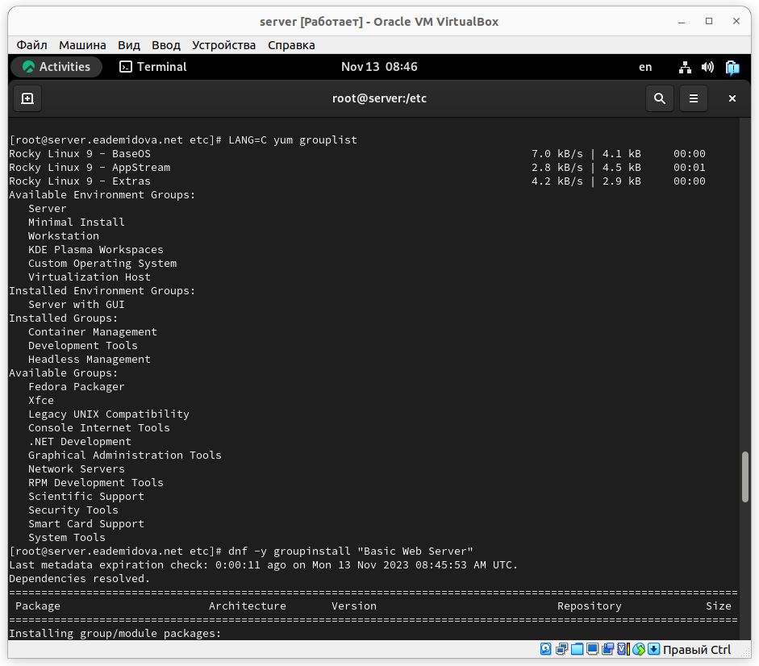
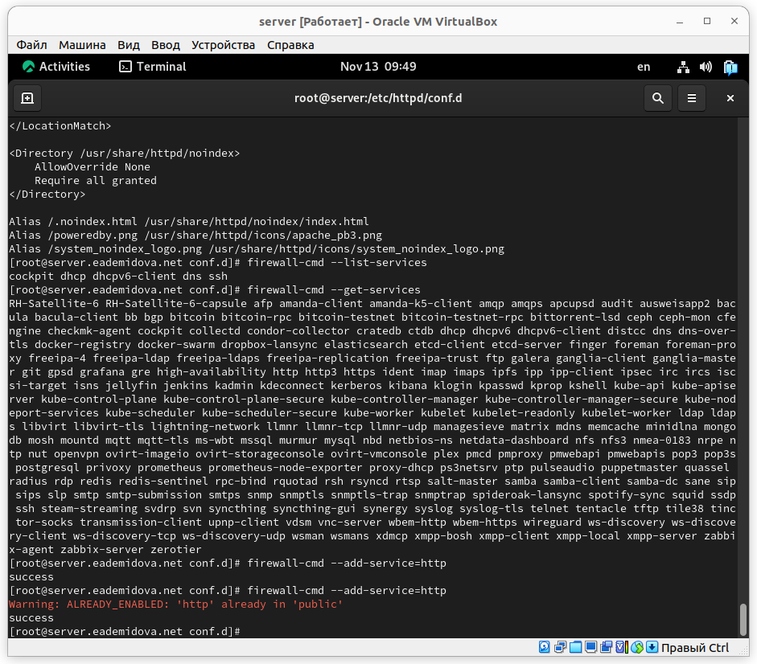
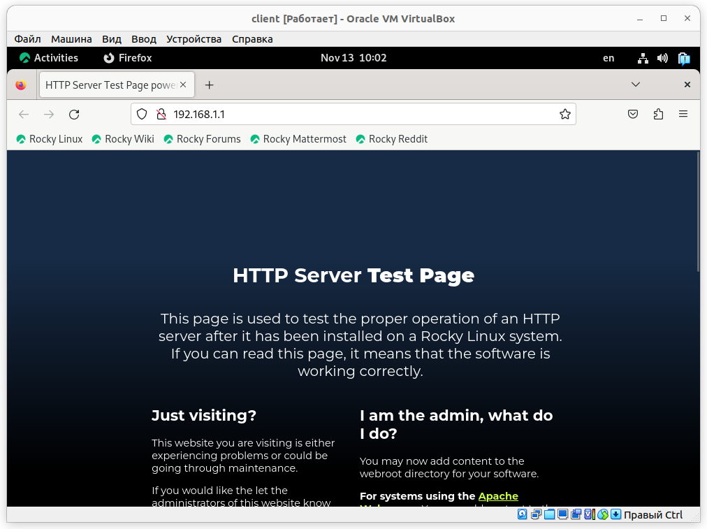
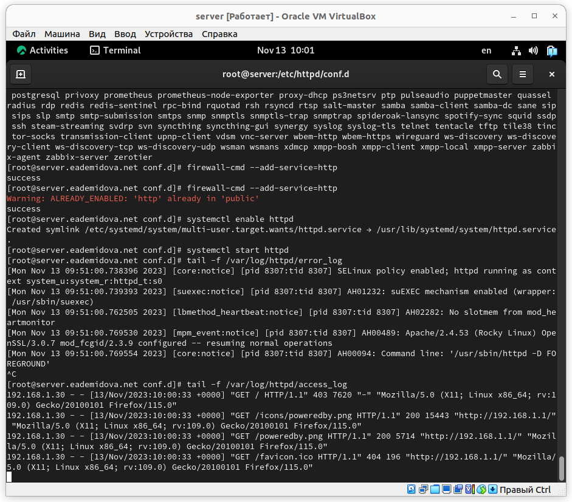
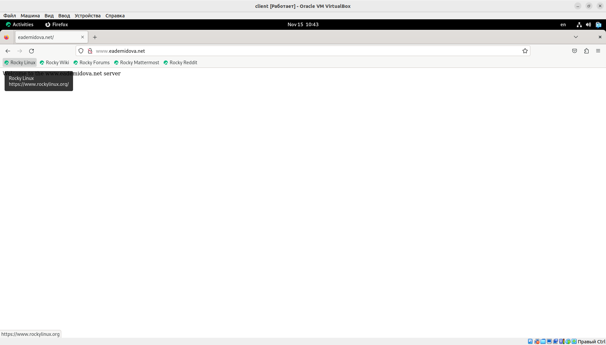
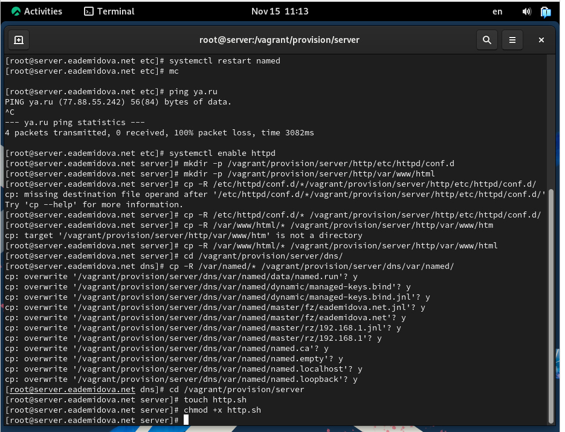
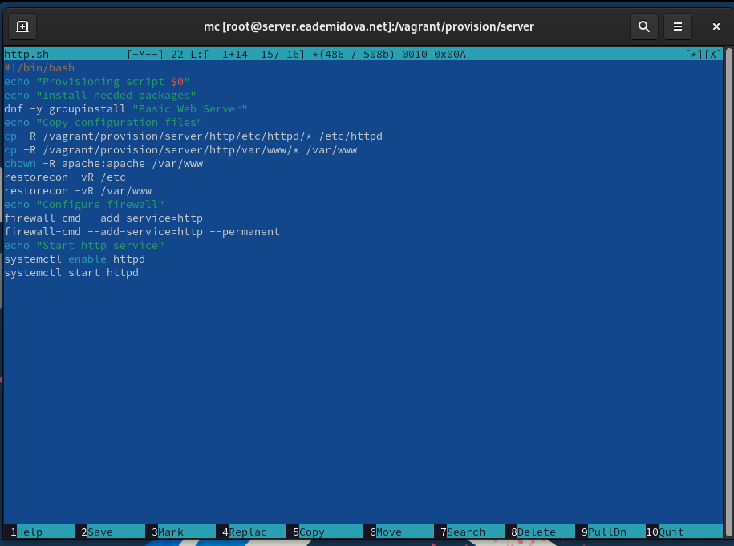

---
## Front matter
title: "Лабораторная работа №4"
subtitle: "Базовая настройка HTTP-сервера Apache"
author: "Демидова Екатерина Алексеевна"

## Generic otions
lang: ru-RU
toc-title: "Содержание"

## Bibliography
bibliography: bib/cite.bib
csl: pandoc/csl/gost-r-7-0-5-2008-numeric.csl

## Pdf output format
toc: true # Table of contents
toc-depth: 2
lof: true # List of figures
lot: false # List of tables
fontsize: 12pt
linestretch: 1.5
papersize: a4
documentclass: scrreprt
## I18n polyglossia
polyglossia-lang:
  name: russian
  options:
	- spelling=modern
	- babelshorthands=true
polyglossia-otherlangs:
  name: english
## I18n babel
babel-lang: russian
babel-otherlangs: english
## Fonts
mainfont: PT Serif
romanfont: PT Serif
sansfont: PT Sans
monofont: PT Mono
mainfontoptions: Ligatures=TeX
romanfontoptions: Ligatures=TeX
sansfontoptions: Ligatures=TeX,Scale=MatchLowercase
monofontoptions: Scale=MatchLowercase,Scale=0.9
## Biblatex
biblatex: true
biblio-style: "gost-numeric"
biblatexoptions:
  - parentracker=true
  - backend=biber
  - hyperref=auto
  - language=auto
  - autolang=other*
  - citestyle=gost-numeric
## Pandoc-crossref LaTeX customization
figureTitle: "Рис."
tableTitle: "Таблица"
listingTitle: "Листинг"
lofTitle: "Список иллюстраций"
lotTitle: "Список таблиц"
lolTitle: "Листинги"
## Misc options
indent: true
header-includes:
  - \usepackage{indentfirst}
  - \usepackage{float} # keep figures where there are in the text
  - \floatplacement{figure}{H} # keep figures where there are in the text
---

# Цель работы

Приобретение практических навыков по установке и базовому конфигурированию HTTP-сервера Apache.

# Задание

1. Установите необходимые для работы HTTP-сервера пакеты.
2. Запустите HTTP-сервер с базовой конфигурацией и проанализируйте его работу.
3. Настройте виртуальный хостинг.
4. Напишите скрипт для Vagrant, фиксирующий действия по установке и настройке HTTP-сервера во внутреннем окружении виртуальной машины server. Соответствующим образом внесите изменения в Vagrantfile

# Выполнение лабораторной работы

## Установка HTTP-сервера

Загрузим нашу операционную систему и перейдем в рабочий каталог с проектом:
```
cd /var/tmp/eademidova/vagran
```
Затем запустим виртуальную машину server:
```
make server-up
```

На виртуальной машине server войдем под созданным в предыдущей работе
пользователем и откроем терминал. Перейдем в режим суперпользователя и установим стандартный веб-сервер(рис. @fig:001):

{#fig:001 width=70%}

## Базовое конфигурирование HTTP-сервера


Просмотрим содержание конфигурационных файлов в каталогах /etc/httpd/conf и /etc/httpd/conf.d.
В каталоге /etc/httpd/conf лежат файлы httpd.conf и magic. Первый -- это основной файл конфигурации HTTP-сервера Apache. Он содержит директивы конфигурации, которые дают серверу инструкции. Второй -- данные для модуля mod_mime_magic, этот модуль определяет тип MIME файлов так же, как работает команда Unix file(1): она просматривает первые несколько байтов файла. Он задуман как «вторая линия защиты» в случаях, которые mod_mime не может разрешить. Этот модуль создан на основе бесплатной версии команды file(1) для Unix, которая использует «магические числа» и другие подсказки по содержимому файла, чтобы выяснить, что это за содержимое.
В каталоге /etc/httpd/conf.d лежат файлы autoindex.conf(настраивант листинг директорий по http, средствами веб-сервера),  fcgid.conf(настраивает клиент-серверный протокол взаимодействия веб-сервера и приложения),  manual.conf(позволяет получить доступ к руководству по адресу http://localhost/manual/),  ssl.conf(SSL-конфигурация, SSL – это протокол для безопасной передачи кодированных данных между веб-браузером и веб-сервером.), userdir.conf(конфигурация userdir  - позволяет пользователям размещать материалы на сайте, без предоставления доступа к директориям Web-сервера),  welcome.conf(включает страницу «Добро пожаловать» по умолчанию, если она есть).

Внесем изменения в настройки межсетевого экрана узла server, разрешив работу с http(рис. @fig:002):

{#fig:002 width=70%}

В дополнительном терминале запустим в режиме реального времени расширенный лог системных сообщений, чтобы проверить корректность работы системы(рис. @fig:003):

{#fig:003 width=70%}

В первом терминале активируем и запустим HTTP-сервер следующими командами:

```
systemctl enable httpd
systemctl start httpd
```

Просмотрим расширенный лог системных сообщений, чтобы убедиться, что веб-сервер успешно запустился(рис. @fig:004):

{#fig:004 width=70%}

## Анализ работы HTTP-сервера

Запустим виртуальную машину client:
```
make client-up
```
На виртуальной машине server просмотрим лог ошибок работы веб-сервера и запустим мониторинг доступа к веб-серверу.

Затем виртуальной машине client запустим браузер и в адресной строке введите 192.168.1.1.(рис. @fig:005):

{#fig:005 width=70%}

Посмотрим информацию, отразившуюся при мониторинге(@fig:006, @fig:007):

{#fig:006 width=70%}

{#fig:007 width=70%}

Можно увидеть ip-адрес устройства, зашедшего на веб-сервер, дату доступа, версию браузера, информацию об устройстве(его ОС и архитектура).

## Настройка виртуального хостинга для HTTP-сервера

Остановим работу DNS-сервера для внесения изменений в файлы описания DNS-зон:
```
systemctl stop named
```
Добавим запись для HTTP-сервера в конце файла прямой DNS-зоны /var/named/master/fz/eademidova.net:
```
server A 192.168.1.1
www A 192.168.1.1
```
и в конце файла обратной зоны /var/named/master/rz/192.168.1:
```
1 PTR server.eademidova.net.
1 PTR www.eademidova.net.
```
Также удалим из этих каталогов файлы журналов DNS: user.net.jnl и 192.168.1.jnl.

Затем перезапустим DNS-сервер командой:
```
systemctl start named
```

В каталоге /etc/httpd/conf.d создадим файлы server.eademidova.net.conf и www.eademidova.net.conf командами:
```
cd /etc/httpd/conf.d
touch server.eademidova.net.conf
touch www.eademidova.net.conf
```

Откроем на редактирование файл server.eademidova.net.conf и внесем следующее содержание(@fig:008):

{#fig:008 width=70%}

Откроем на редактирование файл www.eademidova.net.conf и внесем следующее содержание(рис. @fig:009):

{#fig:009 width=70%}

Перейдем в каталог /var/www/html, в котором должны находиться файлы с содержимым (контентом) веб-серверов, и создадим тестовые страницы для виртуальных веб-серверов server.eademidova.net и www.eademidova.net. Для виртуального веб-сервера server.eademidova.net:
```
cd /var/www/html
mkdir server.eademidova.net
cd /var/www/html/server.eademidova.net
touch index.htm
```
Откроем на редактирование файл index.html и внесем следующее содержание (рис. @fig:010):

{#fig:010 width=70%}

Для виртуального веб-сервера www.eademidova.net:
```
cd /var/www/html
mkdir www.eademidova.net
cd /var/www/html/www.eademidova.net
touch index.htm
```
Откроем на редактирование файл index.html и внесем следующее содержание (рис. @fig:011):

{#fig:011 width=70%}

Теперь скопируем права доступа в каталог с веб-контентом командой:
```
chown -R apache:apache /var/www
```
Затем восстановим контекст безопасности:
```
restorecon -vR /etc
restorecon -vR /var/named
restorecon -vR /var/www
```
И тперь перезапустим HTTP-сервер командой  `systemctl restart httpd`.

На виртуальной машине client убедимся в корректном доступе к веб-серверу по адресам server.eademidova.net и www.eademidova.net в адресной строке веб-браузера(рис. @fig:012, @fig:013):

{#fig:012 width=70%}

{#fig:013 width=70%}

## Внесение изменений в настройки внутреннего окружения виртуальной машины

На виртуальной машине server перейдем в каталог для внесения изменений в настройки внутреннего окружения /vagrant/provision/server/, создадим в нём каталог http, в который поместим в соответствующие подкаталоги конфигурационные файлы HTTP-сервера, затем заменим конфигурационные файлы DNS-сервера и в каталоге /vagrant/provision/server создадим исполняемый файл http.sh(рис. @fig:014)

{#fig:014 width=70%}

Открыв http.sh на редактирование, пропишем в нём следующий скрипт(@fig:015):

{#fig:015 width=70%}

Для отработки созданного скрипта во время загрузки виртуальной машины server в конфигурационном файле Vagrantfile добавим в разделе конфигурации для сервера(@fig:016):

{#fig:021 width=70%}

# Контрольные вопросы

1. Через какой порт по умолчанию работает Apache?

По умолчанию Apache работает через порт 80.

2. Под каким пользователем запускается Apache и к какой группе относится этот пользо-
ватель?

Apache обычно запускается под пользователем "www-data" и относится к группе "www-data".

3. Где располагаются лог-файлы веб-сервера? Что можно по ним отслеживать?

Лог-файлы веб-сервера обычно располагаются в каталоге /var/log/apache2. Можно отслеживать доступ, ошибки, запросы и другую информацию.

4. Где по умолчанию содержится контент веб-серверов?

Контент веб-серверов по умолчанию содержится в каталоге /var/www/html.

5. Каким образом реализуется виртуальный хостинг? Что он даёт

Виртуальный хостинг реализуется через конфигурацию веб-сервера, позволяя одному серверу обслуживать несколько доменов. Он дает возможность размещать несколько веб-сайтов на одном сервере.

# Выводы

В результате выполнения данной работы были приобретены практические навыки по установке и базовому конфигурированию HTTP-сервера Apache.

