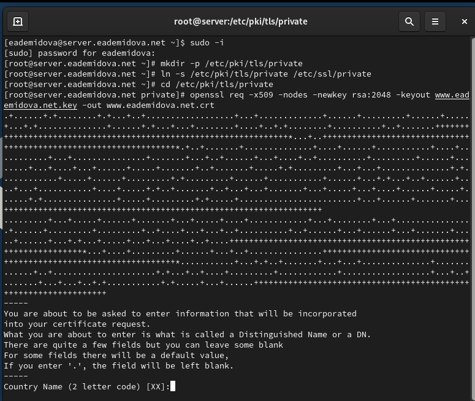
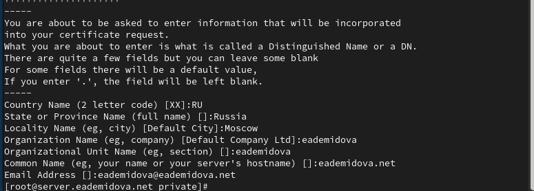
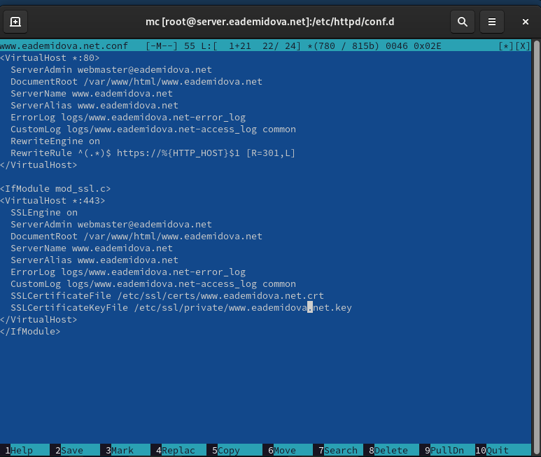
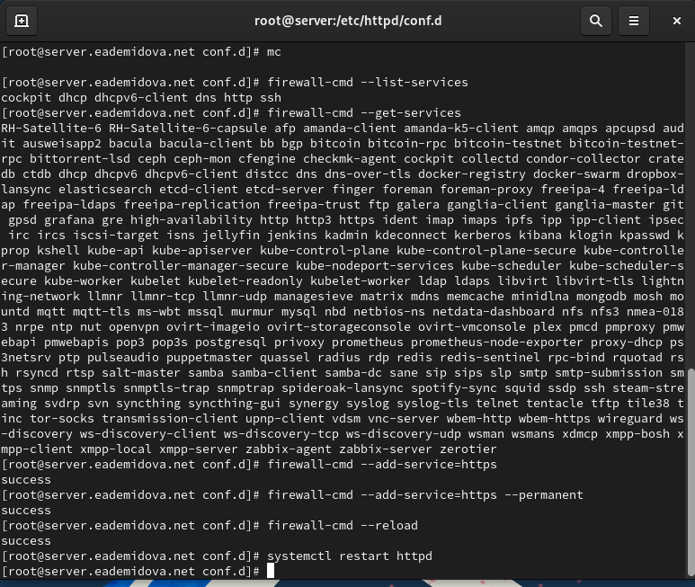
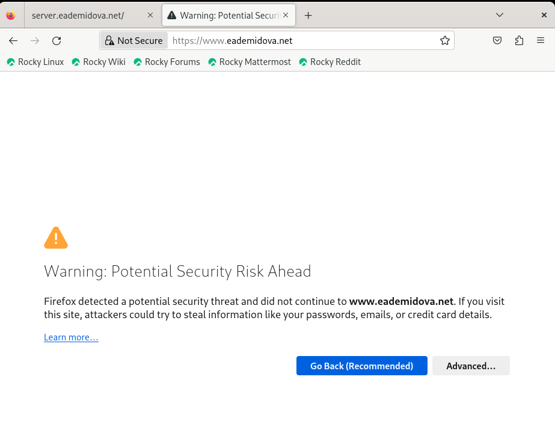
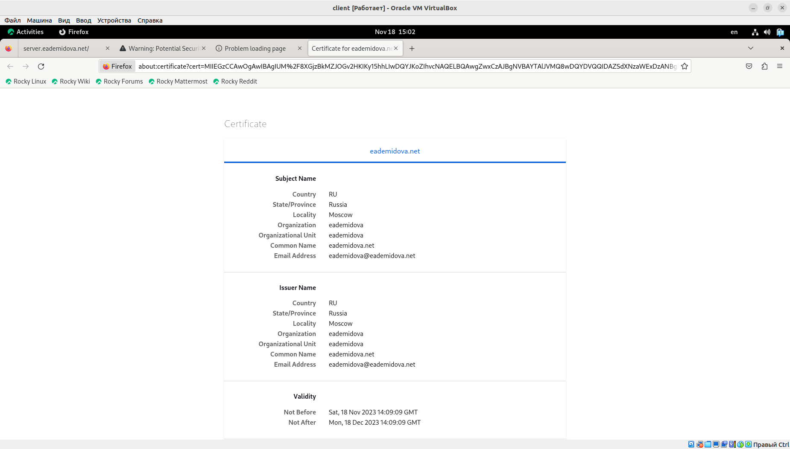
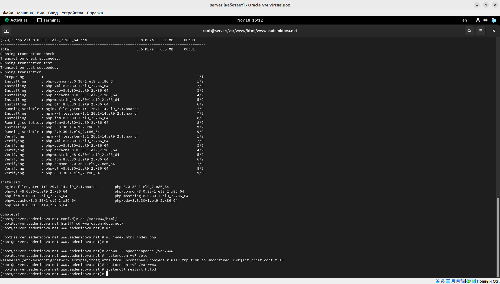
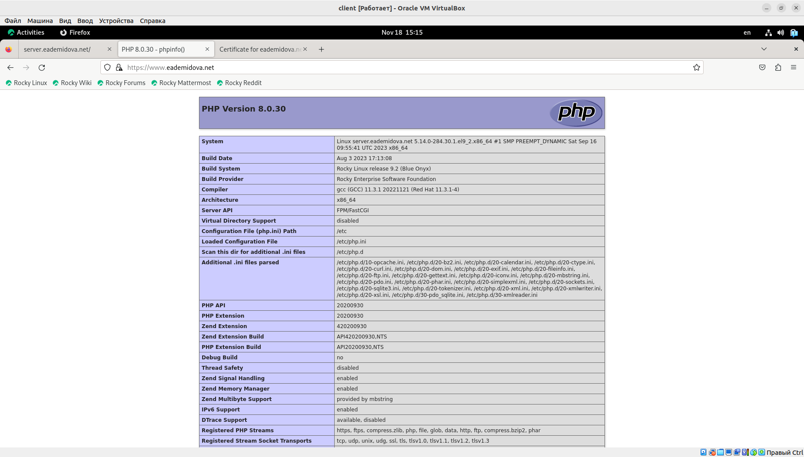
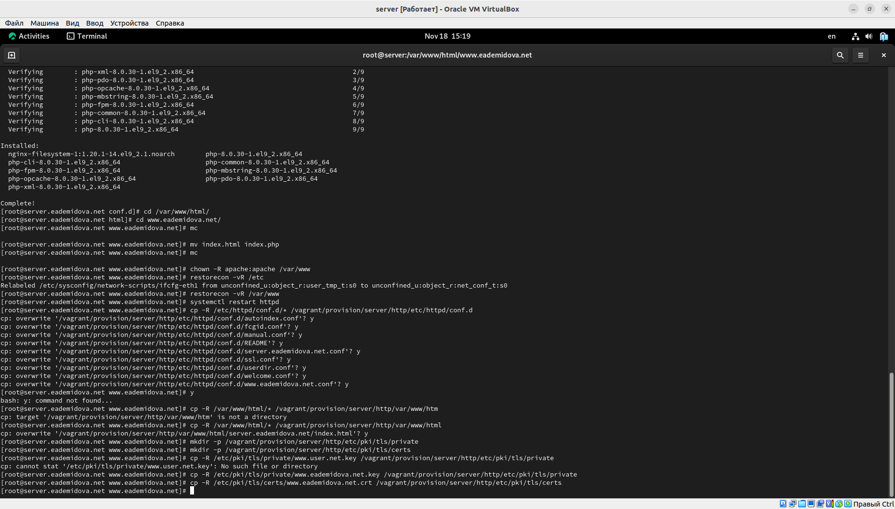
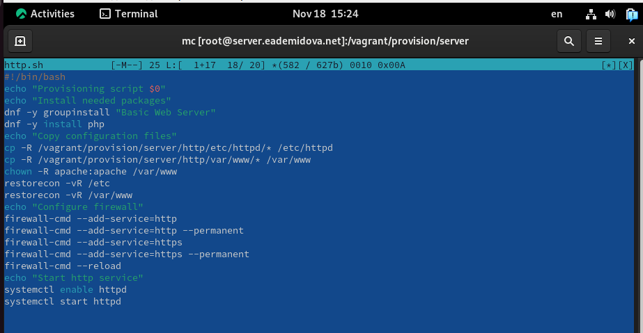

---
## Front matter
lang: ru-RU
title: Лабораторная работа №5
subtitle: Расширенная настройка HTTP-сервера Apache
author:
  - Демидова Е. А.
institute:
  - Российский университет дружбы народов, Москва, Россия
date: 17 ноября 2023 

## i18n babel
babel-lang: russian
babel-otherlangs: english

## Formatting pdf
toc: false
toc-title: Содержание
slide_level: 2
aspectratio: 169
section-titles: true
theme: metropolis
header-includes:
 - \metroset{progressbar=frametitle,sectionpage=progressbar,numbering=fraction}
 - '\makeatletter'
 - '\beamer@ignorenonframefalse'
 - '\makeatother'
---

# Вводная часть

## Цель работы

Приобретение практических навыков по расширенному конфигурированию HTTP-сервера Apache в части безопасности и возможности использования PHP.

## Задание

1. Сгенерируйте криптографический ключ и самоподписанный сертификат безопасности для возможности перехода веб-сервера от работы через протокол HTTP к работе через протокол HTTPS.
2. Настройте веб-сервер для работы с PHP.
3. Напишите (или скорректируйте) скрипт для Vagrant, фиксирующий действия по расширенной настройке HTTP-сервера во внутреннем окружении виртуальной машины server.

# Выполнение лабораторной работы

## Конфигурирование HTTP-сервера для работы через протокол HTTPS

{#fig:001 width=55%}

## Конфигурирование HTTP-сервера для работы через протокол HTTPS

{#fig:002 width=70%}

## Конфигурирование HTTP-сервера для работы через протокол HTTPS

{#fig:003 width=55%}

## Конфигурирование HTTP-сервера для работы через протокол HTTPS

{#fig:004 width=55%}

## Конфигурирование HTTP-сервера для работы через протокол HTTPS

{#fig:005 width=55%}

## Конфигурирование HTTP-сервера для работы через протокол HTTPS

{#fig:006 width=70%}

## Конфигурирование HTTP-сервера для работы с PHP

Установим пакеты для работы с PHP, затем в каталоге /var/www/html/www.eademidova.net заменим файл index.html на index.php следующего содержания:
```
<?php
phpinfo();
?>
```

## Конфигурирование HTTP-сервера для работы с PHP

{#fig:007 width=70%}

## Конфигурирование HTTP-сервера для работы с PHP

{#fig:008 width=70%}

## Внесение изменений в настройки внутреннего окружения виртуальной машины

{#fig:009 width=70%}

## Внесение изменений в настройки внутреннего окружения виртуальной машины

{#fig:010 width=70%}

# Заключение

## Выводы

В результате выполнения данной работы были приобретены практические навыки  по расширенному конфигурированию HTTP-сервера Apache в части безопасности и возможности использования PHP.