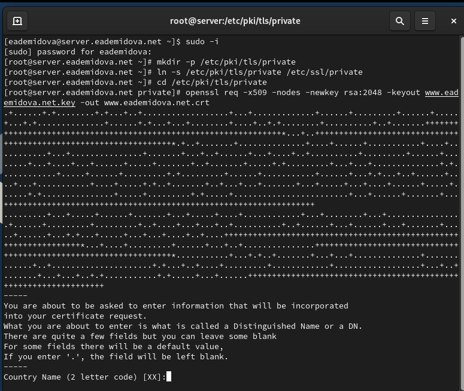
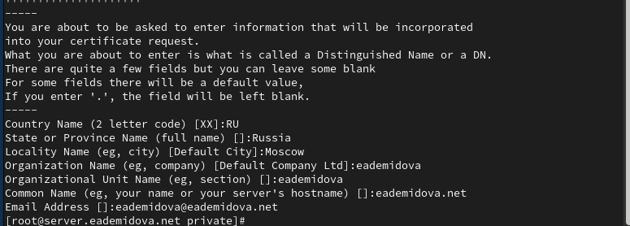
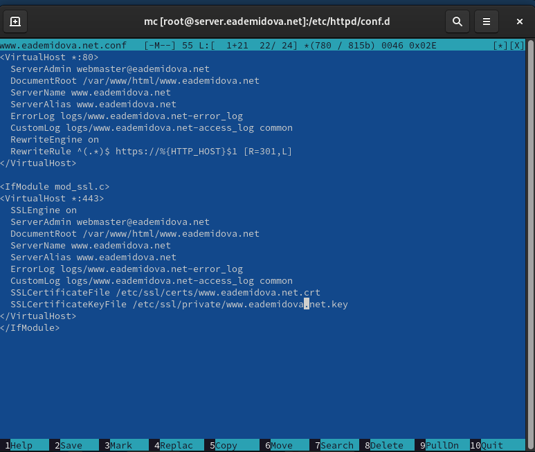
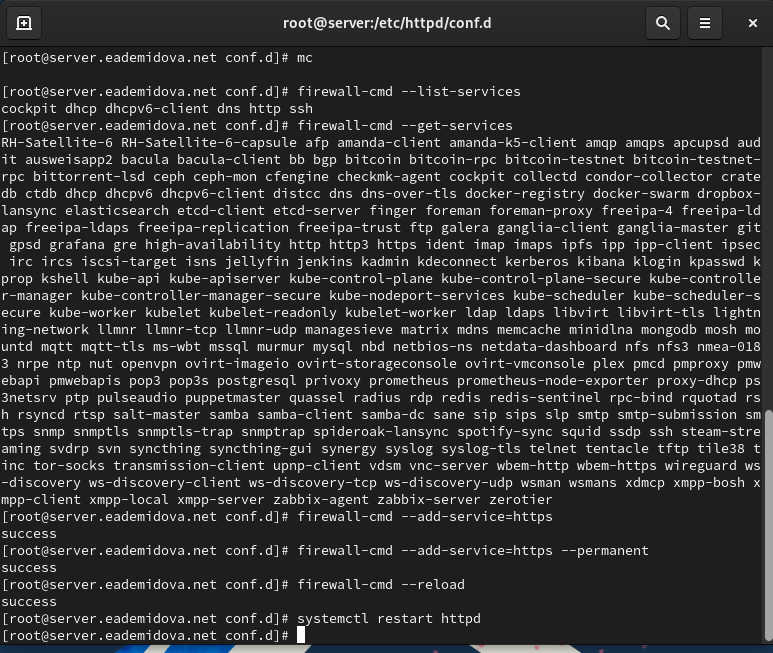
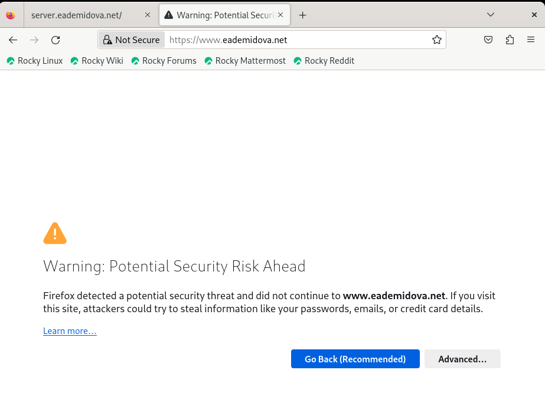
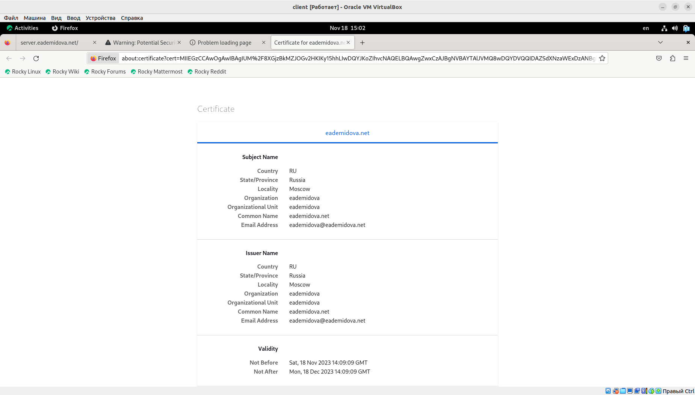
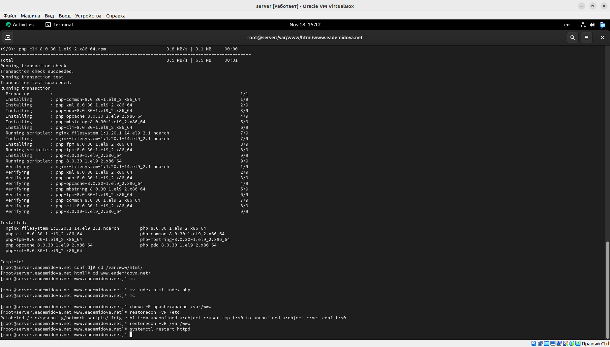
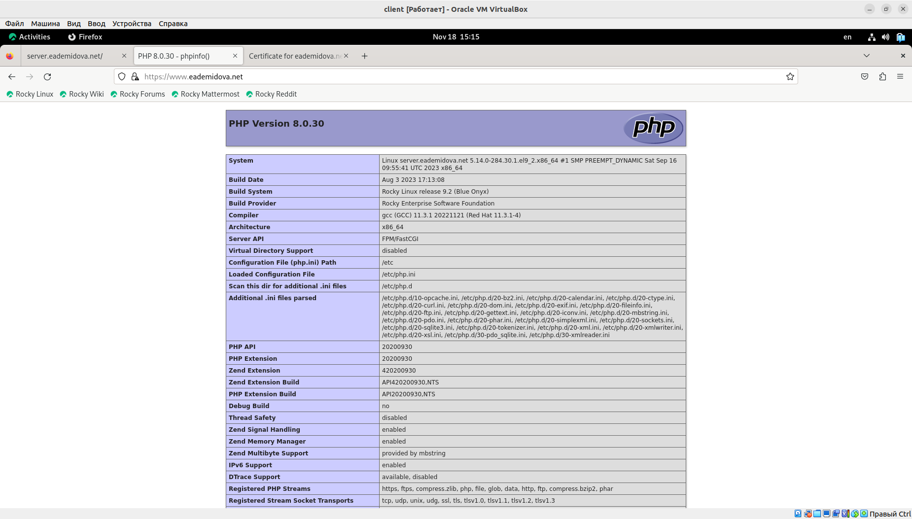
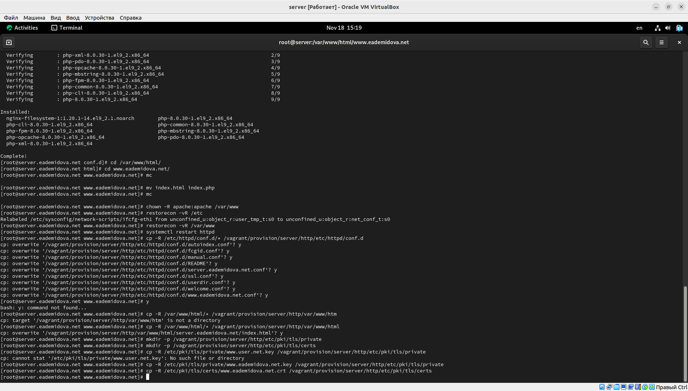
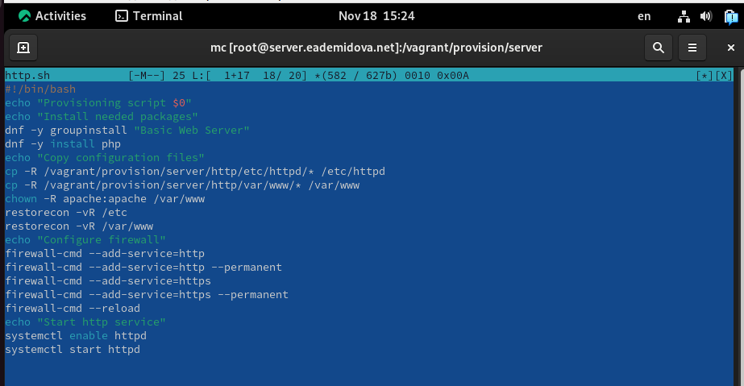

---
## Front matter
title: "Лабораторная работа №5"
subtitle: "Расширенная настройка HTTP-сервера Apache"
author: "Демидова Екатерина Алексеевна"

## Generic otions
lang: ru-RU
toc-title: "Содержание"

## Bibliography
bibliography: bib/cite.bib
csl: pandoc/csl/gost-r-7-0-5-2008-numeric.csl

## Pdf output format
toc: true # Table of contents
toc-depth: 2
lof: true # List of figures
lot: false # List of tables
fontsize: 12pt
linestretch: 1.5
papersize: a4
documentclass: scrreprt
## I18n polyglossia
polyglossia-lang:
  name: russian
  options:
	- spelling=modern
	- babelshorthands=true
polyglossia-otherlangs:
  name: english
## I18n babel
babel-lang: russian
babel-otherlangs: english
## Fonts
mainfont: PT Serif
romanfont: PT Serif
sansfont: PT Sans
monofont: PT Mono
mainfontoptions: Ligatures=TeX
romanfontoptions: Ligatures=TeX
sansfontoptions: Ligatures=TeX,Scale=MatchLowercase
monofontoptions: Scale=MatchLowercase,Scale=0.9
## Biblatex
biblatex: true
biblio-style: "gost-numeric"
biblatexoptions:
  - parentracker=true
  - backend=biber
  - hyperref=auto
  - language=auto
  - autolang=other*
  - citestyle=gost-numeric
## Pandoc-crossref LaTeX customization
figureTitle: "Рис."
tableTitle: "Таблица"
listingTitle: "Листинг"
lofTitle: "Список иллюстраций"
lotTitle: "Список таблиц"
lolTitle: "Листинги"
## Misc options
indent: true
header-includes:
  - \usepackage{indentfirst}
  - \usepackage{float} # keep figures where there are in the text
  - \floatplacement{figure}{H} # keep figures where there are in the text
---

# Цель работы

Приобретение практических навыков по расширенному конфигурированию HTTP-сервера Apache в части безопасности и возможности использования PHP.

# Задание

1. Сгенерируйте криптографический ключ и самоподписанный сертификат безопасности для возможности перехода веб-сервера от работы через протокол HTTP к работе через протокол HTTPS.
2. Настройте веб-сервер для работы с PHP.
3. Напишите (или скорректируйте) скрипт для Vagrant, фиксирующий действия по расширенной настройке HTTP-сервера во внутреннем окружении виртуальной машины server.

# Выполнение лабораторной работы

## Конфигурирование HTTP-сервера для работы через протокол HTTPS

Загрузим нашу операционную систему и перейдем в рабочий каталог с проектом:
```
cd /var/tmp/eademidova/vagran
```
Затем запустим виртуальную машину server:
```
make server-up
```

На виртуальной машине server войдем под созданным в предыдущей работе
пользователем и откроем терминал. Перейдем в режим суперпользователя. В каталоге /etc/ssl создадим каталог private сгенерируем ключ и сертификат, используя следующую команду (рис. @fig:001):

{#fig:001 width=70%}

Далее заполним сертификат(рис. @fig:002):

{#fig:002 width=70%}

Для перехода веб-сервера www.eademidova.net на функционирование через протокол HTTPS требуется изменить его конфигурационный файл. Перейдем в каталог с конфигурационными файлами(рис. @fig:003):

{#fig:003 width=70%}

Внесем изменения в настройки межсетевого экрана на сервере, разрешив работу с https и перезапустим веб-сервер(рис. @fig:004):

{#fig:004 width=70%}

Здесь в первом блоке указывается сервера администратора, указан файл, который используется для запроса, затем имя сервера, альтернативное имя хоста(в нашем случае такое же как основное), лог файл ошибок, лог файл расположения и журнала досутпа, включен механизм перезаписи, запрошенных URL-адресов и правило перезаписи. Во втором блоке настраивается ssl-доступ. Здесь порт 443. Кроме указанных в предыдущем блоке строк, также указан файл ssl-сертификата и его ключ.

На виртуальной машине client в строке браузера введем название веб-сервера www.eademidova.net и убедимся, что произойдёт автоматическое переключение на работу по протоколу HTTPS(рис. @fig:005):

{#fig:005 width=70%}

На открывшейся странице с сообщением о незащищённости соединения нажмем кнопку «Дополнительно», затем добавим адрес нашего сервера в постоянные исключения. Затем просмотрим содержание сертификата (нажав на значок с замком в адресной строке и кнопку «Подробнее»)(@fig:006):

{#fig:006 width=70%}

## Конфигурирование HTTP-сервера для работы с PHP

Установим пакеты для работы с PHP, затем в каталоге /var/www/html/www.eademidova.net заменим файл index.html на index.php следующего содержания:
```
<?php
phpinfo();
?>
```
Cкорректируем права доступа в каталог с веб-контентом, восстановим контекст безопасности в SELinux и перезапустим HTTP-сервер(@fig:007):

{#fig:007 width=70%}

На виртуальной машине client в строке браузера введем название веб-сервера www.eademidova.net и убедимся, что будет выведена страница с информацией об используемой на веб-сервере версии PHP(@fig:008):

{#fig:008 width=70%}

## Внесение изменений в настройки внутреннего окружения виртуальной машины

На виртуальной машине server перейдем в каталог для внесения изменений в настройки внутреннего окружения /vagrant/provision/server/http и в соответствующие каталоги скопируем конфигурационные файлы(рис. @fig:009)

{#fig:009 width=70%}

Открыв http.sh на редактирование, добавим в него следующие строки(@fig:010):

{#fig:010 width=70%}

# Контрольные вопросы

1. В чём отличие HTTP от HTTPS?

Основное отличие между HTTP и HTTPS заключается в том, что HTTPS использует шифрование для обеспечения безопасной передачи данных, в то время как HTTP передает информацию в открытом виде.

2. Каким образом обеспечивается безопасность контента веб-сервера при работе через
HTTPS?

Безопасность контента веб-сервера при работе через HTTPS обеспечивается с помощью шифрования данных, используя SSL/TLS протоколы, что позволяет защитить информацию от несанкционированного доступа.

3. Что такое сертификационный центр? Приведите пример.

Сертификационный центр (Certification authority, CA) представляет собой компонент глобальной службы каталогов, отвечающий за управление криптографическими ключами пользователей. Примеры: Let's Encrypt, Comodo, Symantec.

# Выводы

В результате выполнения данной работы были приобретены практические навыки  по расширенному конфигурированию HTTP-сервера Apache в части безопасности и возможности использования PHP.

