---
## Front matter
lang: ru-RU
title: Лабораторная работа №6
subtitle: Установка и настройка системы управления базами данных MariaDB
author:
  - Демидова Е. А.
institute:
  - Российский университет дружбы народов, Москва, Россия
date: 19 ноября 2023 

## i18n babel
babel-lang: russian
babel-otherlangs: english

## Formatting pdf
toc: false
toc-title: Содержание
slide_level: 2
aspectratio: 169
section-titles: true
theme: metropolis
header-includes:
 - \metroset{progressbar=frametitle,sectionpage=progressbar,numbering=fraction}
 - '\makeatletter'
 - '\beamer@ignorenonframefalse'
 - '\makeatother'
---

# Вводная часть

## Цель работы

Приобретение практических навыков по установке и конфигурированию системы управления базами данных на примере программного обеспечения MariaDB.

## Задание

1. Установите необходимые для работы MariaDB пакеты.
2. Настройте в качестве кодировки символов по умолчанию utf8 в базах данных.
3. В базе данных MariaDB создайте тестовую базу addressbook, содержащую таблицу city с полями name и city, т.е., например, для некоторого сотрудника указан город, в котором он работает.
4. Создайте резервную копию базы данных addressbook и восстановите из неё данные.
5. Напишите скрипт для Vagrant, фиксирующий действия по установке и настройке базы данных MariaDB во внутреннем окружении виртуальной машины server. Соответствующим образом внести изменения в Vagrantfile.

# Выполнение лабораторной работы

## Установка MariaDB

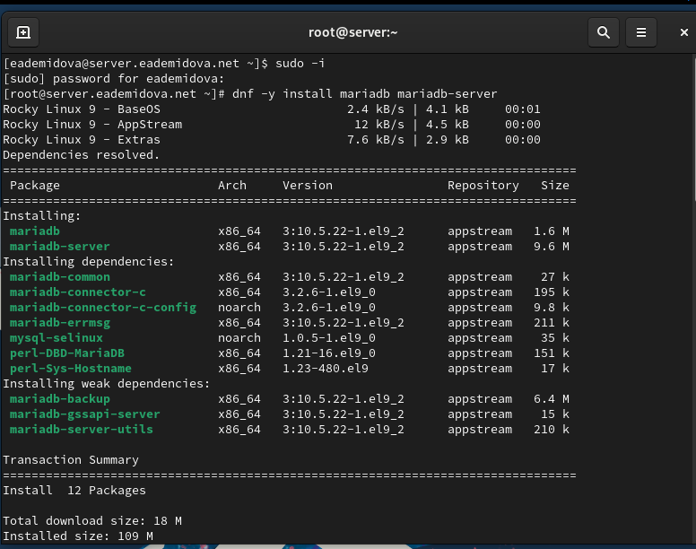{#fig:001 width=55%}

## Установка MariaDB

Для запуска и включения программного обеспечения mariadb используем:
```
systemctl start mariadb
systemctl enable mariadb
```
## Установка MariaDB

Убедимся, что mariadb прослушивает порт:

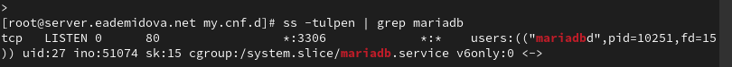{#fig:002 width=80%}

## Установка MariaDB

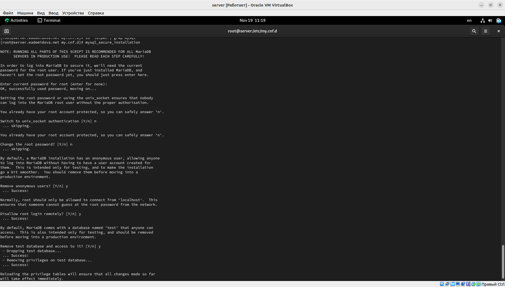{#fig:003 width=70%}

## Установка MariaDB

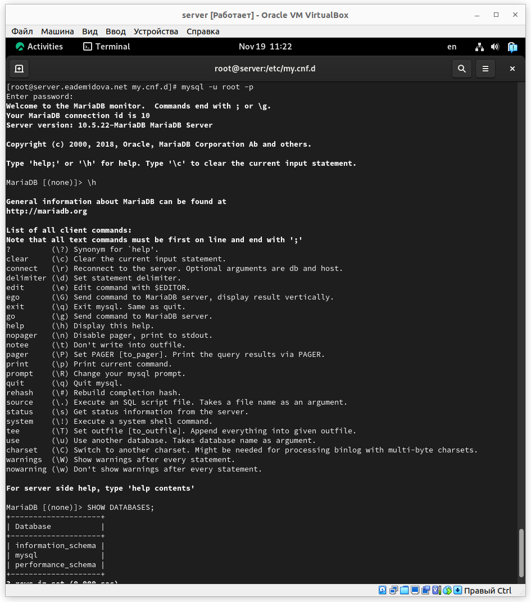{#fig:004 width=40%}

## Конфигурация кодировки символов

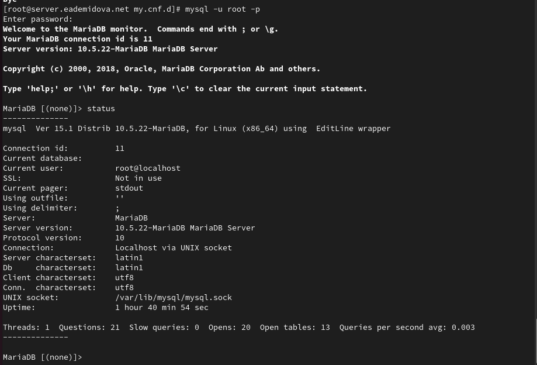{#fig:005 width=70%}

## Конфигурация кодировки символов

В каталоге /etc/my.cnf.d создадим файл utf8.cnf:
```
cd /etc/my.cnf.d
touch utf8.cnf
```
Откроем его на редактирование и укажем в нём следующую конфигурацию:
```
[client]
default-character-set = utf8
[mysqld]
character-set-server = utf8
```
Перезапустим MariaDB:
```
systemctl restart mariadb
```

## Конфигурация кодировки символов

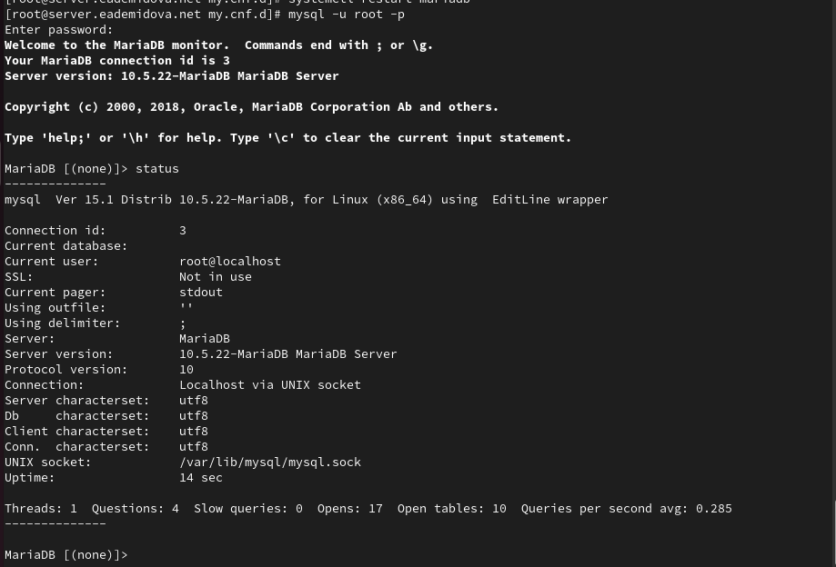{#fig:006 width=70%}

## Создание базы данных

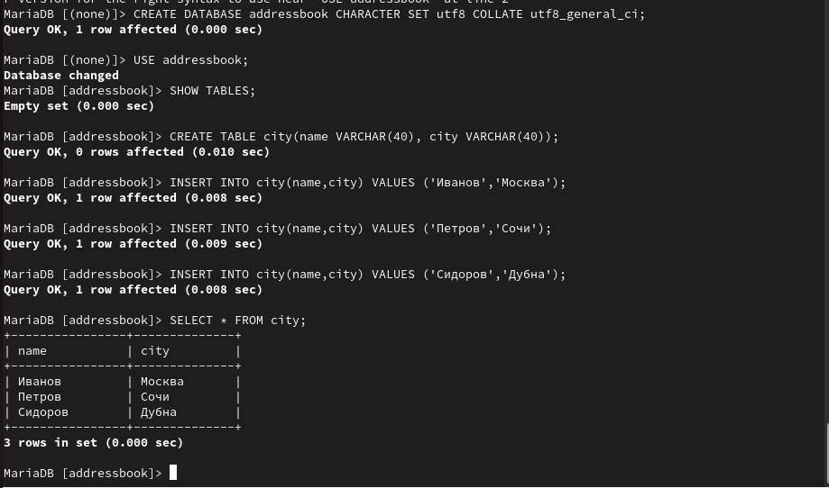{#fig:007 width=70%}

## Создание базы данных

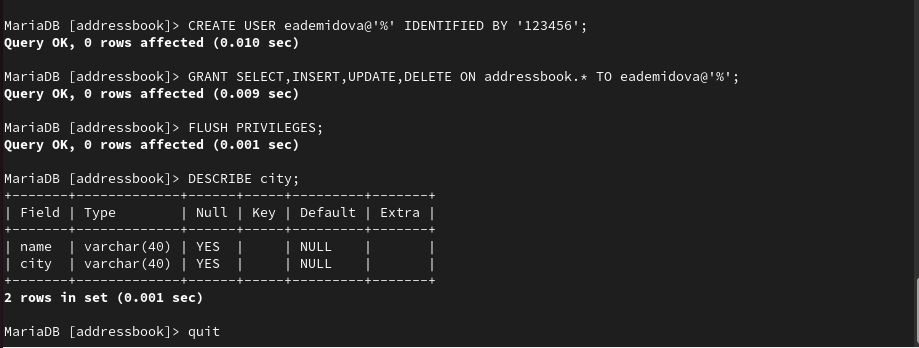{#fig:008 width=70%}

## Создание базы данных

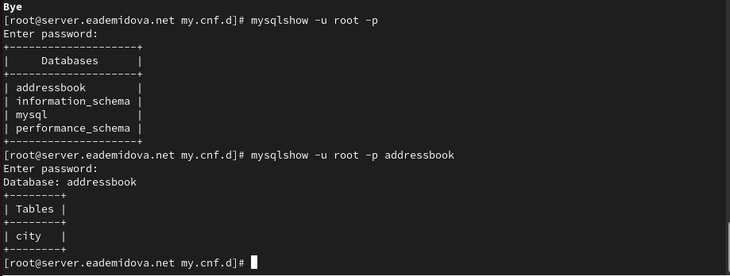{#fig:009 width=70%}

## Резервные копии

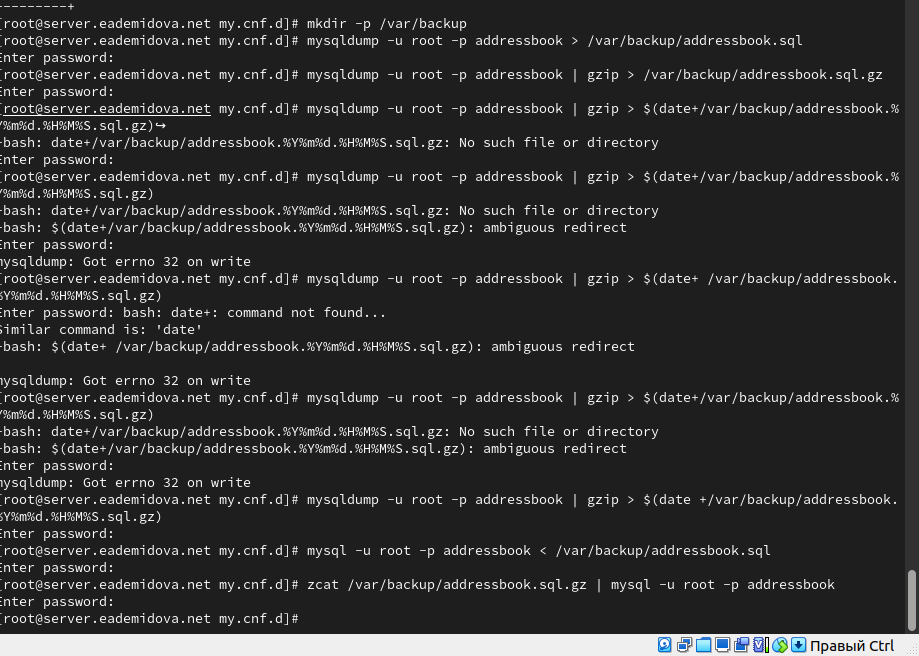{#fig:010 width=70%}

## Внесение изменений в настройки внутреннего окружения виртуальной машины

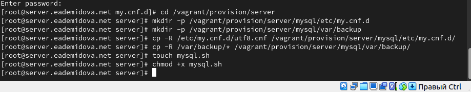{#fig:011 width=70%}

## Внесение изменений в настройки внутреннего окружения виртуальной машины

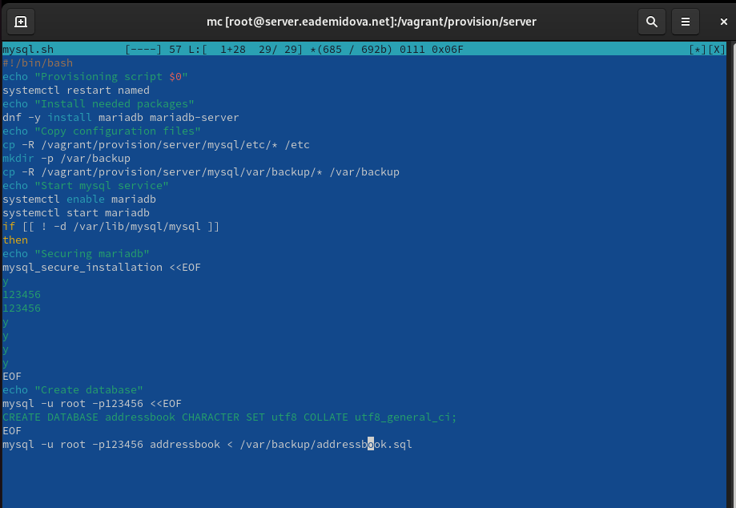{#fig:012 width=70%}

## Внесение изменений в настройки внутреннего окружения виртуальной машины

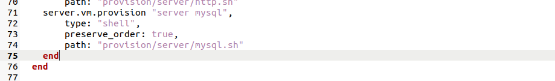{#fig:013 width=70%}

# Заключение

## Выводы

В результате выполнения данной работы были приобретены практические навыки по установке и конфигурированию системы управления базами данных на примере программного обеспечения MariaDB.