---
## Front matter
title: "Лабораторная работа №6"
subtitle: "Установка и настройка системы управления базами данных MariaDB"
author: "Демидова Екатерина Алексеевна"

## Generic otions
lang: ru-RU
toc-title: "Содержание"

## Bibliography
bibliography: bib/cite.bib
csl: pandoc/csl/gost-r-7-0-5-2008-numeric.csl

## Pdf output format
toc: true # Table of contents
toc-depth: 2
lof: true # List of figures
lot: false # List of tables
fontsize: 12pt
linestretch: 1.5
papersize: a4
documentclass: scrreprt
## I18n polyglossia
polyglossia-lang:
  name: russian
  options:
	- spelling=modern
	- babelshorthands=true
polyglossia-otherlangs:
  name: english
## I18n babel
babel-lang: russian
babel-otherlangs: english
## Fonts
mainfont: PT Serif
romanfont: PT Serif
sansfont: PT Sans
monofont: PT Mono
mainfontoptions: Ligatures=TeX
romanfontoptions: Ligatures=TeX
sansfontoptions: Ligatures=TeX,Scale=MatchLowercase
monofontoptions: Scale=MatchLowercase,Scale=0.9
## Biblatex
biblatex: true
biblio-style: "gost-numeric"
biblatexoptions:
  - parentracker=true
  - backend=biber
  - hyperref=auto
  - language=auto
  - autolang=other*
  - citestyle=gost-numeric
## Pandoc-crossref LaTeX customization
figureTitle: "Рис."
tableTitle: "Таблица"
listingTitle: "Листинг"
lofTitle: "Список иллюстраций"
lotTitle: "Список таблиц"
lolTitle: "Листинги"
## Misc options
indent: true
header-includes:
  - \usepackage{indentfirst}
  - \usepackage{float} # keep figures where there are in the text
  - \floatplacement{figure}{H} # keep figures where there are in the text
---

# Цель работы

Приобретение практических навыков по установке и конфигурированию системы управления базами данных на примере программного обеспечения MariaDB.

# Задание

1. Установите необходимые для работы MariaDB пакеты.
2. Настройте в качестве кодировки символов по умолчанию utf8 в базах данных.
3. В базе данных MariaDB создайте тестовую базу addressbook, содержащую таблицу city с полями name и city, т.е., например, для некоторого сотрудника указан город, в котором он работает.
4. Создайте резервную копию базы данных addressbook и восстановите из неё данные.
5. Напишите скрипт для Vagrant, фиксирующий действия по установке и настройке базы данных MariaDB во внутреннем окружении виртуальной машины server. Соответствующим образом внести изменения в Vagrantfile.

# Выполнение лабораторной работы

## Установка MariaDB

Загрузим нашу операционную систему и перейдем в рабочий каталог с проектом:
```
cd /var/tmp/eademidova/vagran
```
Затем запустим виртуальную машину server:
```
make server-up
```

Установим необходимые для работы с базами данных пакеты(рис. @fig:001):

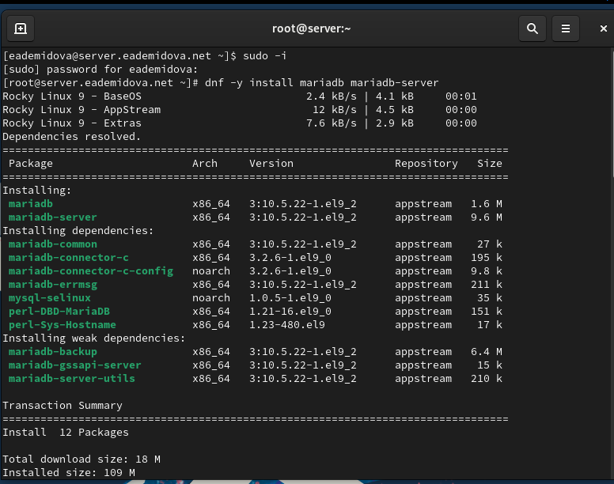{#fig:001 width=70%}

Просмотрим конфигурационные файлы mariadb в каталоге /etc/my.cnf.d и в фай-
ле /etc/my.cnf.
Рассмотрим файлы в каталоге /etc/my.cnf.d.

В файле auth_gssapi.cnf содержится закомментированная строчка для загрузки плагина аутентификации gssapi:
```
#plugin-load-add=auth_gssapi.so
```

В файле enable_encryption.preset содержится базовый шаблон для шифрования. 

```
[mariadb]
aria-encrypt-tables \\ опция для шифрования таблиц
encrypt-binlog \\ опция шиврования бинарных журналов сервера
encrypt-tmp-disk-tables \\ опция шифрования временных таблиц на диске
encrypt-tmp-files  \\ опция щифрования временных файлов
loose-innodb-encrypt-log  \\ опция выключения шифрования логов механизма innodb
loose-innodb-encrypt-tables \\ опция выключения шифрования таблиц с механизма innodb
```

В файле mysql-clients.cnf хранятся опции, читаемые разными перечисленными в файле группами.

```
[mysql]

[mysql_upgrade]

[mysqladmin]

[mysqlbinlog]

[mysqlcheck]

[mysqldump]

[mysqlimport]

[mysqlshow]

[mysqlslap]

```

В файле client.cnf хранятся опции, читаемые клиентскими программами MeSQL и MariaDB.

```
# These two groups are read by the client library
# Use it for options that affect all clients, but not the server
#


[client]

# This group is not read by mysql client library,
# If you use the same .cnf file for MySQL and MariaDB,
# use it for MariaDB-only client options
[client-mariadb]

```

В файле mariadb-server.cnf хранятся опции, читаемые сервером MariaDB. Сначала указан раздел, который читает только сервер. Затем раздел `[mysqld]`, читаемый автономным демоном mysqld, здесь уже указана директория для данных, сокет-файл, лог-файл ошибок, pid-файл. Затем раздел настроек сервера с поддержкой galera cluster, после место для раздела встроенного сервера, далее два раздела для серверов MariaDB.

```
#
# These groups are read by MariaDB server.
# Use it for options that only the server (but not clients) should see
#
# See the examples of server my.cnf files in /usr/share/mysql/
#

# this is read by the standalone daemon and embedded servers
[server]

# this is only for the mysqld standalone daemon
# Settings user and group are ignored when systemd is used.
# If you need to run mysqld under a different user or group,
# customize your systemd unit file for mysqld/mariadb according to the
# instructions in http://fedoraproject.org/wiki/Systemd
[mysqld]
datadir=/var/lib/mysql
socket=/var/lib/mysql/mysql.sock
log-error=/var/log/mariadb/mariadb.log
pid-file=/run/mariadb/mariadb.pid


#
# * Galera-related settings
#
[galera]
# Mandatory settings
#wsrep_on=ON
#wsrep_provider=
#wsrep_cluster_address=
#binlog_format=row
#default_storage_engine=InnoDB
#innodb_autoinc_lock_mode=2
#
# Allow server to accept connections on all interfaces.
#
#bind-address=0.0.0.0
#
# Optional setting
#wsrep_slave_threads=1
#innodb_flush_log_at_trx_commit=0

# this is only for embedded server
[embedded]

# This group is only read by MariaDB servers, not by MySQL.
# If you use the same .cnf file for MySQL and MariaDB,
# you can put MariaDB-only options here
[mariadb]

# This group is only read by MariaDB-10.5 servers.
# If you use the same .cnf file for MariaDB of different versions,
# use this group for options that older servers don't understand
[mariadb-10.5]

```

В файле spider.cnf хранятся конфигурации для механизма хранения Spider. МОжно увидеть закомментированную строчку для добавления плагина ha_spider.

```
[mariadb]
#
# Uncomment line to enable
#
#plugin-load-add = ha_spider

# Read more at https://mariadb.com/kb/en/spider/

```

В файле /etc/my.cnf хранятся конфигурации, которые читаются и сервером, и клиентом. Последняя строчка включает все конфигурации из предыдущего рассматриваемого каталога /etc/my.cnf.d.

```
#
# This group is read both both by the client and the server
# use it for options that affect everything
#
[client-server]

#
# include all files from the config directory
#
!includedir /etc/my.cnf.d
```

Для запуска и включения программного обеспечения mariadb используем:
```
systemctl start mariadb
systemctl enable mariadb
```

Убедимся, что mariadb прослушивает порт(рис. @fig:002)

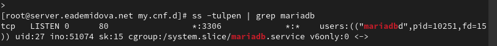{#fig:002 width=70%}

Запустите скрипт конфигурации безопасности mariadb, и с помощью запустившегося диалога и путём выбора `[Y/n]` установим пароль для пользователя root базы данных, отключим удалённый корневой доступ и удалим тестовую базу данных и любых анонимных пользователей(@fig:003):

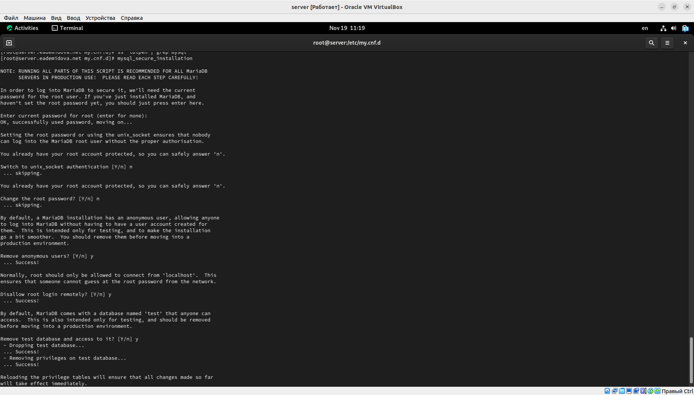{#fig:003 width=70%}

Войдем в базу данных с правами администратора базы данных. Просмотрим список команд MySQL, введя `\h`. Из приглашения интерактивной оболочки MariaDB для отображения доступных в настоящее время баз данных введем MySQL-запрос
SHOW DATABASES;. В системе есть три базы данных: mysql, information_schema, performance_schema(рис. @fig:004):

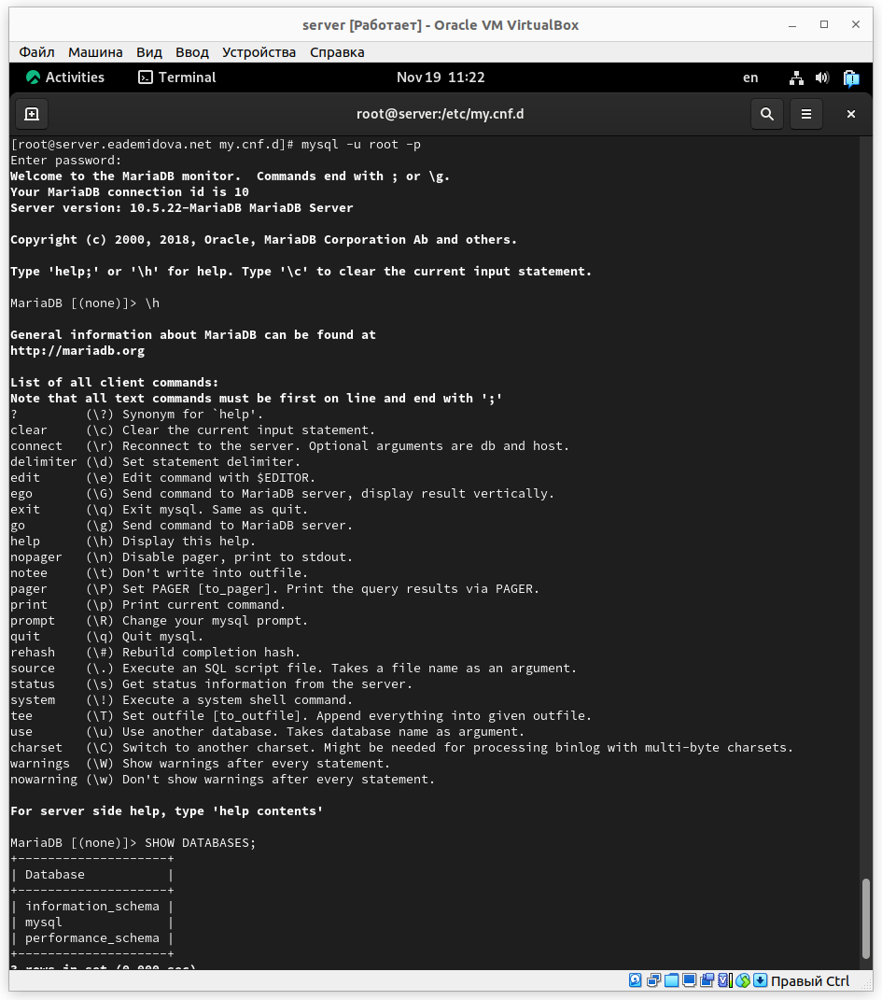{#fig:004 width=70%}

Для выхода из интерфейса интерактивной оболочки MariaDB введем
exit.

## Конфигурация кодировки символов

Войдем в базу данных с правами администратора. Для отображения статуса MariaDB введем из приглашения интерактивной оболочки MariaDB:
```
status
```
В первой строчке указана версия ПО, далее перечислены следующая информация: id соединения, текущая база данных, текущей пользователеь, SSL не используется, средство вывода информации, используемый файл для выведения информации, используемый разделитель, ПО сервера и его версия, версия протокола, вид соединения, характеристики сервера, баз данных, клиента, сокет-файл и время начала работы. В последней строке указано количество потоков, вопросов, очередей, открытых файлов, таблиц и срдняя скорость в секунду запросов(рис. @fig:005):

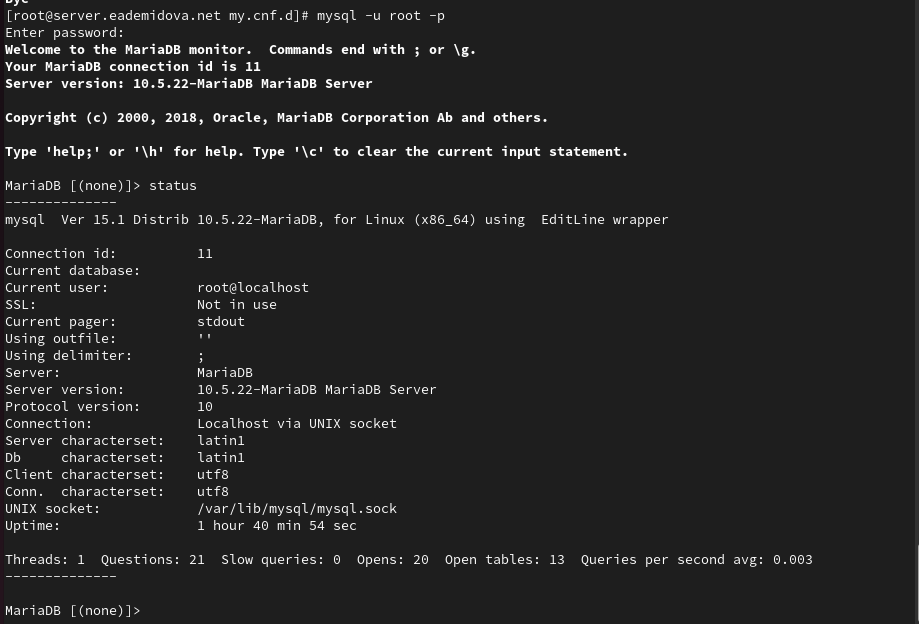{#fig:005 width=70%}

В каталоге /etc/my.cnf.d создадим файл utf8.cnf:
```
cd /etc/my.cnf.d
touch utf8.cnf
```

Откроем его на редактирование и укажем в нём следующую конфигурацию:
```
[client]
default-character-set = utf8
[mysqld]
character-set-server = utf8
```
Перезапустим MariaDB:
```
systemctl restart mariadb
```
Войдем в базу данных с правами администратора и посмотрим статус MariaDB(@fig:006):

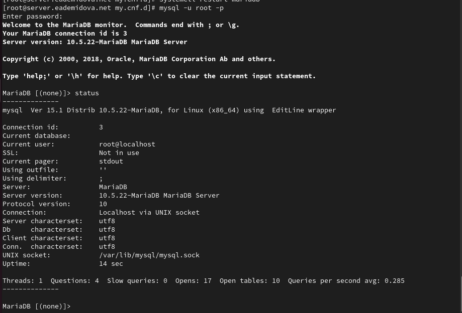{#fig:006 width=70%}

Изменился ID подключения, увеличилось среднее время запроса, а также для соединения сервера и баз данных стала задана кодировка utf8.

## Создание базы данных

Создайте базу данных с именем addressbook и перейдем к ней, затем отобразим имеющиеся в ней таблицы(их нет) и создадим таблицу с полями name и city, затем внесём в неё три записи. Сделаем запрос `SELECT * FROM city;`, он выводит все строки таблицы city (@fig:007):

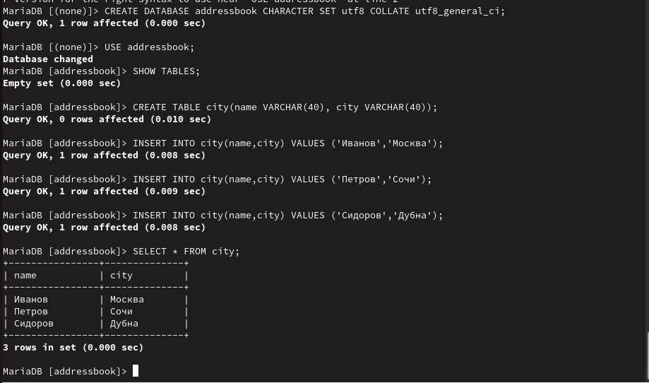{#fig:007 width=70%}

Создадим пользователя для работы с базой данных addressbook и предоставим ему права доступа, а затем обновим привелегии и посмотрим общую информацию о таблице city(@fig:008):

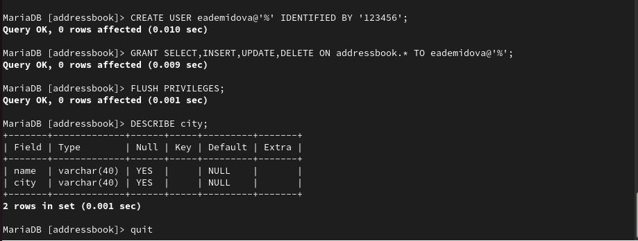{#fig:008 width=70%}

Выйдем из окружения MariaDB и посмотрим список баз данных, а затем посмотрим список таблиц базы данных addressbook(рис. @fig:009):

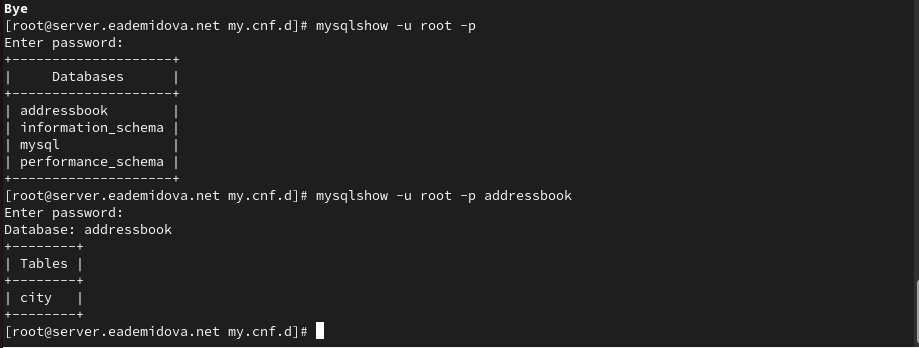{#fig:009 width=70%}

## Резервные копии

На виртуальной машине server создайте каталог для резервных копий /var/backup, затем сделаем резервную копию базы данных, сжатую резервную копию базы данных addressbook и её сжатую резервную копию с указанием даты, восстановим базу данных addressbook из резервной копии и из сжатой резервной копии(рис. @fig:010):

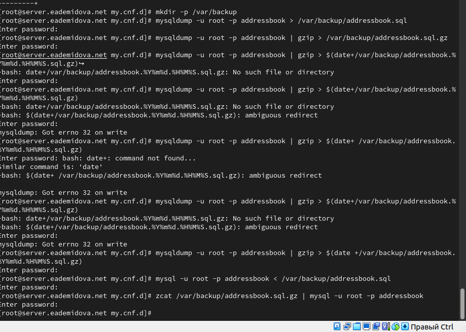{#fig:010 width=70%}

## Внесение изменений в настройки внутреннего окружения виртуальной машины

На виртуальной машине server перейдем в каталог для внесения изменений в настройки внутреннего окружения /vagrant/provision/server/, создадим в нём каталог mysql, в который поместим в соответствующие подкаталоги конфигурационные файлы MariaDB и резервную копию базы данных addressbook и в каталоге /vagrant/provision/server создадим исполняемый файл  mysql.sh(рис. @fig:011)

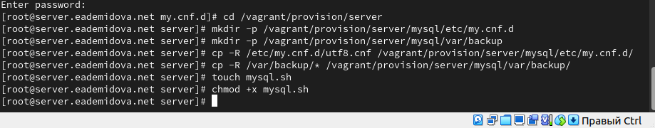{#fig:011 width=70%}

Открыв mysql.sh на редактирование, пропишем в нём следующий скрипт(@fig:012):

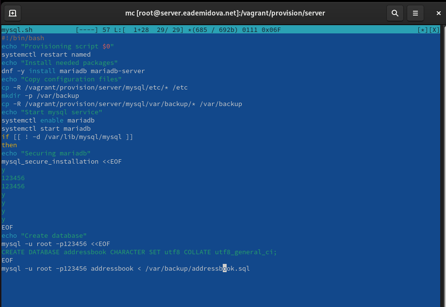{#fig:012 width=70%}

Для отработки созданного скрипта во время загрузки виртуальной машины server в конфигурационном файле Vagrantfile добавим в разделе конфигурации для сервера(@fig:013):

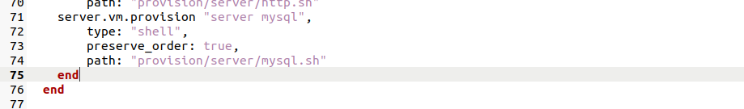{#fig:013 width=70%}

# Контрольные вопросы

1. Какая команда отвечает за настройки безопасности в MariaDB?

Для настройки безопасности в MariaDB используется команда "GRANT" и "REVOKE".

2. Как настроить MariaDB для доступа через сеть?

Для доступа через сеть в MariaDB необходимо изменить файл конфигурации my.cnf, указав IP-адрес и порт, а также настроить привилегии пользователей.

3. Какая команда позволяет получить обзор доступных баз данных после входа в среду
оболочки MariaDB?

Обзор доступных баз данных можно получить с помощью команды "SHOW DATABASES;".

4. Какая команда позволяет узнать, какие таблицы доступны в базе данных?

Для просмотра доступных таблиц в базе данных используется команда "SHOW TABLES FROM database_name;".

5. Какая команда позволяет узнать, какие поля доступны в таблице?

Чтобы узнать доступные поля в таблице, используйте команду "DESCRIBE table_name;" или "SHOW COLUMNS FROM table_name;"

6. Какая команда позволяет узнать, какие записи доступны в таблице?

Для просмотра записей в таблице используется команда "SELECT * FROM table_name;".

7. Как удалить запись из таблицы?

Для удаления записи из таблицы используется команда "DELETE FROM table_name WHERE condition;".

8. Где расположены файлы конфигурации MariaDB? Что можно настроить с их помощью?

Файлы конфигурации MariaDB обычно расположены в /etc/mysql/ или /etc/my.cnf. С их помощью можно настроить параметры сервера, безопасность, память и другие параметры.

9. Где располагаются файлы с базами данных MariaDB?

Файлы с базами данных MariaDB обычно хранятся в каталоге данных, указанном в конфигурационном файле (например, /var/lib/mysql/).

10. Как сделать резервную копию базы данных и затем её восстановить?

Для создания резервной копии базы данных используйте команду "mysqldump", а для восстановления - команду "mysql < backup_file.sql".

# Выводы

В результате выполнения данной работы были приобретены практические навыки по установке и конфигурированию системы управления базами данных на примере программного обеспечения MariaDB.

