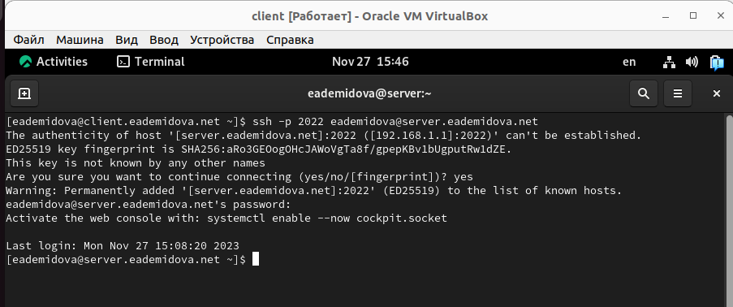
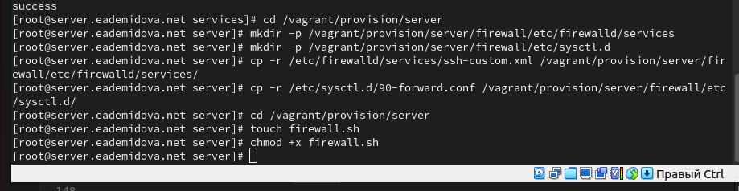

---
## Front matter
lang: ru-RU
title: Лабораторная работа №7
subtitle: Расширенные настройки межсетевого экрана
author:
  - Демидова Е. А.
institute:
  - Российский университет дружбы народов, Москва, Россия
date: 19 ноября 2023 

## i18n babel
babel-lang: russian
babel-otherlangs: english

## Formatting pdf
toc: false
toc-title: Содержание
slide_level: 2
aspectratio: 169
section-titles: true
theme: metropolis
header-includes:
 - \metroset{progressbar=frametitle,sectionpage=progressbar,numbering=fraction}
 - '\makeatletter'
 - '\beamer@ignorenonframefalse'
 - '\makeatother'
---

# Вводная часть

## Цель работы

Получить навыки настройки межсетевого экрана в Linux в части переадресации портов и настройки Masquerading.

## Задание

1. Настройте межсетевой экран виртуальной машины server для доступа к серверу по протоколу SSH не через 22-й порт, а через порт 2022.
2. Настройте Port Forwarding на виртуальной машине server.
3. Настройте маскарадинг на виртуальной машине server для организации доступа клиента к сети Интернет.
4. Напишите скрипт для Vagrant, фиксирующий действия по расширенной настройке межсетевого экрана. Соответствующим образом внести изменения в Vagrantfile

# Выполнение лабораторной работы

## Создание пользовательской службы firewalld

{#fig:001 width=60%}

## Создание пользовательской службы firewalld

{#fig:002 width=70%}

## Создание пользовательской службы firewalld

{#fig:003 width=70%}

## Создание пользовательской службы firewalld

{#fig:004 width=70%}

## Перенаправление портов

Организуем на сервере переадресацию с порта 2022 на порт 22 с помощью команды:
```
firewall-cmd --add-forward-port=port=2022:proto=tcp:toport=22
```
## Перенаправление портов

{#fig:005 width=70%}

## Настройка Port Forwarding и Masquerading

{#fig:006 width=50%}

## Внесение изменений в настройки внутреннего окружения виртуальной машины

{#fig:007 width=70%}

## Внесение изменений в настройки внутреннего окружения виртуальной машины

{#fig:008 width=70%}

## Внесение изменений в настройки внутреннего окружения виртуальной машины

{#fig:009 width=70%}

# Заключение

## Выводы

В результате выполнения данной работы были приобретены практические навыки настройки межсетевого экрана в Linux в части переадресации портов и настройки Masquerading.