---
## Front matter
lang: ru-RU
title: Лабораторная работа №8
subtitle: Настройка SMTP-сервера
author:
  - Демидова Е. А.
institute:
  - Российский университет дружбы народов, Москва, Россия
date: 29 ноября 2023 

## i18n babel
babel-lang: russian
babel-otherlangs: english

## Formatting pdf
toc: false
toc-title: Содержание
slide_level: 2
aspectratio: 169
section-titles: true
theme: metropolis
header-includes:
 - \metroset{progressbar=frametitle,sectionpage=progressbar,numbering=fraction}
 - '\makeatletter'
 - '\beamer@ignorenonframefalse'
 - '\makeatother'
---

# Вводная часть

## Цель работы

Приобретение практических навыков по установке и конфигурированию SMTP-сервера.

## Задание

1. Установите на виртуальной машине server SMTP-сервер postfix.
2. Сделайте первоначальную настройку postfix при помощи утилиты postconf, задав отправку писем не на локальный хост, а на сервер в домене.
3. Проверьте отправку почты с сервера и клиента.
4. Сконфигурируйте Postfix для работы в домене. Проверьте отправку почты с сервера и клиента.
5. Напишите скрипт для Vagrant, фиксирующий действия по установке и настройке Postfix во внутреннем окружении виртуальной машины server. Соответствующим образом внесите изменения в Vagrantfile.

# Выполнение лабораторной работы

## Установка Postfix

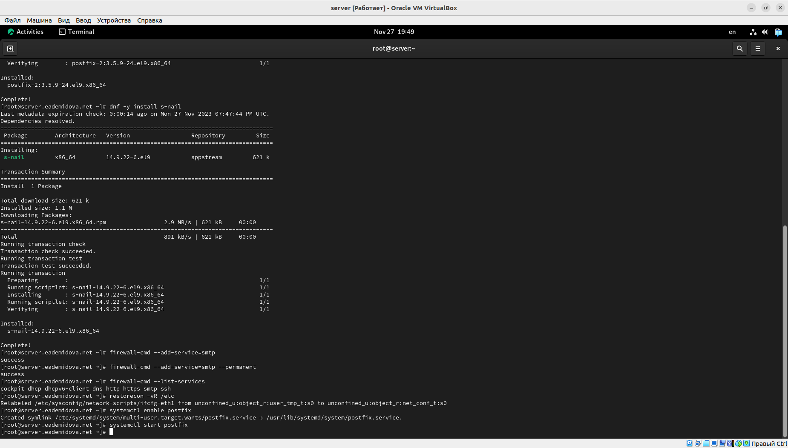{#fig:001 width=70%}

## Изменение параметров Postfix с помощью postconf

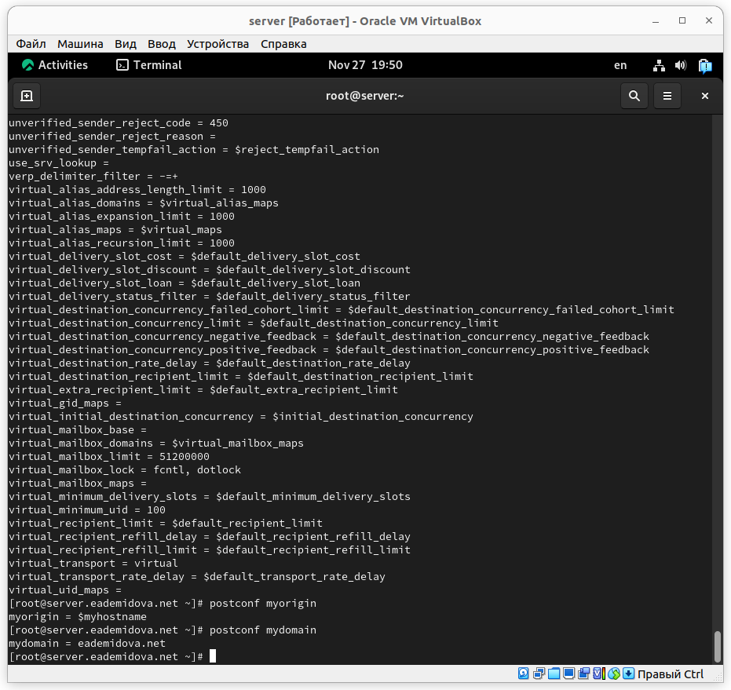{#fig:002 width=50%}

## Изменение параметров Postfix с помощью postconf

Заменим значение параметра myorigin на значение параметра mydomain и снова посмотрим значение myorigin:

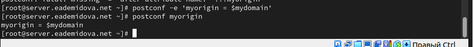{#fig:003 width=70%}

## Изменение параметров Postfix с помощью postconf

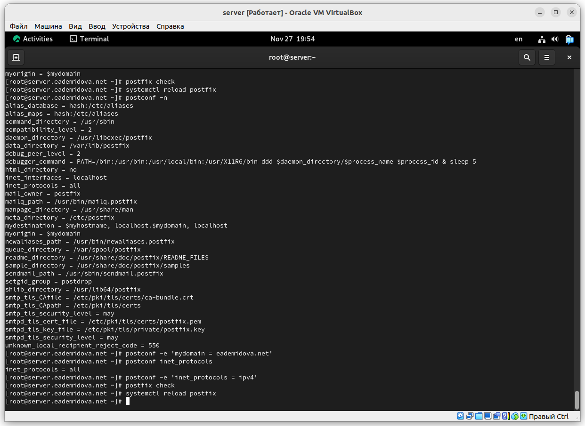{#fig:004 width=60%}

## Проверка работы Postfix

На сервере под учётной записью пользователя отправим себе письмо, используя утилиту mail с помощью команды:

```
echo .| mail -s test1 eademidova@server.eademidova.net
```

## Проверка работы Postfix

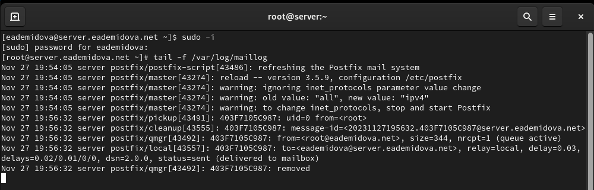{#fig:005 width=70%}

## Проверка работы Postfix

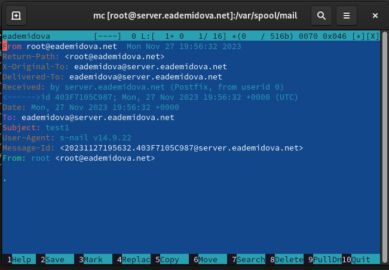{#fig:006 width=70%}

## Проверка работы Postfix

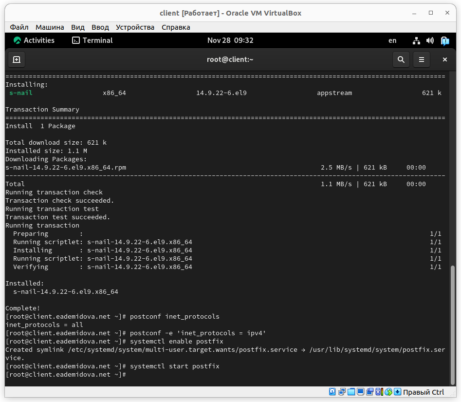{#fig:007 width=60%}

## Проверка работы Postfix

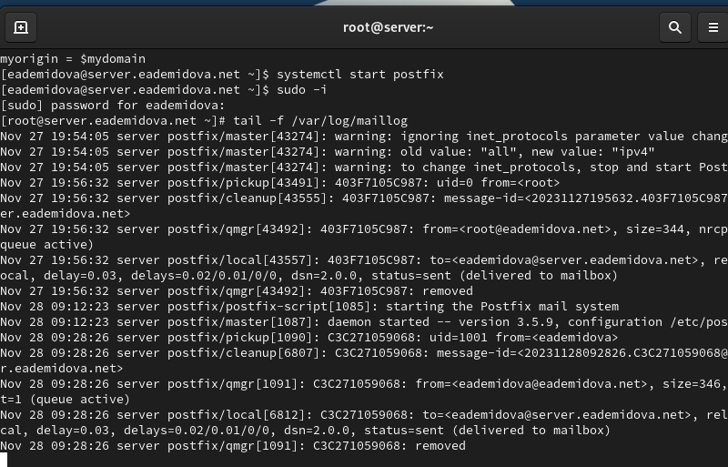{#fig:008 width=70%}

## Проверка работы Postfix

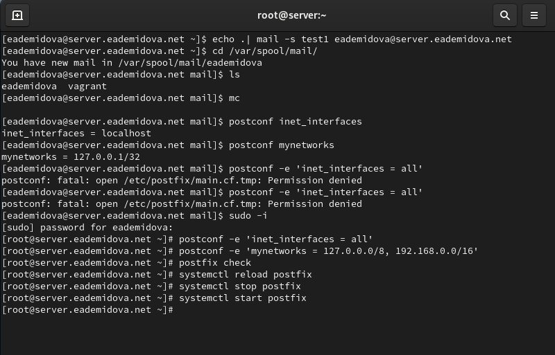{#fig:009 width=70%}

## Проверка работы Postfix

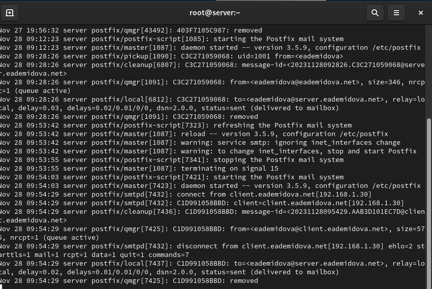{#fig:010 width=70%}

## Конфигурация Postfix для домена

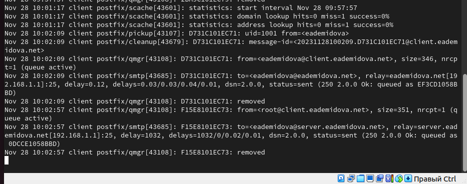{#fig:011 width=70%}

## Конфигурация Postfix для домена

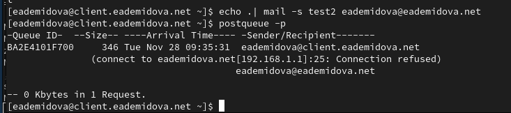{#fig:012 width=70%}

## Конфигурация Postfix для домена

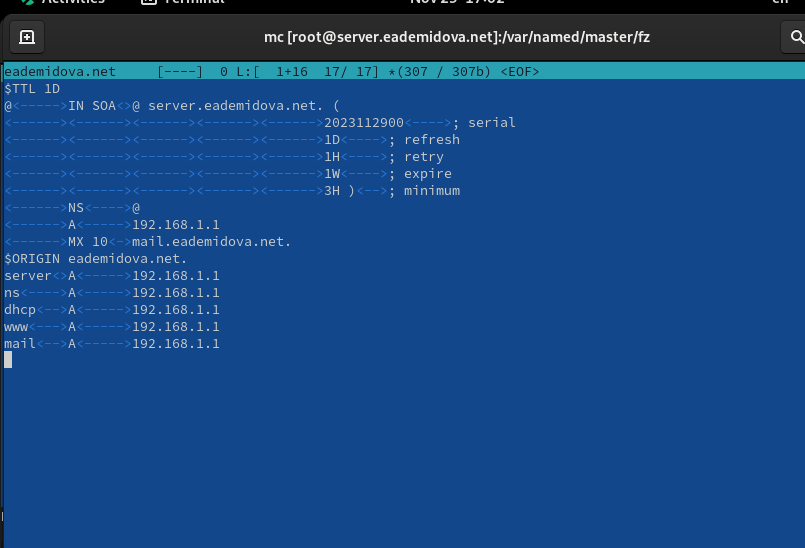{#fig:013 width=70%}

## Конфигурация Postfix для домена

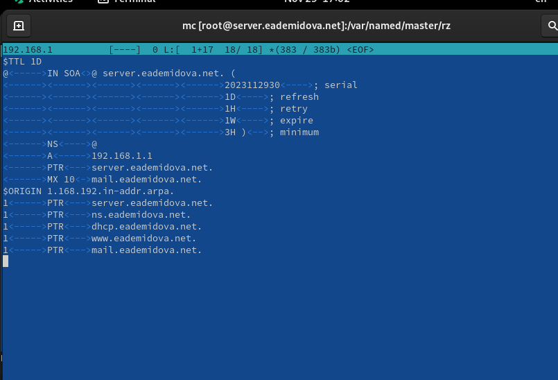{#fig:014 width=70%}

## Конфигурация Postfix для домена

В конфигурации Postfix добавим домен в список элементов сети, для которых данный сервер является конечной точкой доставки почты с помощью команды:

```
postconf -e 'mydestination = $myhostname, localhost.$mydomain, 
localhost, $mydomain
```

## Конфигурация Postfix для домена

А затем перезагрузим конфигурацию Postfix, восстановим контекст безопасности  в SELinux и перезапустим DNS:

```
postfix check
systemctl reload postfix

restorecon -vR /etc
restorecon -vR /var/named

systemctl restart named
```

## Конфигурация Postfix для домена

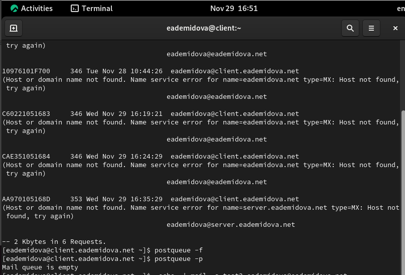{#fig:015 width=70%}

## Конфигурация Postfix для домена

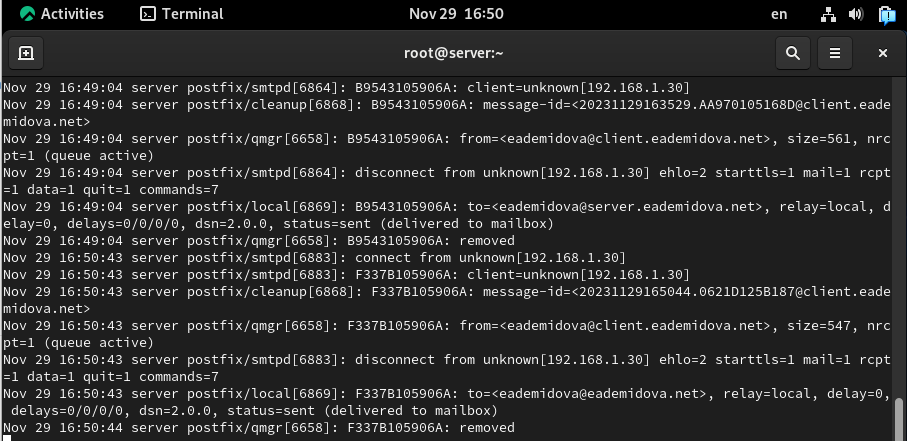{#fig:016 width=70%}

## Внесение изменений в настройки внутреннего окружения виртуальной машины

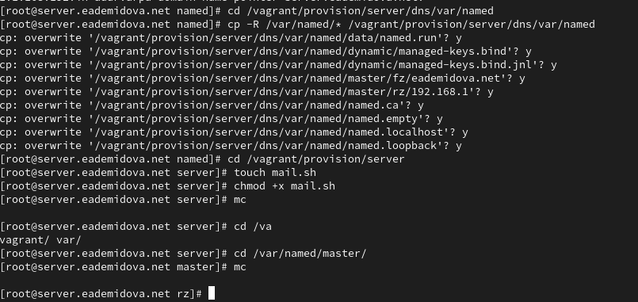{#fig:017 width=70%}

## Внесение изменений в настройки внутреннего окружения виртуальной машины

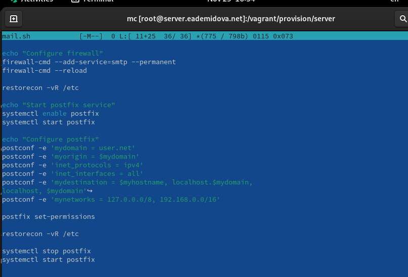{#fig:018 width=70%}

## Внесение изменений в настройки внутреннего окружения виртуальной машины

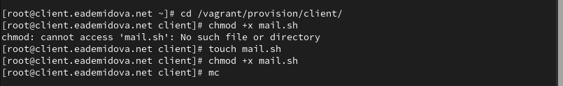{#fig:019 width=70%}

## Внесение изменений в настройки внутреннего окружения виртуальной машины

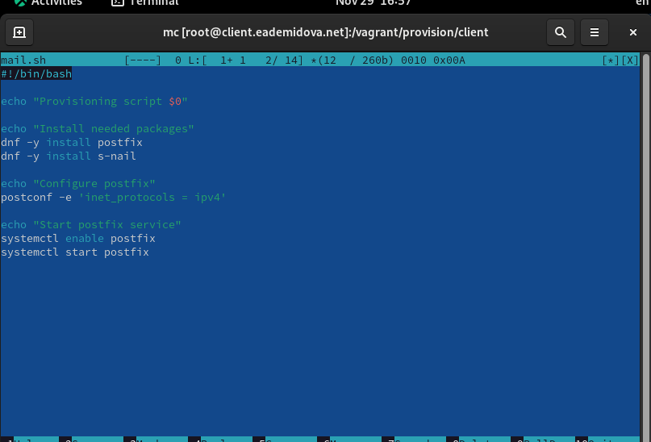{#fig:020 width=70%}

## Внесение изменений в настройки внутреннего окружения виртуальной машины

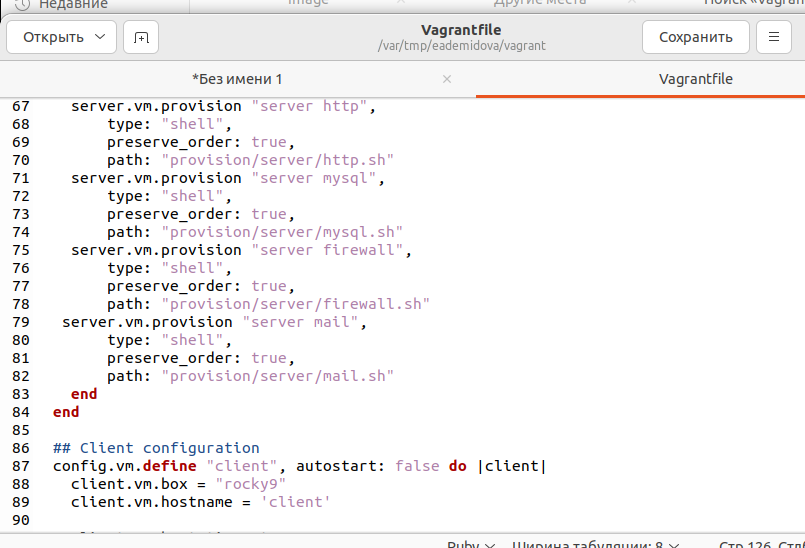{#fig:021 width=70%}

## Внесение изменений в настройки внутреннего окружения виртуальной машины

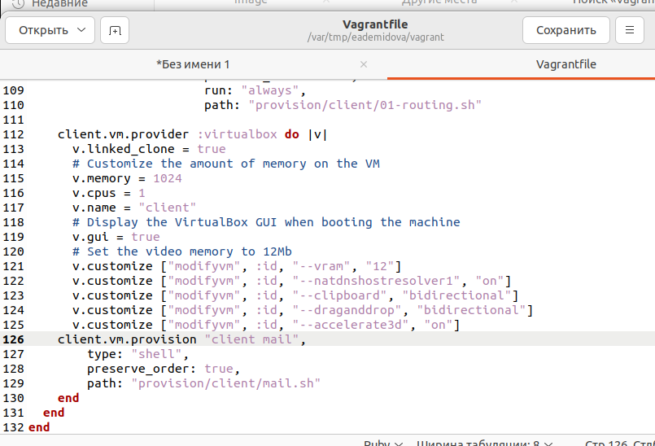{#fig:022 width=70%}

# Заключение

## Выводы

В результате выполнения данной работы были приобретены практические навыки по установке и конфигурированию SMTP-сервера.