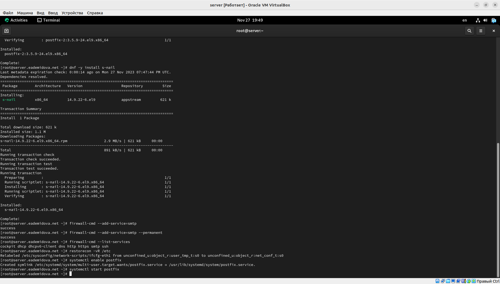
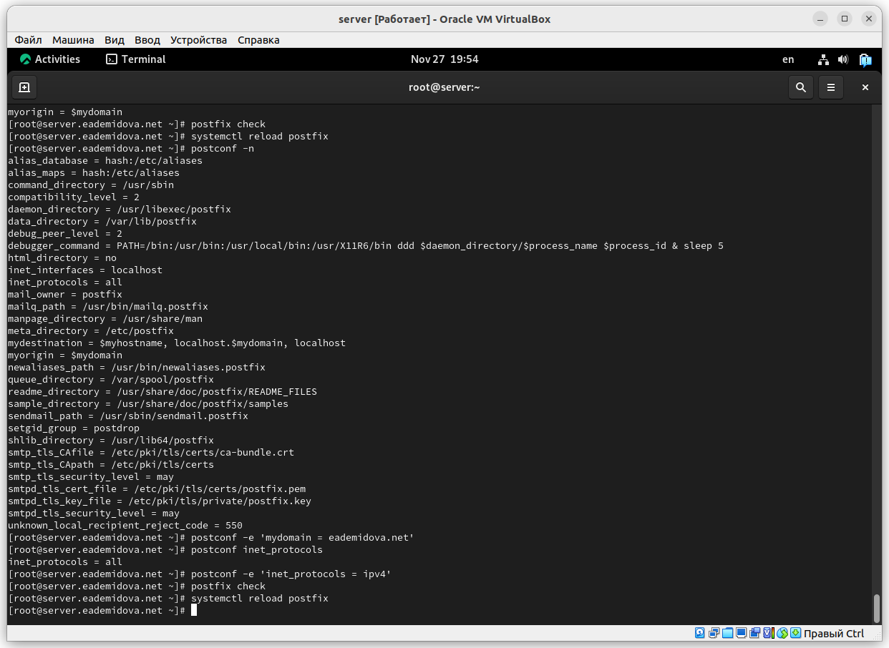
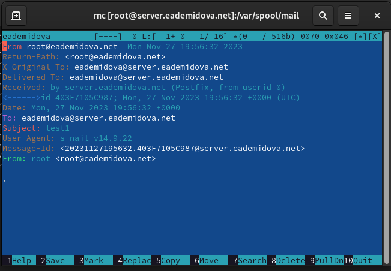
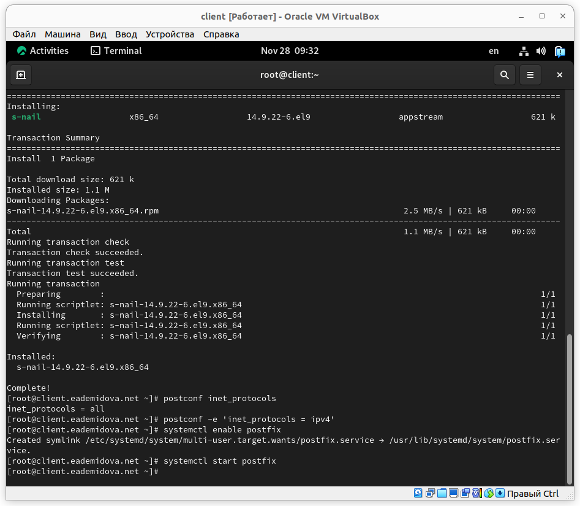
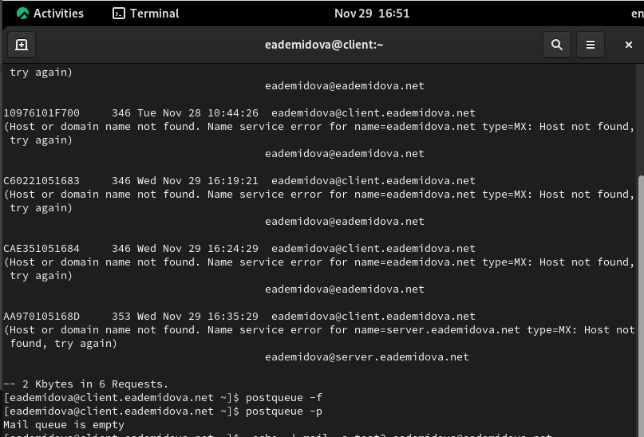
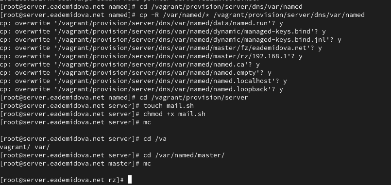
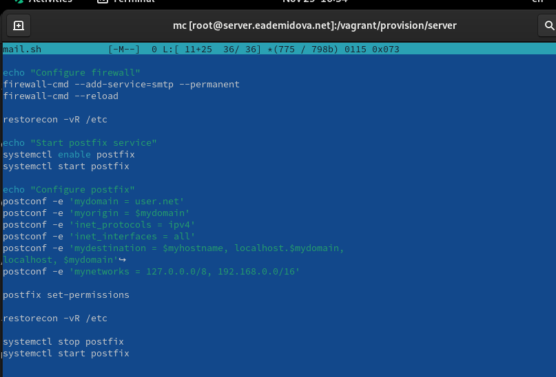
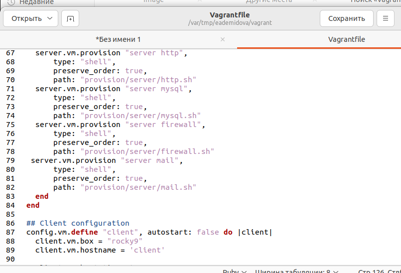
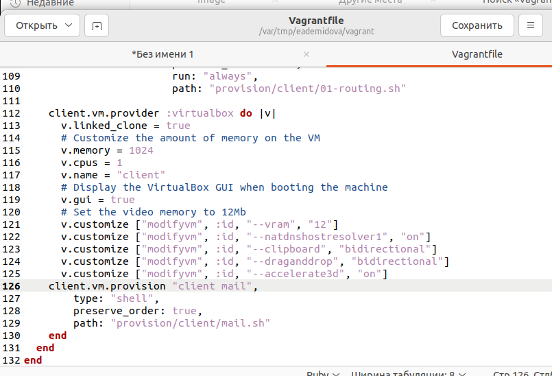

---
## Front matter
title: "Лабораторная работа №8"
subtitle: "Настройка SMTP-сервера"
author: "Демидова Екатерина Алексеевна"

## Generic otions
lang: ru-RU
toc-title: "Содержание"

## Bibliography
bibliography: bib/cite.bib
csl: pandoc/csl/gost-r-7-0-5-2008-numeric.csl

## Pdf output format
toc: true # Table of contents
toc-depth: 2
lof: true # List of figures
lot: false # List of tables
fontsize: 12pt
linestretch: 1.5
papersize: a4
documentclass: scrreprt
## I18n polyglossia
polyglossia-lang:
  name: russian
  options:
	- spelling=modern
	- babelshorthands=true
polyglossia-otherlangs:
  name: english
## I18n babel
babel-lang: russian
babel-otherlangs: english
## Fonts
mainfont: PT Serif
romanfont: PT Serif
sansfont: PT Sans
monofont: PT Mono
mainfontoptions: Ligatures=TeX
romanfontoptions: Ligatures=TeX
sansfontoptions: Ligatures=TeX,Scale=MatchLowercase
monofontoptions: Scale=MatchLowercase,Scale=0.9
## Biblatex
biblatex: true
biblio-style: "gost-numeric"
biblatexoptions:
  - parentracker=true
  - backend=biber
  - hyperref=auto
  - language=auto
  - autolang=other*
  - citestyle=gost-numeric
## Pandoc-crossref LaTeX customization
figureTitle: "Рис."
tableTitle: "Таблица"
listingTitle: "Листинг"
lofTitle: "Список иллюстраций"
lotTitle: "Список таблиц"
lolTitle: "Листинги"
## Misc options
indent: true
header-includes:
  - \usepackage{indentfirst}
  - \usepackage{float} # keep figures where there are in the text
  - \floatplacement{figure}{H} # keep figures where there are in the text
---

# Цель работы

Приобретение практических навыков по установке и конфигурированию SMTP-сервера.

# Задание

1. Установите на виртуальной машине server SMTP-сервер postfix.
2. Сделайте первоначальную настройку postfix при помощи утилиты postconf, задав отправку писем не на локальный хост, а на сервер в домене.
3. Проверьте отправку почты с сервера и клиента.
4. Сконфигурируйте Postfix для работы в домене. Проверьте отправку почты с сервера и клиента.
5. Напишите скрипт для Vagrant, фиксирующий действия по установке и настройке Postfix во внутреннем окружении виртуальной машины server. Соответствующим образом внесите изменения в Vagrantfile.

# Выполнение лабораторной работы

## Установка Postfix

Загрузим нашу операционную систему и перейдем в рабочий каталог с проектом:
```
cd /var/tmp/eademidova/vagran
```
Затем запустим виртуальную машину server:
```
make server-up
```

Установим необходимые для работы пакеты, затем сконфигурируем межсетевой экран, разрешив работать службе протокола SMTP, после чего восстановим контекст безопасности в SELinux и запустим Postfix(рис. @fig:001):

{#fig:001 width=70%}

## Изменение параметров Postfix с помощью postconf

Посмотрим список текущих настроек Postfix, текущее значение параметра myorigin и mydomain(рис. @fig:002):

{#fig:002 width=70%}

Заменим значение параметра myorigin на значение параметра mydomain и снова посмотрим значение myorigin(@fig:003):

{#fig:003 width=70%}

Проверим корректность содержания конфигурационного файла main.cf и перезагрузим конфигурационные файлы Postfix. Затем Просмотрим все параметры с значением, отличным от значения по умолчанию и зададим жёстко значение домена. Отключим IPv6 в списке разрешённых в работе Postfix протоколов и оставим только IPv4, после чего перезагрузим конфигурацию Postfix(рис. @fig:004):

{#fig:004 width=60%}

## Проверка работы Postfix

На сервере под учётной записью пользователя отправим себе письмо, используя утилиту mail с помощью команды:
```
echo .| mail -s test1 eademidova@server.eademidova.net
```

На втором терминале запустим мониторинг работы почтовой службы и посмотрим, что произошло с сообщением(рис. @fig:005):

{#fig:005 width=70%}

Можно увидеть в предпоследней строчке, что статус сообщения отправлено, а в скобках указано, что отправлено на mailbox. В последней строчке указано, что сообщение перемещено.

Посмотрев содержимое файла eademidova из каталога /var/spool/mail можно убедиться, что сообщение получено(@fig:006):

{#fig:006 width=70%}

На виртуальной машине client войдем под нашим пользователем и откроем терминал. Перейдем в режим суперпользователя. Затем на клиенте установим необходимые для работы пакеты, отключим IPv6 в списке разрешённых в работе Postfix протоколов, оставив только IPv4 и запустим  Postfix(рис. @fig:007):

{#fig:007 width=70%}

На клиенте под учётной записью пользователя аналогичным образом отправим себе второе письмо, используя утилиту mail. Сравним результат мониторинга почтовой службы на сервере при отправке сообщения с сервера и с клиента(@fig:008):

{#fig:008 width=70%}

При мониторинге не было обнаружено никаких писем, то есть письмо не получено.

На сервере в конфигурации Postfix посмотрим значения параметров сетевых интерфейсов inet_interfaces и сетевых адресов mynetworks. Затем разрешим Postfix прослушивать соединения не только с локального узла, но и с других интерфейсов сети и добавим адрес внутренней сети, разрешив таким образом пересылку сообщений между узлами сети. Теперь перезагрустим конфигурацию Postfix и перезапустим Postfix(@fig:009):

{#fig:009 width=70%}

Повториv отправку сообщения с клиента и посмотрим результат мониторинга(@fig:010):

{#fig:010 width=70%}

Теперь можно увидеть, что сначала произошло соединение с клиентом, было получено от него сообщение и затем соединение было разорвано.

## Конфигурация Postfix для домена

С клиента отправим письмо на свой доменный адрес eademidova@eademidova.net, запустим мониторинг почтовой службы и посмотрим, что случилось с сообщением(@fig:011):

{#fig:011 width=70%}

Можно увидеть, что письмо отправлено и находится в очереди.

Дополнительно посмотрим, какие сообщения ожидают в очереди(@fig:012):

{#fig:012 width=70%}

В очереди находится одно письмо, которое мы только что отправили на доменные адрес.

Для настройки возможности отправки сообщений не на конкретный узел сети, а на доменный адрес пропишем MX-запись с указанием имени почтового сервера mail.eademidova.net в файле прямой и обратной DNS-зон(рис. @fig:013, @fig:014)

{#fig:013 width=70%}

{#fig:014 width=70%}

В конфигурации Postfix добавим домен в список элементов сети, для которых данный сервер является конечной точкой доставки почты с помощью команды:

```
postconf -e 'mydestination = $myhostname, localhost.$mydomain, 
localhost, $mydomain
```
А затем перезагрузим конфигурацию Postfix, восстановим контекст безопасности  в SELinux и перезапустим DNS:

```
postfix check
systemctl reload postfix

restorecon -vR /etc
restorecon -vR /var/named

systemctl restart named
```

Теперь отправим сообщения, находящиеся в очереди, затем снова проверим очередь и убедимся, что она пустая(рис. @fig:015):

{#fig:015 width=70%}

Теперь снова проверим отправку почты с клиента на доменный адрес(рис. @fig:016):

{#fig:016 width=70%}

## Внесение изменений в настройки внутреннего окружения виртуальной машины

На виртуальной машине server заменим конфигурационные файлы DNS-сервера и создадим файл mail.sh(рис. @fig:017)

{#fig:017 width=70%}

Открыв mail.sh на редактирование, пропишем в нём следующий скрипт(@fig:018):

{#fig:018 width=70%}

На виртуальной машине client перейдите в каталог для внесения изменений в настройки внутреннего окружения /vagrant/provision/client/ и создадим файл mail.sh(рис. @fig:019)

{#fig:019 width=70%}

Открыв mail.sh на редактирование, пропишем в нём следующий скрипт(@fig:020):

{#fig:020 width=70%}


Для отработки созданных скрипта во время загрузки виртуальной машины server и client в конфигурационном файле Vagrantfile добавим в разделе конфигурации для сервера и клиента(@fig:021, @fig:022):

{#fig:021 width=70%}

{#fig:022 width=70%}

# Контрольные вопросы

1. В каком каталоге и в каком файле следует смотреть конфигурацию Postfix?
2. Каким образом можно проверить корректность синтаксиса в конфигурационном файле Postfix?
3. В каких параметрах конфигурации Postfix требуется внести изменения в значениях для настройки возможности отправки писем не на локальный хост, а на доменные адреса?
4. Приведите примеры работы с утилитой mail по отправке письма, просмотру имеющихся писем, удалению письма.
5. Приведите примеры работы с утилитой postqueue. Как посмотреть очередь сообщений? Как определить число сообщений в очереди? Как отправить все сообщения, находящиеся в очереди? Как удалить письмо из очереди

1. Конфигурацию Postfix следует смотреть в файле main.cf, который находится в каталоге /etc/postfix/.

2. Для проверки корректности синтаксиса в конфигурационном файле Postfix можно использовать команду `postfix check`.

3. Для настройки возможности отправки писем не на локальный хост, а на доменные адреса, требуется изменить параметры myorigin и mydestination в файле main.cf.

4. Примеры работы с утилитой mail:

- Отправка письма: echo "Текст письма" | mail -s "Тема" адрес@домен
- Просмотр имеющихся писем: mail
- Удаление письма: ввод команды d в интерфейсе утилиты mail, затем номера письма.

5. Примеры работы с утилитой postqueue:

- Просмотр очереди сообщений: postqueue -p
- Определение числа сообщений в очереди: postqueue -p | tail -n 1
- Отправка всех сообщений в очереди: postqueue -f
- Удаление письма из очереди: postsuper -d <идентификатор сообщения>

# Выводы

В результате выполнения данной работы были приобретены практические навыки по установке и конфигурированию SMTP-сервера.
