---
## Front matter
lang: ru-RU
title: Лабораторная работа №9
subtitle: Настройка POP3/IMAP сервера
author:
  - Демидова Е. А.
institute:
  - Российский университет дружбы народов, Москва, Россия
date: 4 декабря 2023 

## i18n babel
babel-lang: russian
babel-otherlangs: english

## Formatting pdf
toc: false
toc-title: Содержание
slide_level: 2
aspectratio: 169
section-titles: true
theme: metropolis
header-includes:
 - \metroset{progressbar=frametitle,sectionpage=progressbar,numbering=fraction}
 - '\makeatletter'
 - '\beamer@ignorenonframefalse'
 - '\makeatother'
---

# Вводная часть

## Цель работы

Приобретение практических навыков по установке и простейшему конфигурированию POP3/IMAP-сервера.

## Задание

1. Установите на виртуальной машине server Dovecot и Telnet для дальнейшей проверки корректности работы почтового сервера.
2. Настройте Dovecot.
3. Установите на виртуальной машине client программу для чтения почты Evolution и настройте её для манипуляций с почтой вашего пользователя. Проверьте корректность работы почтового сервера как с виртуальной машины server, так и с виртуальной машины client.
4. Измените скрипт для Vagrant, фиксирующий действия по установке и настройке Postfix и Dovecote во внутреннем окружении виртуальной машины server, создайте скрипт для Vagrant, фиксирующий действия по установке Evolution во внутреннем окружении виртуальной машины client. Соответствующим образом внесите изменения в Vagrantfile.

# Выполнение лабораторной работы

## Установка Dovecot

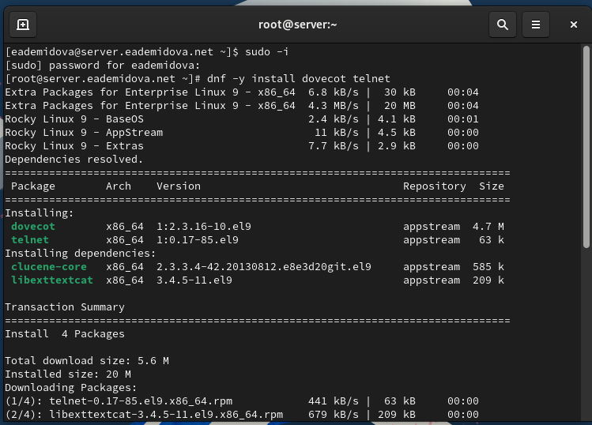{#fig:001 width=70%}

## Настройка dovecot

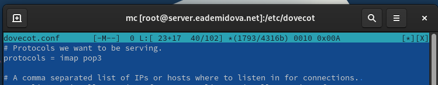{#fig:002 width=70%}

## Настройка dovecot

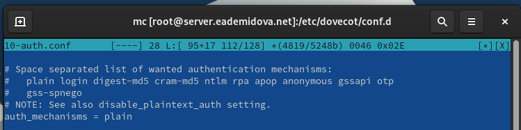{#fig:003 width=70%}

## Настройка dovecot

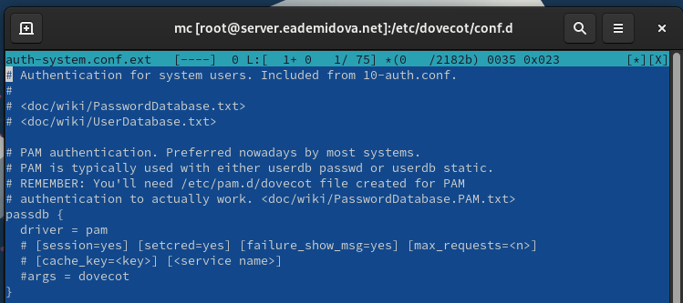{#fig:004 width=70%}

## Настройка dovecot

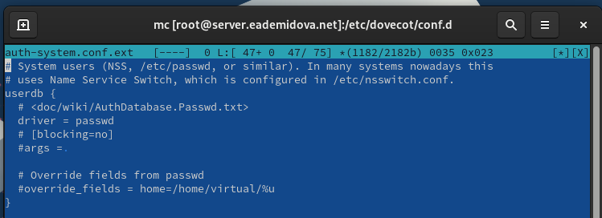{#fig:005 width=70%}

## Настройка dovecot

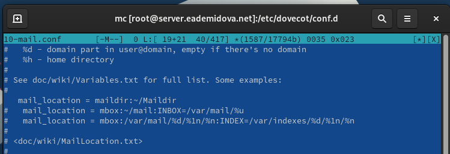{#fig:006 width=70%}

## Настройка dovecot

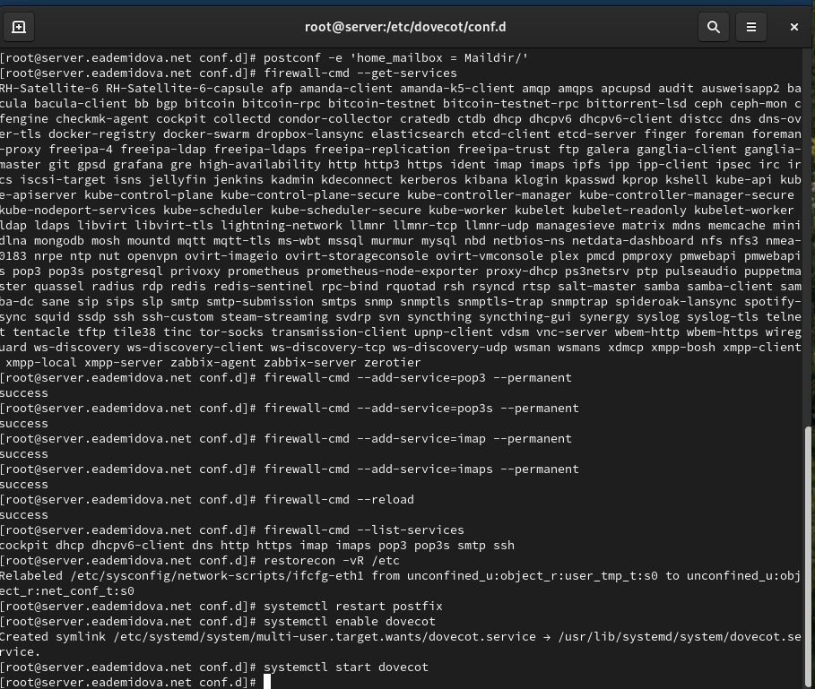{#fig:007 width=60%}


## Проверка работы Dovecot

На дополнительном терминале виртуальной машины server запустим мониторинг
работы почтовой службы с помощью команды:

```
tail -f /var/log/maillog
```

## Проверка работы Dovecot

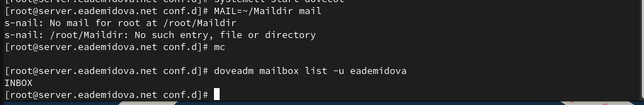{#fig:008 width=70%}

## Проверка работы Dovecot

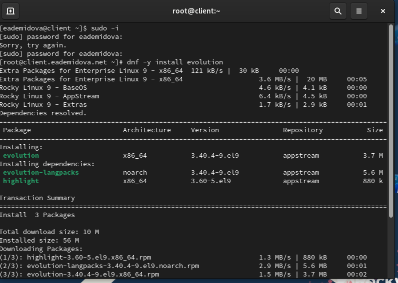{#fig:009 width=70%}

## Проверка работы Dovecot

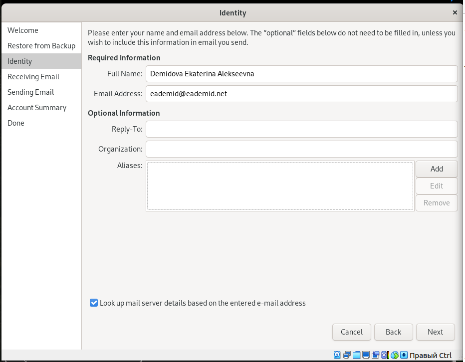{#fig:010 width=60%}

## Проверка работы Dovecot

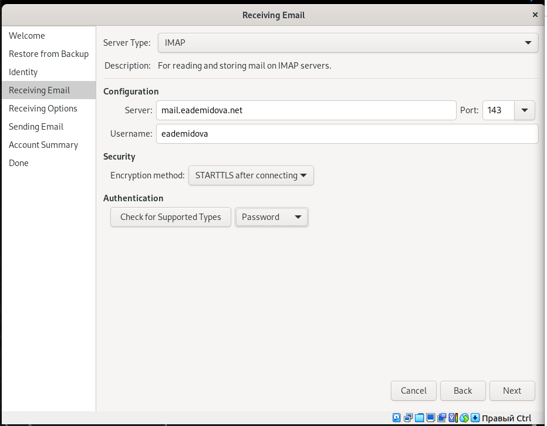{#fig:011 width=60%}

## Проверка работы Dovecot

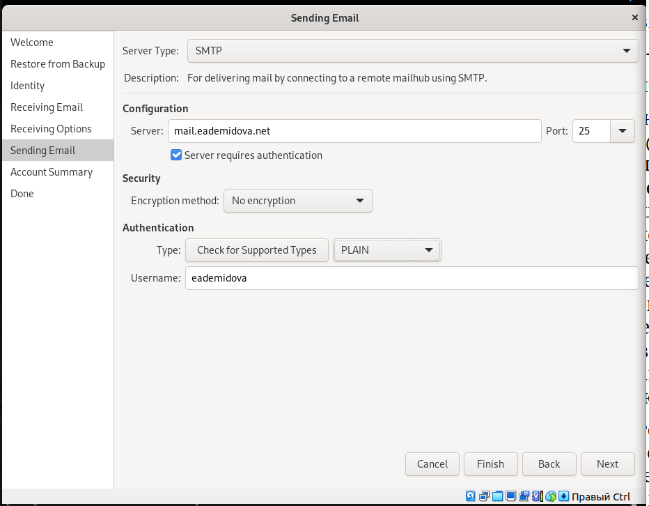{#fig:012 width=60%}

## Проверка работы Dovecot

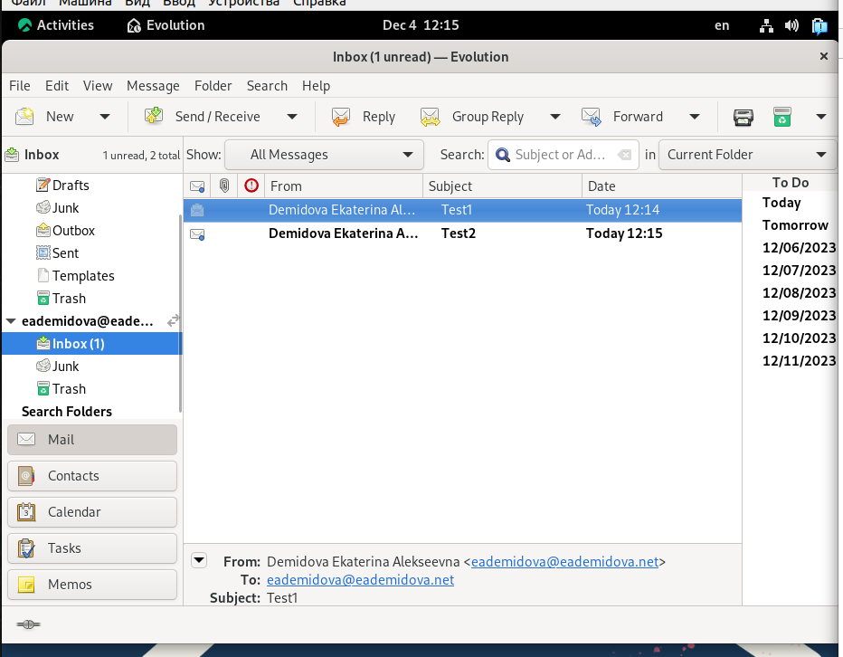{#fig:013 width=60%}

## Проверка работы Dovecot

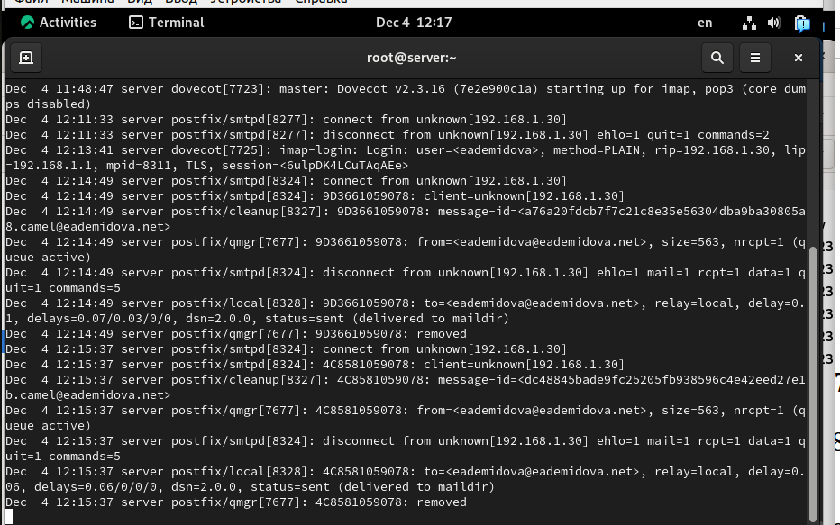{#fig:014 width=70%}

## Проверка работы Dovecot

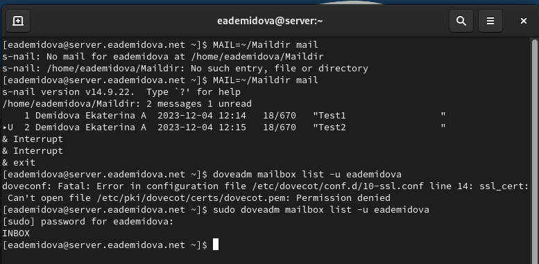{#fig:015 width=70%}

## Проверка работы Dovecot

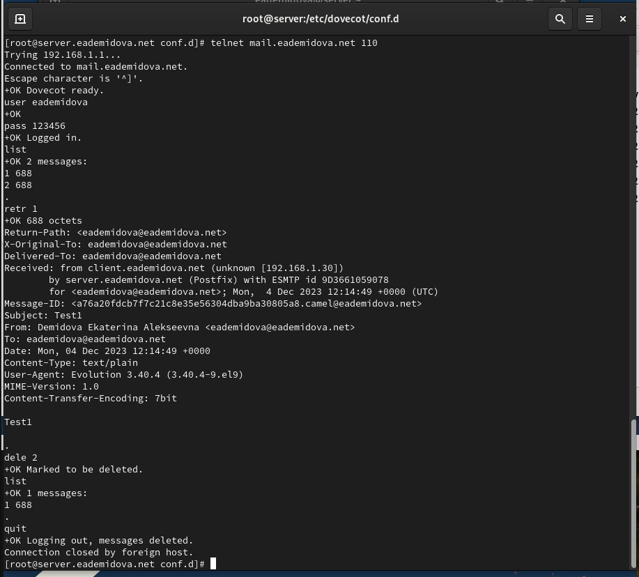{#fig:016 width=55%}

## Внесение изменений в настройки внутреннего окружения виртуальной машины

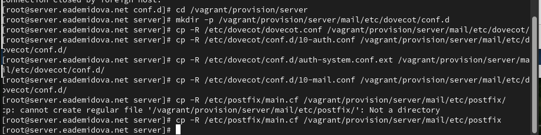{#fig:017 width=70%}

## Внесение изменений в настройки внутреннего окружения виртуальной машины

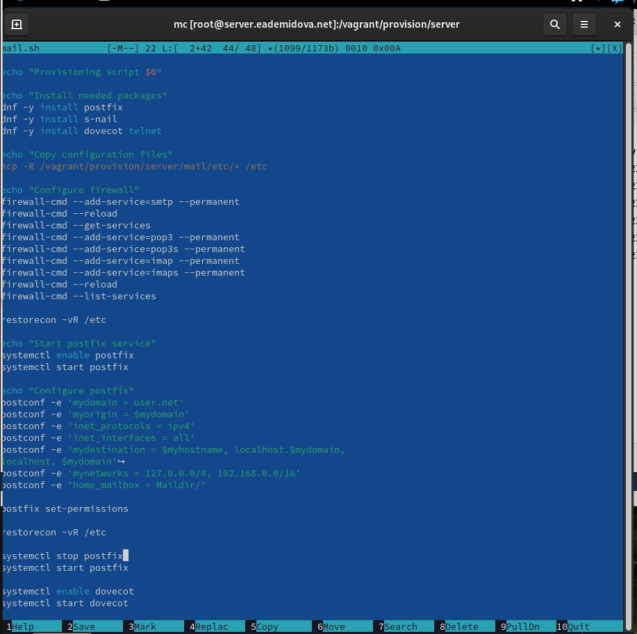{#fig:018 width=50%}

## Внесение изменений в настройки внутреннего окружения виртуальной машины

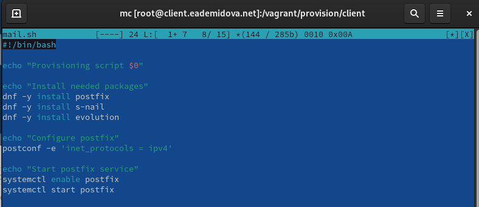{#fig:019 width=70%}

# Заключение

## Выводы

В результате выполнения данной работы были приобретены практические навыки по установке и простейшему конфигурированию POP3/IMAP-сервера.