---
## Front matter
lang: ru-RU
title: Лабораторная работа №11
subtitle: Настройка безопасного удалённого доступа по протоколу SSH
author:
  - Демидова Е. А.
institute:
  - Российский университет дружбы народов, Москва, Россия
date: 4 декабря 2023 

## i18n babel
babel-lang: russian
babel-otherlangs: english

## Formatting pdf
toc: false
toc-title: Содержание
slide_level: 2
aspectratio: 169
section-titles: true
theme: metropolis
header-includes:
 - \metroset{progressbar=frametitle,sectionpage=progressbar,numbering=fraction}
 - '\makeatletter'
 - '\beamer@ignorenonframefalse'
 - '\makeatother'
---

# Вводная часть

## Цель работы

Приобретение практических навыков по настройке удалённого доступа к серверу с помощью SSH.

## Задание

1. Настройте запрет удалённого доступа на сервер по SSH для пользователя root.
2. Настройте разрешение удалённого доступа к серверу по SSH только для пользователей группы vagrant и вашего пользователя.
3. Настройте удалённый доступ к серверу по SSH через порт 2022.
4. Настройте удалённый доступ к серверу по SSH по ключу.
5. Организуйте SSH-туннель с клиента на сервер, перенаправив локальное соединение с TCP-порта 80 на порт 8080.
6. Используя удалённое SSH-соединение, выполните с клиента несколько команд на сервере и запустите графическое приложение на сервере.
8. Напишите скрипт для Vagrant, фиксирующий действия по настройке SSH-сервера во внутреннем окружении виртуальной машины server.

# Выполнение лабораторной работы

## Запрет удалённого доступа по SSH для пользователя root

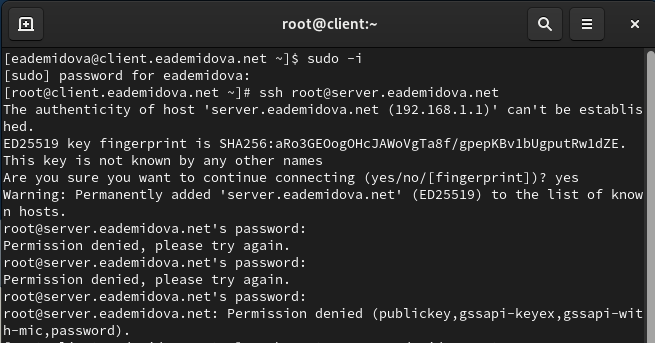{#fig:001 width=70%}

## Запрет удалённого доступа по SSH для пользователя root

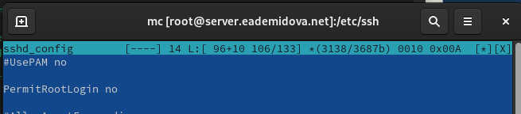{#fig:002 width=70%}

## Запрет удалённого доступа по SSH для пользователя root

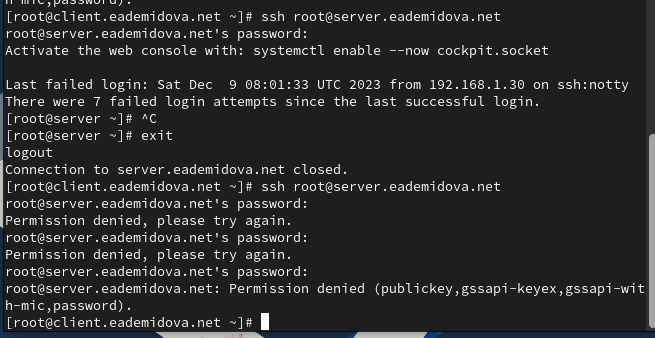{#fig:003 width=70%}

## Ограничение списка пользователей для удалённого доступа по SSH

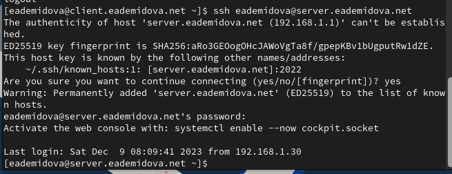{#fig:004 width=70%}

## Ограничение списка пользователей для удалённого доступа по SSH

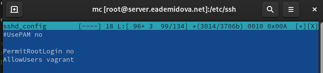{#fig:005 width=70%}

## Ограничение списка пользователей для удалённого доступа по SSH

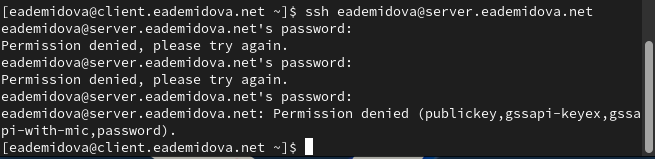{#fig:006 width=70%}

## Ограничение списка пользователей для удалённого доступа по SSH

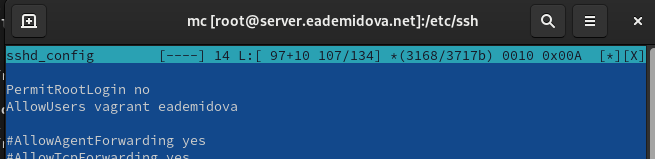{#fig:007 width=70%}

## Ограничение списка пользователей для удалённого доступа по SSH

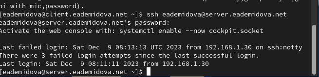{#fig:008 width=70%}

## Настройка дополнительных портов для удалённого доступа по SSH

{#fig:009 width=70%}

## Настройка дополнительных портов для удалённого доступа по SSH

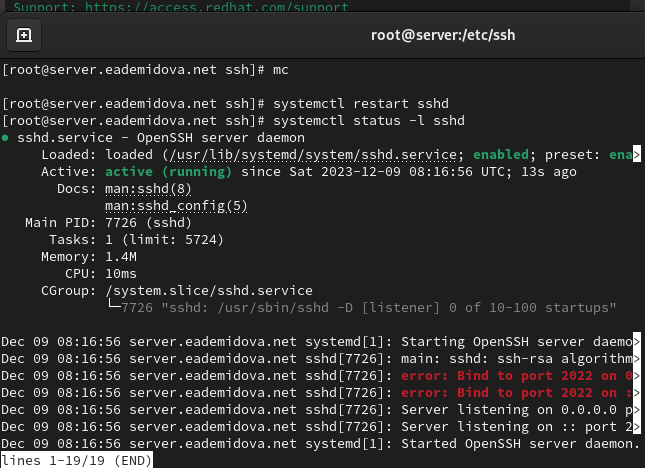{#fig:010 width=65%}

## Настройка дополнительных портов для удалённого доступа по SSH

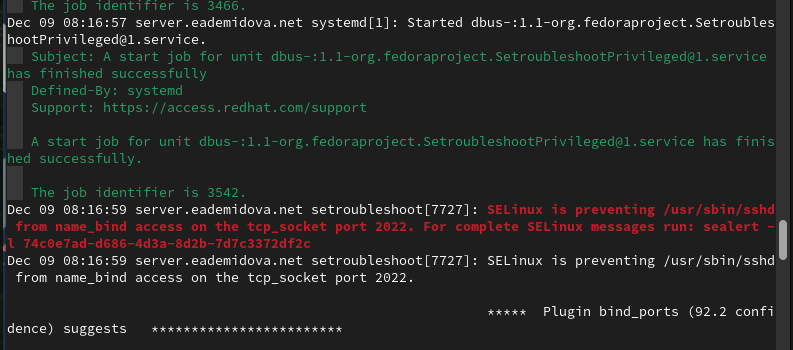{#fig:011 width=70%}

## Настройка дополнительных портов для удалённого доступа по SSH

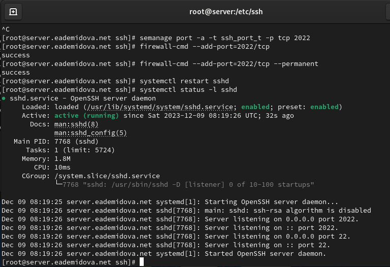{#fig:012 width=70%}

## Настройка дополнительных портов для удалённого доступа по SSH

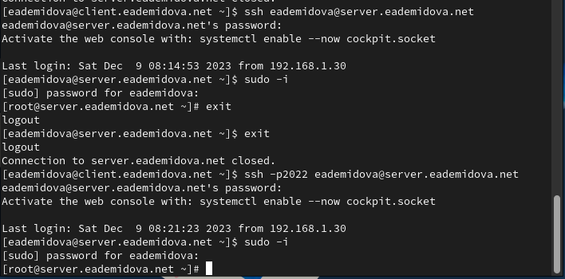{#fig:013 width=70%}

## Настройка удалённого доступа по SSH по ключу

На сервере в конфигурационном файле /etc/ssh/sshd_config зададим параметр,
разрешающий аутентификацию по ключу, написав:

```
PubkeyAuthentication yes
```

## Настройка удалённого доступа по SSH по ключу

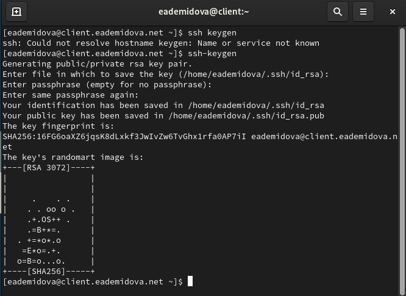{#fig:014 width=65%}

## Настройка удалённого доступа по SSH по ключу

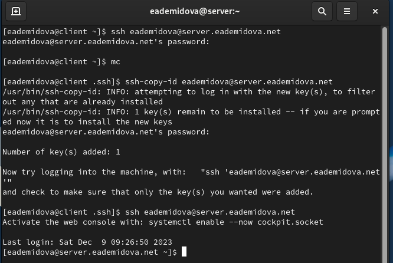{#fig:015 width=70%}

## Организация туннелей SSH, перенаправление TCP-портов

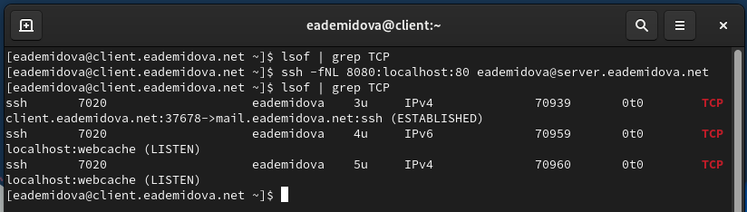{#fig:016 width=70%}

## Организация туннелей SSH, перенаправление TCP-портов

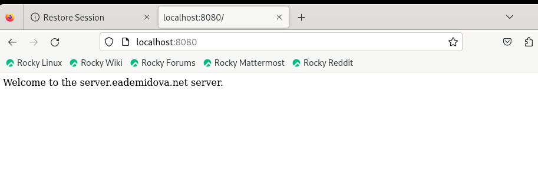{#fig:017 width=70%}

## Запуск консольных приложений через SSH

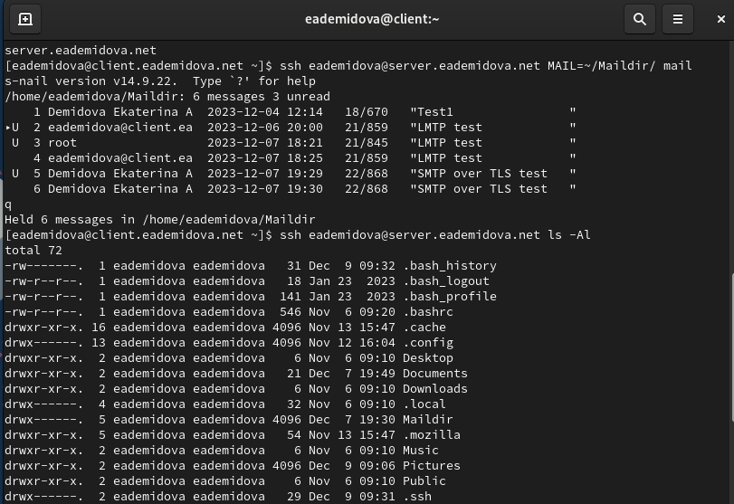{#fig:018 width=70%}

## Запуск графических приложений через SSH (X11Forwarding)

На сервере в конфигурационном файле /etc/ssh/sshd_config разрешим отображать на локальном клиентском компьютере графические интерфейсы X11, прописав:
```
X11Forwarding yes
```

## Запуск графических приложений через SSH (X11Forwarding)

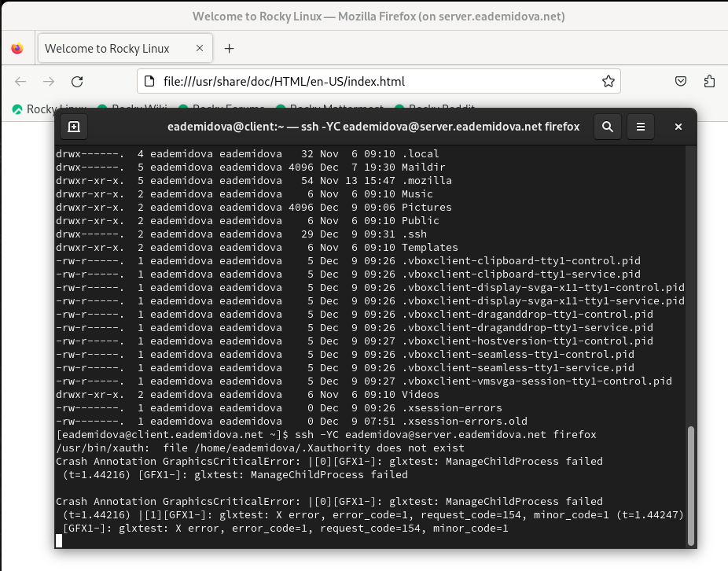{#fig:019 width=60%}

## Внесение изменений в настройки внутреннего окружения виртуальной машины

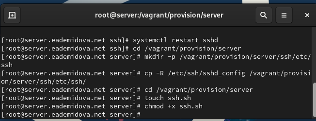{#fig:020 width=70%}

## Внесение изменений в настройки внутреннего окружения виртуальной машины

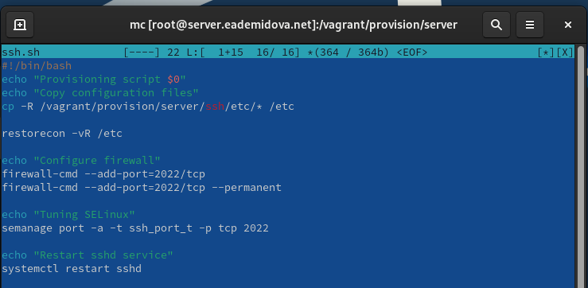{#fig:021 width=70%}

## Внесение изменений в настройки внутреннего окружения виртуальной машины

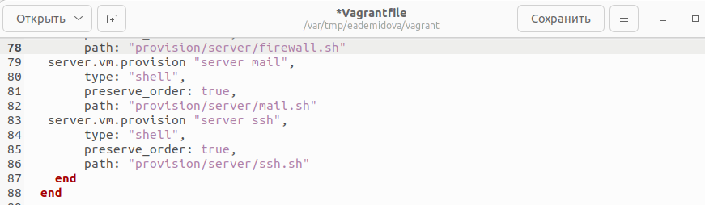{#fig:022 width=70%}

# Заключение

## Выводы

В результате выполнения данной работы были приобретены практические навыки по настройке удалённого доступа к серверу с помощью SSH.