---
## Front matter
title: "Лабораторная работа №11"
subtitle: "Настройка безопасного удалённого доступа по протоколу SSH"
author: "Демидова Екатерина Алексеевна"

## Generic otions
lang: ru-RU
toc-title: "Содержание"

## Bibliography
bibliography: bib/cite.bib
csl: pandoc/csl/gost-r-7-0-5-2008-numeric.csl

## Pdf output format
toc: true # Table of contents
toc-depth: 2
lof: true # List of figures
lot: false # List of tables
fontsize: 12pt
linestretch: 1.5
papersize: a4
documentclass: scrreprt
## I18n polyglossia
polyglossia-lang:
  name: russian
  options:
	- spelling=modern
	- babelshorthands=true
polyglossia-otherlangs:
  name: english
## I18n babel
babel-lang: russian
babel-otherlangs: english
## Fonts
mainfont: PT Serif
romanfont: PT Serif
sansfont: PT Sans
monofont: PT Mono
mainfontoptions: Ligatures=TeX
romanfontoptions: Ligatures=TeX
sansfontoptions: Ligatures=TeX,Scale=MatchLowercase
monofontoptions: Scale=MatchLowercase,Scale=0.9
## Biblatex
biblatex: true
biblio-style: "gost-numeric"
biblatexoptions:
  - parentracker=true
  - backend=biber
  - hyperref=auto
  - language=auto
  - autolang=other*
  - citestyle=gost-numeric
## Pandoc-crossref LaTeX customization
figureTitle: "Рис."
tableTitle: "Таблица"
listingTitle: "Листинг"
lofTitle: "Список иллюстраций"
lotTitle: "Список таблиц"
lolTitle: "Листинги"
## Misc options
indent: true
header-includes:
  - \usepackage{indentfirst}
  - \usepackage{float} # keep figures where there are in the text
  - \floatplacement{figure}{H} # keep figures where there are in the text
---

# Цель работы

Приобретение практических навыков по настройке удалённого доступа к серверу с помощью SSH.

# Задание

1. Настройте запрет удалённого доступа на сервер по SSH для пользователя root.
2. Настройте разрешение удалённого доступа к серверу по SSH только для пользователей группы vagrant и вашего пользователя.
3. Настройте удалённый доступ к серверу по SSH через порт 2022.
4. Настройте удалённый доступ к серверу по SSH по ключу.
5. Организуйте SSH-туннель с клиента на сервер, перенаправив локальное соединение с TCP-порта 80 на порт 8080.
6. Используя удалённое SSH-соединение, выполните с клиента несколько команд на сервере.
7. Используя удалённое SSH-соединение, запустите с клиента графическое приложение на сервере.
8. Напишите скрипт для Vagrant, фиксирующий действия по настройке SSH-сервера во внутреннем окружении виртуальной машины server. Соответствующим образом внесите изменения в Vagrantfile.

# Выполнение лабораторной работы

## Запрет удалённого доступа по SSH для пользователя root

Загрузим нашу операционную систему и перейдем в рабочий каталог с проектом:
```
cd /var/tmp/eademidova/vagrant
```
Затем запустим виртуальную машину server:
```
make server-up
```

Откроем терминал и перейдем в режим суперпользователя

В дополнительном терминале запустим мониторинг  системных событий с помощью команды `journalctl -x -f`. С клиента попытаемся получить доступ к серверу посредством SSH-соединения через пользователя root(рис. @fig:001):

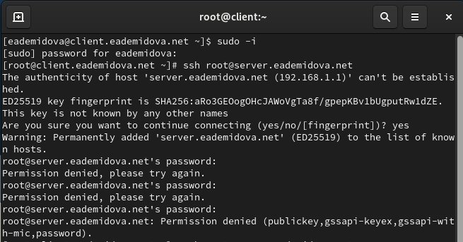{#fig:001 width=70%}

При попытке соединения, так как мы делаем это первый раз, добавлям сервер в список известных хостов. Затем требуется ввести пароль от пользователя root, но соединение отклоняется.

На сервере откроем файл /etc/ssh/sshd_config конфигурации sshd для редактирования и запретим вход на сервер пользователю root, установив(рис. @fig:002):

{#fig:002 width=70%}

После сохранения изменений в файле конфигурации перезапустим sshd с помощью команды `systemctl restart sshd`.
Повторим попытку получения доступа с клиента к серверу посредством SSH-соединения через пользователя root(здесь первое удачное соединение с разрешенным входом на сервер пользователю рут, а второ подключение уже с запрещенным)(@fig:003):

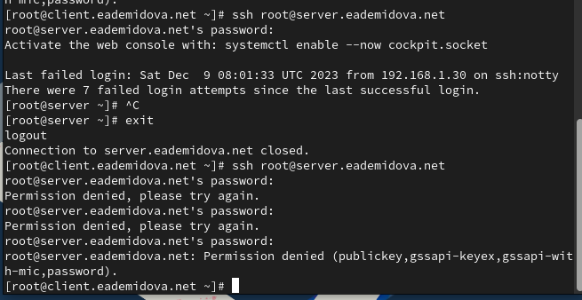{#fig:003 width=70%}

## Ограничение списка пользователей для удалённого доступа по SSH

С клиента попытаемся получить доступ к серверу посредством SSH-соединения через пользователя eademidova(рис. @fig:004):

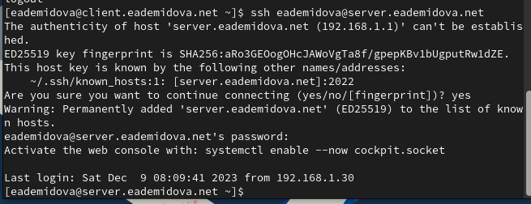{#fig:004 width=70%}

Соединениие проходит удачно.

На сервере откроем файл /etc/ssh/sshd_config конфигурации sshd на редактирование и добавим строку(@fig:005):

{#fig:005 width=70%}

После сохранения изменений в файле конфигурации перезапустим sshd.

Повторим попытку получения доступа с клиента к серверу посредством SSH-соединения через пользователя eademidova(рис. @fig:006):

{#fig:006 width=70%}

В этот раз соединение не устанавливается, так как в списке разрешенных пользователей нет нашего.

В файле /etc/ssh/sshd_config конфигурации sshd внесем следующее изменение(@fig:007):

{#fig:007 width=70%}

Снова попытаемся установить соединение с клиента к серверу(@fig:008):

{#fig:008 width=70%}

В этот раз доступ получен.

## Настройка дополнительных портов для удалённого доступа по SSH

На сервере в файле конфигурации sshd /etc/ssh/sshd_config найдем строку Port и ниже этой строки добавим(@fig:009):

{#fig:009 width=70%}

Эта запись сообщает процессу sshd о необходимости организации соединения через два разных порта, что даёт гарантию возможности открыть сеансы SSH, даже если была сделана ошибка в конфигурации.

После сохранения изменений в файле конфигурации перезапустим sshd.

Посмотрим расширенный статус работы sshd(@fig:009):

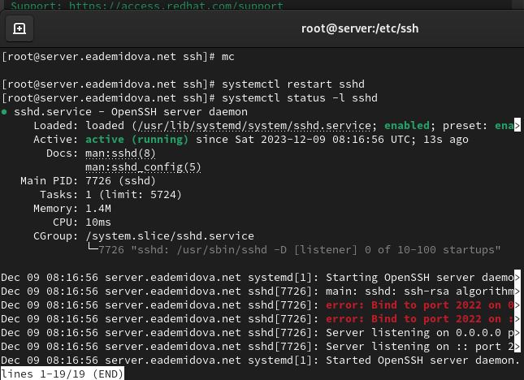{#fig:010 width=70%}

Система сообщает об отказе в работе sshd через порт 2022. Дополнительно посмотрим сообщения в терминале с мониторингом системных событий(рис. @fig:011):

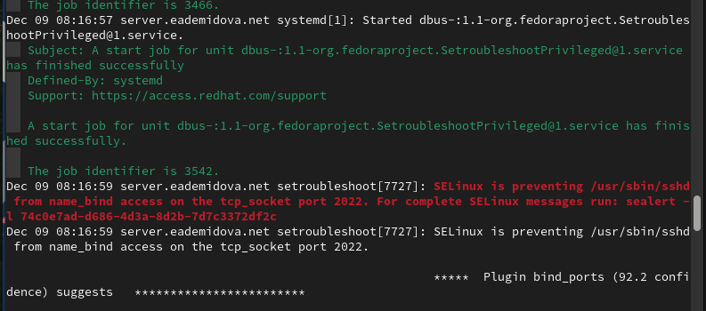{#fig:011 width=70%}

Можно увидеть, что отказ происходит из-за запрета SELinux на работу с этим портом.

Исправим на сервере метки SELinux к порту 2022 и в настройках межсетевого экрана откроем порт 2022 протокола. Вновь перезапустим sshd и посмотрите расширенный статус его работы. Статус показывает, что процесс sshd теперь прослушивает два порта(@fig:012)

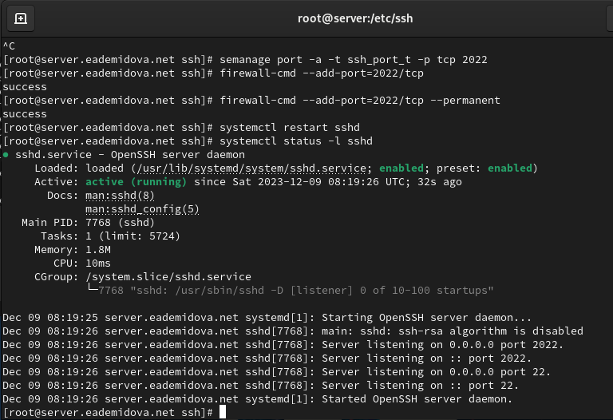{#fig:012 width=70%}

С клиента попытаемся получить доступ к серверу посредством SSH-соединения через пользователя eademidova обычным способом и указав порт 2022(рис. @fig:013):

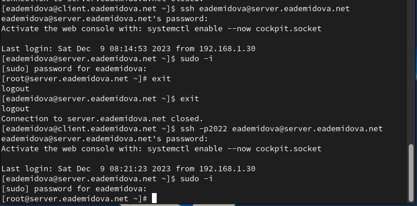{#fig:013 width=70%}

## Настройка удалённого доступа по SSH по ключу

Создадим пару из открытого и закрытого ключей для входа на сервер.

На сервере в конфигурационном файле /etc/ssh/sshd_config зададим параметр,
разрешающий аутентификацию по ключу, написав:

```
PubkeyAuthentication yes
```

После сохранения изменений в файле конфигурации перезапустим sshd.

На клиенте сформируем SSH-ключ, введя в терминале(@fig:014):

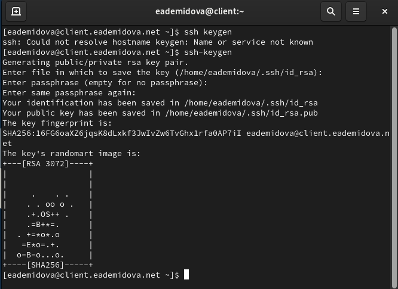{#fig:014 width=70%}

Закрытый ключ теперь будет записан в файл ~/.ssh/id_rsa, а открытый ключ записывается в файл ~/.ssh/id_rsa.pub.

Скопируем открытый ключ на сервер, введя на клиенте:
```
ssh-copy-id user@server.user.net
```

Попробуем получить доступ с клиента к серверу посредством SSH-соединения(@fig:015):

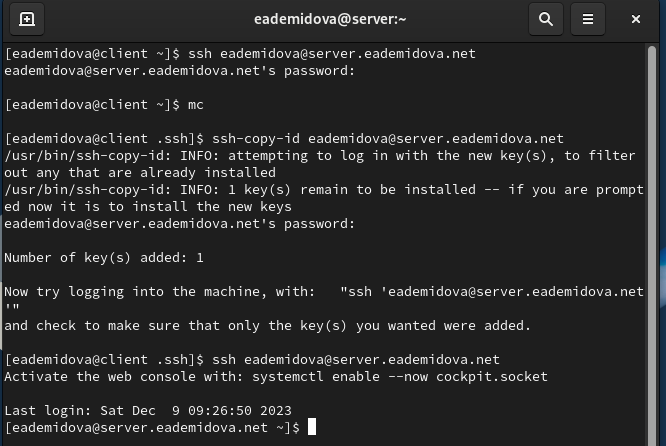{#fig:015 width=70%}

## Организация туннелей SSH, перенаправление TCP-портов

На клиенте посмотрим, запущены ли какие-то службы с протоколом TCP, на данный момент их нет. Перенаправим порт 80 на server.eademidova.net на порт 8080 на локальной машине и вновь на клиенте посмотрим, запущены ли какие-то службы с протоколом TCP(рис. @fig:016)

{#fig:016 width=70%}

Появилось три службы, использующие TCP протокол -- появился доступ к mail.eademidova.net по ssh, а также к локальному хосту по IPv4 и IPv6.

На клиенте запустим браузер и в адресной строке введем localhost:8080. Отображается страница с приветствием «Welcome to the server.eademidova.net server»(@fig:017):

{#fig:017 width=70%}

## Запуск консольных приложений через SSH

На клиенте откроем терминал под пользователем eademidova и посмотрим с клиента имя узла сервера, файлов на сервере и почту(рис. @fig:018):

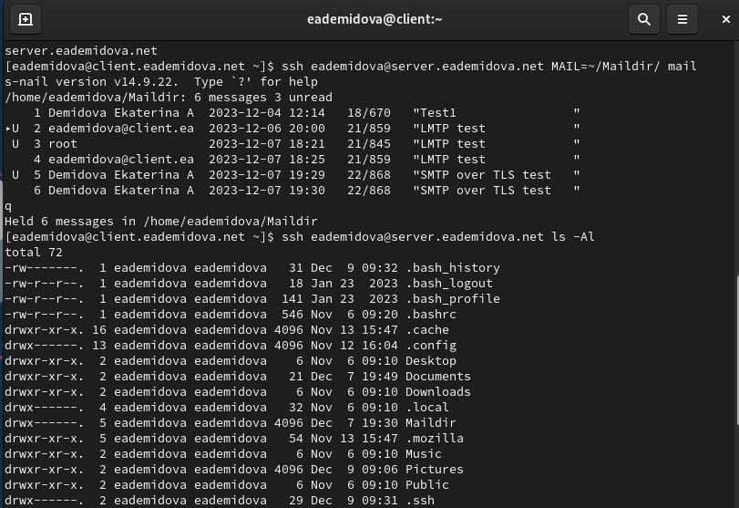{#fig:018 width=70%}


## Запуск графических приложений через SSH (X11Forwarding)

На сервере в конфигурационном файле /etc/ssh/sshd_config разрешим отображать на локальном клиентском компьютере графические интерфейсы X11, прописав:
```
X11Forwarding yes
```

После сохранения изменения в конфигурационном файле перезапустим sshd

Попробуем с клиента удалённо подключиться к серверу и запустить графическое
приложение firefox(рис. @fig:019):

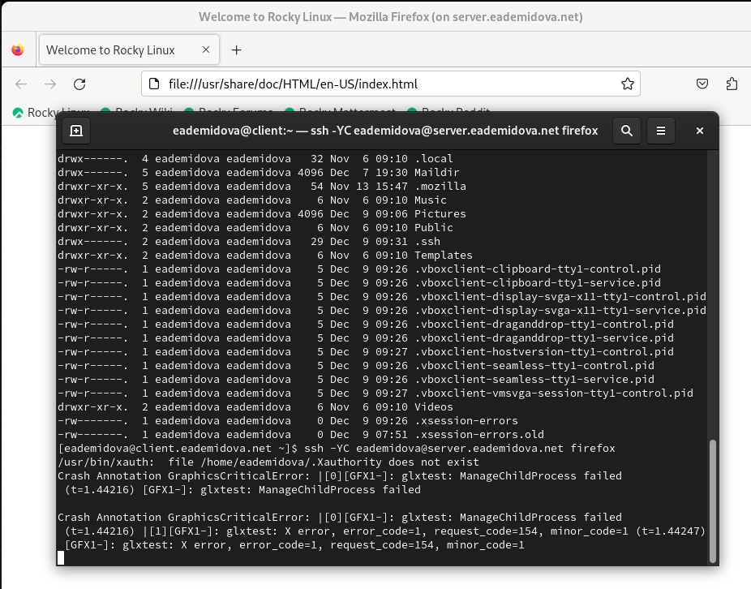{#fig:019 width=70%}

## Внесение изменений в настройки внутреннего окружения виртуальной машины

На виртуальной машине server перейдем в каталог для внесения изменений в настройки внутреннего окружения /vagrant/provision/server/, создадим в нём каталог ssh, в который поместим в соответствующие подкаталоги конфигурационный файл sshd_config и в каталоге /vagrant/provision/server создадим исполняемый файл ssh.sh(рис. @fig:020)

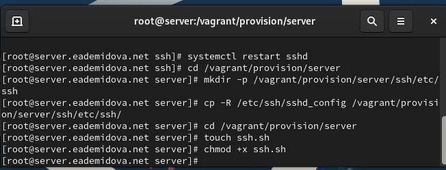{#fig:020 width=70%}

Пропишем скрипт в /vagrant/provision/server/ssh.sht(@fig:021):

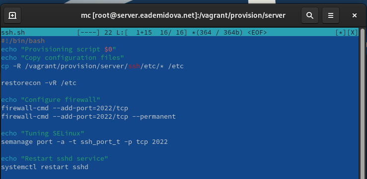{#fig:021 width=70%}

Для отработки созданного скрипта во время загрузки виртуальной машины server в конфигурационном файле Vagrantfile добавим следующую запись в разделе конфигурации для сервера(@fig:022):

{#fig:022 width=70%}

# Контрольные вопросы

1. Вы хотите запретить удалённый доступ по SSH на сервер пользователю root и разрешить доступ пользователю alice. Как это сделать?
2. Как настроить удалённый доступ по SSH через несколько портов? Для чего это может потребоваться?
3. Какие параметры используются для создания туннеля SSH, когда команда ssh устанавливает фоновое соединение и не ожидает какой-либо конкретной команды?
4. Как настроить локальную переадресацию с локального порта 5555 на порт 80 сервера server2.example.com?
5. Как настроить SELinux, чтобы позволить SSH связываться с портом 2022?
6. Как настроить межсетевой экран на сервере, чтобы разрешить входящие подключения по SSH через порт 2022?

1. В файле /etc/ssh/sshd_config конфигурации прописать `PermitRootLogin no` и `AllowUsers alice`.

2. Для настройки удалённого доступа по SSH через несколько портов нужно отредактировать файл конфигурации SSH (/etc/ssh/sshd_config) и добавить строку `Port <порт>`. 

3. Для установки фонового соединения без команды используется параметр -N при использовании команды ssh: `ssh -N <hostname>`.

4. Для настройки локальной переадресации с локального порта 5555 на порт 80 сервера server2.example.com следует использовать команду: `ssh -fNL 80:localhost:55555 server2.example.com`.

5. Для настройки SELinux и разрешения SSH связываться с портом 2022 можно использовать команду: semanage port -a -t ssh_port_t -p tcp 2022.

6. Для разрешения входящих подключений по SSH через порт 2022 с помощью межсетевого экрана следует использовать команду: `firewall-cmd --add-port=2022/tcp --permanent`.

# Выводы

В результате выполнения данной работы были приобретены практические навыки по настройке удалённого доступа к серверу с помощью SSH.


