---
## Front matter
lang: ru-RU
title: Лабораторная работа № 12
subtitle: Синхронизация времени
author:
  - Демидова Е. А.
institute:
  - Российский университет дружбы народов, Москва, Россия
date: 15 декабря 2023 

## i18n babel
babel-lang: russian
babel-otherlangs: english

## Formatting pdf
toc: false
toc-title: Содержание
slide_level: 2
aspectratio: 169
section-titles: true
theme: metropolis
header-includes:
 - \metroset{progressbar=frametitle,sectionpage=progressbar,numbering=fraction}
 - '\makeatletter'
 - '\beamer@ignorenonframefalse'
 - '\makeatother'
---

# Вводная часть

## Цель работы

Приобретение практических навыков по управлению системным временем и настройке синхронизации времени.

## Задание

1. Изучите команды по настройке параметров времени.
2. Настройте сервер в качестве сервера синхронизации времени для локальной сети.
3. Напишите скрипты для Vagrant, фиксирующие действия по установке и настройке NTP-сервера и клиента.

# Выполнение лабораторной работы

## Настройка параметров времени

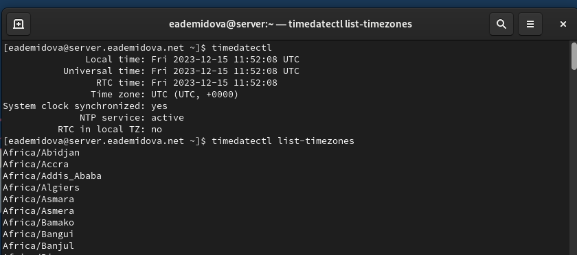{#fig:001 width=70%}

## Настройка параметров времени

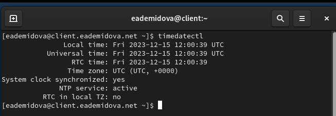{#fig:002 width=70%}

## Настройка параметров времени

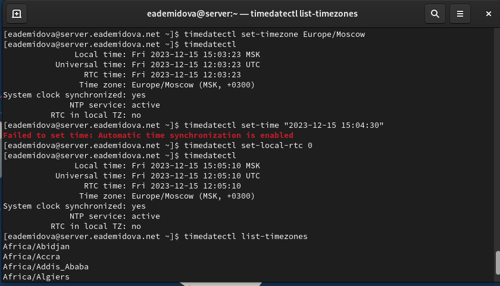{#fig:003 width=70%}

## Настройка параметров времени

{#fig:004 width=70%}

## Настройка параметров времени

{#fig:005 width=70%}

## Настройка параметров времени

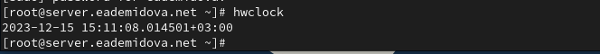{#fig:006 width=70%}

## Настройка параметров времени

{#fig:007 width=70%}

## Управление синхронизацией времени

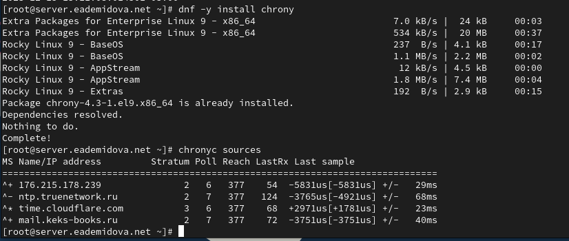{#fig:008 width=70%}

## Управление синхронизацией времени

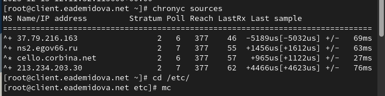{#fig:009 width=70%}

## Управление синхронизацией времени

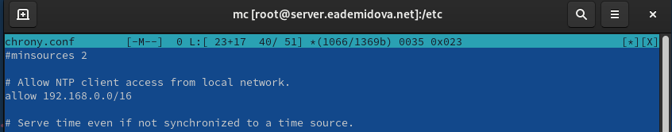{#fig:010 width=70%}

## Управление синхронизацией времени

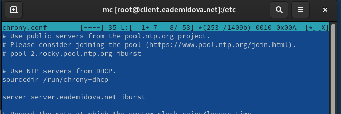{#fig:011 width=70%}

## Управление синхронизацией времени

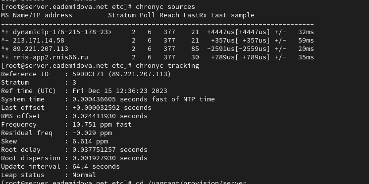{#fig:012 width=70%}

## Управление синхронизацией времени

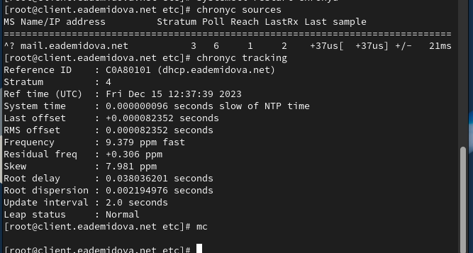{#fig:013 width=70%}

## Внесение изменений в настройки внутреннего окружения виртуальных машины

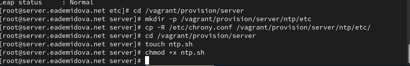{#fig:014 width=70%}

## Внесение изменений в настройки внутреннего окружения виртуальных машины

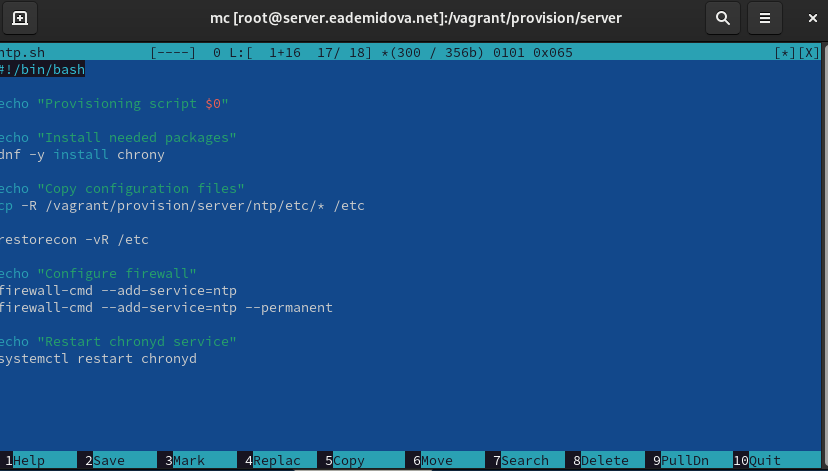{#fig:015 width=70%}

## Внесение изменений в настройки внутреннего окружения виртуальных машины

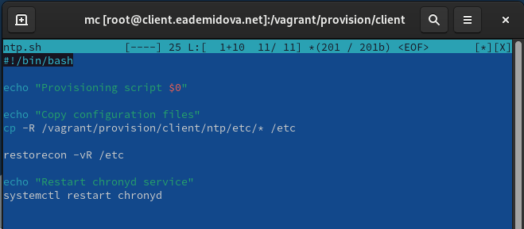{#fig:016 width=70%}

## Внесение изменений в настройки внутреннего окружения виртуальных машины

```
server.vm.provision "server ntp",
type: "shell",
preserve_order: true,
path: "provision/server/ntp.sh"

client.vm.provision "client ntp",
type: "shell",
preserve_order: true,
path: "provision/client/ntp.sh"

```
# Заключение

## Выводы

В результате выполнения данной работы были приобретены практические навыки по управлению системным временем и настройке синхронизации времени.