---
## Front matter
title: "Лабораторная работа № 12"
subtitle: "Синхронизация времени"
author: "Демидова Екатерина Алексеевна"

## Generic otions
lang: ru-RU
toc-title: "Содержание"

## Bibliography
bibliography: bib/cite.bib
csl: pandoc/csl/gost-r-7-0-5-2008-numeric.csl

## Pdf output format
toc: true # Table of contents
toc-depth: 2
lof: true # List of figures
lot: false # List of tables
fontsize: 12pt
linestretch: 1.5
papersize: a4
documentclass: scrreprt
## I18n polyglossia
polyglossia-lang:
  name: russian
  options:
	- spelling=modern
	- babelshorthands=true
polyglossia-otherlangs:
  name: english
## I18n babel
babel-lang: russian
babel-otherlangs: english
## Fonts
mainfont: PT Serif
romanfont: PT Serif
sansfont: PT Sans
monofont: PT Mono
mainfontoptions: Ligatures=TeX
romanfontoptions: Ligatures=TeX
sansfontoptions: Ligatures=TeX,Scale=MatchLowercase
monofontoptions: Scale=MatchLowercase,Scale=0.9
## Biblatex
biblatex: true
biblio-style: "gost-numeric"
biblatexoptions:
  - parentracker=true
  - backend=biber
  - hyperref=auto
  - language=auto
  - autolang=other*
  - citestyle=gost-numeric
## Pandoc-crossref LaTeX customization
figureTitle: "Рис."
tableTitle: "Таблица"
listingTitle: "Листинг"
lofTitle: "Список иллюстраций"
lotTitle: "Список таблиц"
lolTitle: "Листинги"
## Misc options
indent: true
header-includes:
  - \usepackage{indentfirst}
  - \usepackage{float} # keep figures where there are in the text
  - \floatplacement{figure}{H} # keep figures where there are in the text
---

# Цель работы

Приобретение практических навыков по управлению системным временем и настройке синхронизации времени.

# Задание

1. Изучите команды по настройке параметров времени.
2. Настройте сервер в качестве сервера синхронизации времени для локальной сети.
3. Напишите скрипты для Vagrant, фиксирующие действия по установке и настройке NTP-сервера и клиента.

# Выполнение лабораторной работы

## Настройка параметров времени

Загрузим нашу операционную систему и перейдем в рабочий каталог с проектом:
```
cd /var/tmp/eademidova/vagrant
```
Затем запустим виртуальную машину server:
```
make server-up
```

На сервере и клиенте посмотрим параметры настройки даты и времени(рис. @fig:001, @fig:002):

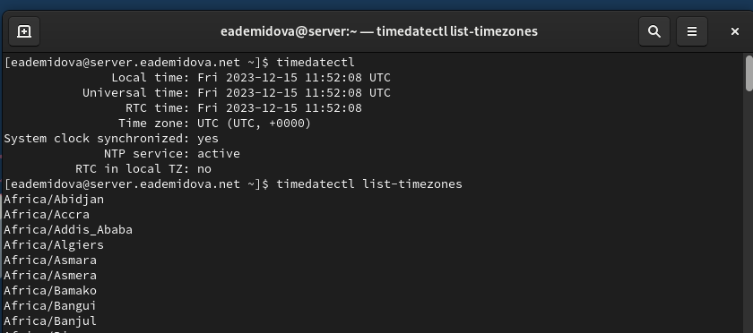{#fig:001 width=70%}

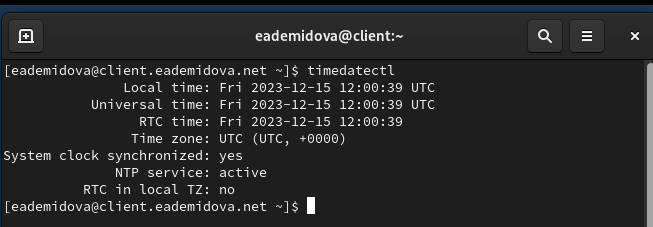{#fig:002 width=70%}

Можно увидеть, что устройство находится во временной зоне UTC+0:00 -- это всемирное координированное время, сетевая синхронизацию времени проводится. С помощью этой же команды мы можем посмотреть список доступных временных зон, поменять временную зону. При попытке поменять системное время получим отказ, так как включена синхронизация(@fig:003):

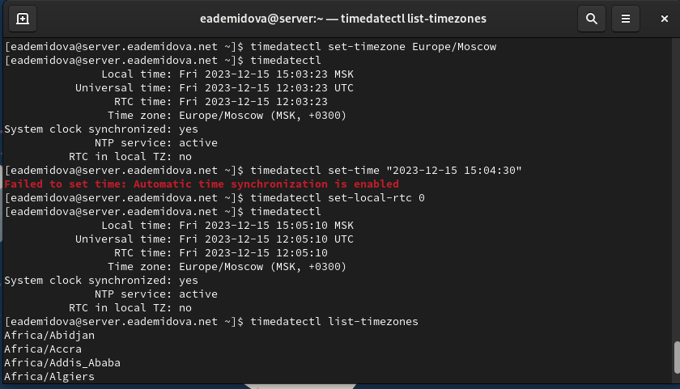{#fig:003 width=70%}

На сервере и клиенте посмотрим текущее системное время(@fig:004, @fig:005):

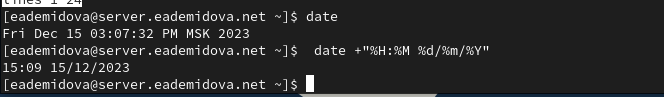{#fig:004 width=70%}

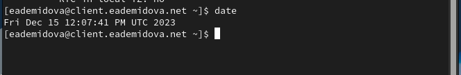{#fig:005 width=70%}

Также можно смотреть время в разных форматах задавая шаблон отображения.

На сервере и клиенте посмотрим аппаратное время(@fig:006, @fig:007):

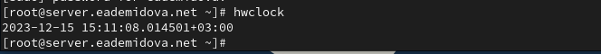{#fig:006 width=70%}

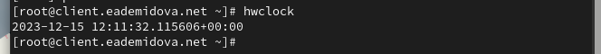{#fig:007 width=70%}

## Управление синхронизацией времени

Установим на сервер необходимые пакеты и проверим источники времени на клиенте и сервере(@fig:008, @fig:009):

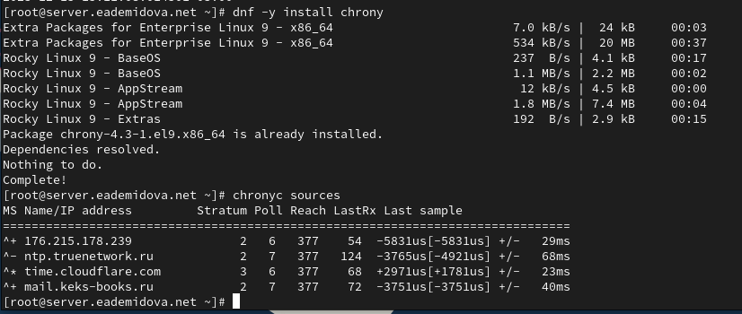{#fig:008 width=70%}

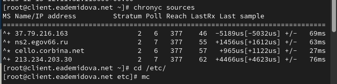{#fig:009 width=70%}

Эта команда выводит источники синхронизации. В первом столбце указан IP-адрес или имя источника. Во втором показан слой источника. Уровень 1 указывает на компьютер с локально подключенными эталонными часами. Компьютер, синхронизированный с компьютером уровня 1, находится на уровне 2. В нашем случае все источники второго уровня. Так же указаны скорости опроса источника в виде логарифма по основанию 2 интервала в секундах. Таким образом, значения у наших источников 6 и 7 означают, что измерение выполняется каждые 64 и 128 секунд. Следующтй столбец показывает регистр досягаемости источника, напечатанный в виде восьмеричного числа. Регистр имеет 8 бит и обновляется при каждом полученном или пропущенном пакете от источника. Значение 377 указывает, что для всех последних восьми передач был получен действительный ответ. В следующем столбце показано, как давно была получена последняя выборка от источника. Последний столбец показывает смещение между местными часами и источником при последнем измерении.

На сервере откроем на редактирование файл /etc/chrony.conf и добавим строку(@fig:009):

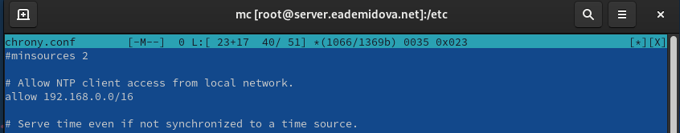{#fig:010 width=70%}

Затем на сервере перезапустим службу chronyd и настроим межсетевой экран для работы с ntp:

```
systemctl restart chronyd

firewall-cmd --add-service=ntp --permanent
firewall-cmd --reload
```


На клиенте откроем файл /etc/chrony.conf и добавим строку, указывающую источником синхронизации сервер(рис. @fig:011):

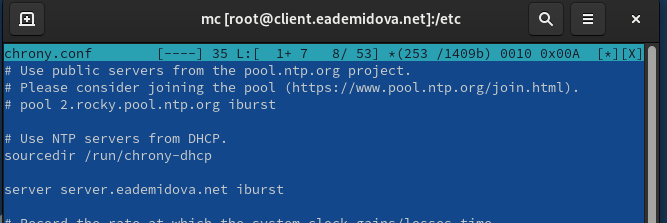{#fig:011 width=70%}

Затем на клиенте перезапустим службу chronyd. Проверим источники времени на клиенте и сервере (@fig:012, @fig:013)

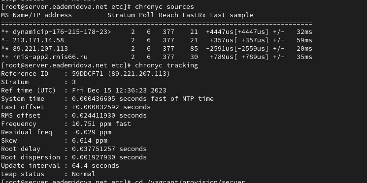{#fig:012 width=70%}

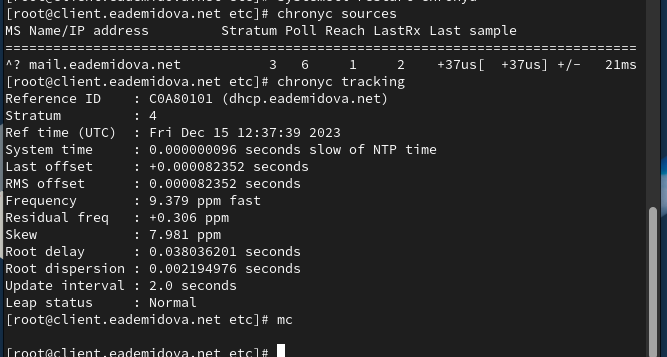{#fig:013 width=70%}

Теперь на клиенте один источник синхронизации времени - наш сервер, имеющий уровень 3(то есть синхронизируется с ичточниками, которые синхронизируются от первичного источника).

При просмотре подробной информации о синхронизации можно увидеть, что клиент имеет уровень синхронизации - 4, так как синхронизирутеся с сервером, имеющим уровень 3. Также выводится информация о реальном времени, системном времени, частоте  обновления, задержке, leap status - в нашем случае он нормальный, то есть всё синхронизировано.

## Внесение изменений в настройки внутреннего окружения виртуальных машины

На виртуальной машине server перейдем в каталог для внесения изменений в настройки внутреннего окружения /vagrant/provision/server/, создадим в нём каталоги /ntp/etc, в который поместим конфигурационный файл hrony.conf и в каталоге /vagrant/provision/server создадим исполняемый файл ntp.sh(рис. @fig:014)

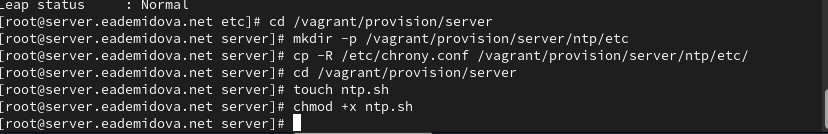{#fig:014 width=70%}

То же самое сделаем на виртуальной машине client.

Пропишем скрипт в /vagrant/provision/server/ntp.sh(@fig:015):

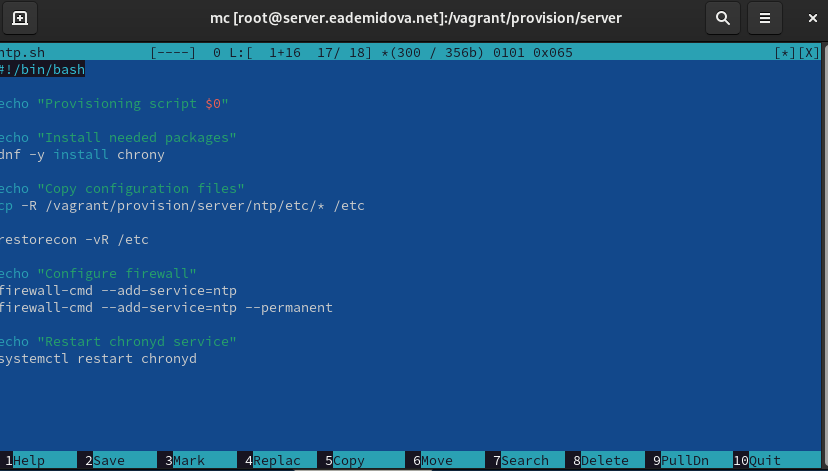{#fig:015 width=70%}

И пропишем скрипт в /vagrant/provision/client/ntp.sh(@fig:016):

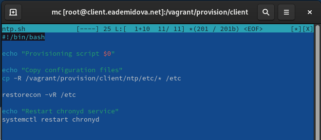{#fig:016 width=70%}

Затем для отработки созданных скриптов в конфигурационном файле Vagrantfile необходимо добавить в соответствующих разделах конфигураций для сервера и клиента:

```
server.vm.provision "server ntp",
type: "shell",
preserve_order: true,
path: "provision/server/ntp.sh"

client.vm.provision "client ntp",
type: "shell",
preserve_order: true,
path: "provision/client/ntp.sh"

```

# Контрольные вопросы

1. Почему важна точная синхронизация времени для служб баз данных?
2. Почему служба проверки подлинности Kerberos сильно зависит от правильной син
хронизации времени?
3. Какая служба используется по умолчанию для синхронизации времени на RHEL 7?
4. Какова страта по умолчанию для локальных часов?
5. Какой порт брандмауэра должен быть открыт, если вы настраиваете свой сервер как одноранговый узел NTP?
6. Какую строку вам нужно включить в конфигурационный файл chrony, если вы хотите быть сервером времени, даже если внешние серверы NTP недоступны?
7. Какую страту имеет хост, если нет текущей синхронизации времени NTP?
8. Какую команду вы бы использовали на сервере с chrony, чтобы узнать, с какими серверами он синхронизируется?
9. Как вы можете получить подробную статистику текущих настроек времени для процесса chrony вашего сервера?

1. Точная синхронизация времени в службах баз данных важна для обеспечения целостности и согласованности данных. Она позволяет различным узлам базы данных оперировать с одним и тем же временем, что помогает предотвратить конфликты при репликации данных и обеспечить правильную последовательность операций.

2. Служба проверки подлинности Kerberos зависит от правильной синхронизации времени для обеспечения безопасности. Керберос использует временные метки для защиты от атак воспроизведения и повтора. Если временные метки не синхронизированы правильно, то проверка подлинности Kerberos может не работать, так как таймстампы могут быть некорректно интерпретированы.

3. На RHEL 7 по умолчанию используется служба chronyd для синхронизации времени.

4. Страта по умолчанию для локальных часов в chronyd равна 10.

5. Для настройки своего сервера как однорангового узла NTP необходимо открыть порт 123 UDP в брандмауэре.

6. Для настройки сервера времени в chrony, даже если внешние серверы NTP недоступны, нужно включить строку "local stratum 10" в конфигурационном файле chrony.

7. Если нет текущей синхронизации времени NTP, хост будет иметь страту 16, что означает "недоступно".

8. Для узнавания с какими серверами chrony синхронизируется, можно использовать команду "chronyc sources".

9. Для получения подробной статистики текущих настроек времени для процесса chrony на вашем сервере можно использовать команду "chronyc tracking".

# Выводы

В результате выполнения данной работы были приобретены практические навыки по управлению системным временем и настройке синхронизации времени.


