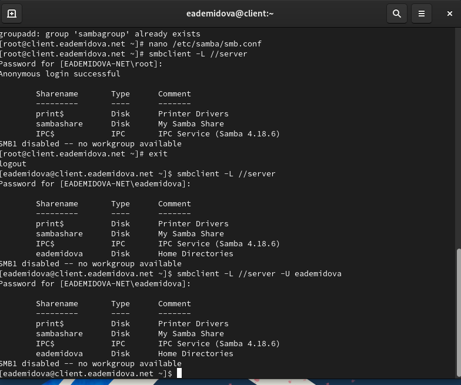
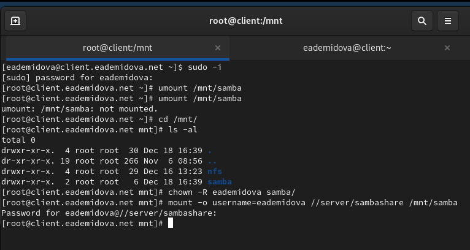

---
## Front matter
title: "Лабораторная работа № 14"
subtitle: "Настройка файловых служб Samba"
author: "Демидова Екатерина Алексеевна"

## Generic otions
lang: ru-RU
toc-title: "Содержание"

## Bibliography
bibliography: bib/cite.bib
csl: pandoc/csl/gost-r-7-0-5-2008-numeric.csl

## Pdf output format
toc: true # Table of contents
toc-depth: 2
lof: true # List of figures
lot: false # List of tables
fontsize: 12pt
linestretch: 1.5
papersize: a4
documentclass: scrreprt
## I18n polyglossia
polyglossia-lang:
  name: russian
  options:
	- spelling=modern
	- babelshorthands=true
polyglossia-otherlangs:
  name: english
## I18n babel
babel-lang: russian
babel-otherlangs: english
## Fonts
mainfont: PT Serif
romanfont: PT Serif
sansfont: PT Sans
monofont: PT Mono
mainfontoptions: Ligatures=TeX
romanfontoptions: Ligatures=TeX
sansfontoptions: Ligatures=TeX,Scale=MatchLowercase
monofontoptions: Scale=MatchLowercase,Scale=0.9
## Biblatex
biblatex: true
biblio-style: "gost-numeric"
biblatexoptions:
  - parentracker=true
  - backend=biber
  - hyperref=auto
  - language=auto
  - autolang=other*
  - citestyle=gost-numeric
## Pandoc-crossref LaTeX customization
figureTitle: "Рис."
tableTitle: "Таблица"
listingTitle: "Листинг"
lofTitle: "Список иллюстраций"
lotTitle: "Список таблиц"
lolTitle: "Листинги"
## Misc options
indent: true
header-includes:
  - \usepackage{indentfirst}
  - \usepackage{float} # keep figures where there are in the text
  - \floatplacement{figure}{H} # keep figures where there are in the text
---

# Цель работы

Приобретение навыков настройки доступа групп пользователей к общим ресурсам по протоколу SMB.

# Задание

1. Установите и настройте сервер Samba.
2. Настройте на клиенте доступ к разделяемым ресурсам.
3. Напишите скрипты для Vagrant, фиксирующие действия по установке и настройке сервера Samba для доступа к разделяемым ресурсам во внутреннем окружении виртуальных машин server и client. Соответствующим образом необходимо внести изменения в Vagrantfile.

# Выполнение лабораторной работы

## Настройка сервера Samba

Загрузим нашу операционную систему и перейдем в рабочий каталог с проектом:
```
cd /var/tmp/eademidova/vagrant
```
Затем запустим виртуальную машину server:
```
make server-up
```

На сервере установим необходимые пакеты:

```
dnf -y install samba samba-client cifs-utils
```

Создадим группу sambagroup для пользователей, которые будут работать с Samba-сервером, и присвоим ей GID 1010 с помощью команды `groupadd -g 1010 sambagroup`. Затем добавим пользователя eademidova к группе sambagroup командой `usermod -aG sambagroup user`.  И создадим общий каталог в файловой системе Linux, в который предполагается монтировать разделяемые ресурсы:(рис. @fig:001):

{#fig:001 width=70%}

В файле конфигурации /etc/samba/smb.conf изменим параметр рабочей группы и в конец файла добавим раздел с описанием общего доступа к разделяемому ресурсу /srv/sambashare(рис. @fig:002):

{#fig:002 width=70%}

Убедимся, что не сделали синтаксических ошибок в файле smb.conf и запустим демон Samba, а затем посмотрим его статус(@fig:003):

{#fig:003 width=70%}

Для проверки наличия общего доступа попробуем подключиться к серверу с помощью smbclient(@fig:004):

{#fig:004 width=70%}

Посмотрите файл конфигурации межсетевого экрана для Samba(@fig:005):

{#fig:005 width=70%}

Настроим межсетевой экран и права доступа для каталога с разделяемым ресурсом(@fig:006):

{#fig:006 width=70%}

Посмотрим контекст безопасности SELinux и настроим его для каталога с разделяемым ресурсом. Затем проверим, что контекст безопасности изменился и резрешим экспортировать разделяемыйе ресурсы для чтения и записи(@fig:007):

{#fig:007 width=70%}

Посмотрим UID нашего пользователя и в какие группы он включён(@fig:008):

{#fig:008 width=70%}

Затем под нашим пользователем eademidova попробуем создать файл на разделяемом ресурсе(@fig:009):

{#fig:009 width=70%}

Добавим пользователя eademidova в базу пользователей Samba(@fig:010):

{#fig:010 width=70%}

## Монтирование файловой системы Samba на клиенте

На клиенте установим необходимые пакеты. Затем посмотрим файл конфигурации межсетевого экрана для клиента Samba, настроим межсетевой экран и создадим группу sambagroup, добавим в неё пользователя eademidova(рис. @fig:011):

{#fig:011 width=70%}

На клиенте в файле конфигурации /etc/samba/smb.conf изменим параметр рабочей группы(рис. @fig:012):

{#fig:012 width=70%}

Для проверки наличия общего доступа попробуем подключиться с клиента к серверу с помощью smbclient под учетной записью root, зайдя как анонимный пользователь и под учетной записью eademidova. Затем подключемся к клиенту с сервера под учётной записью нашего пользователя(указав параметр -U можно авторизоваться под записью eadfemidova и с пользователя root)(@fig:013)

{#fig:013 width=70%}

Теперь создадим точку монтирования с помощью команды `mkdir /mnt/samba` и на клиенте получим доступ к общему ресурсу с помощью `mount`(@fig:014)

{#fig:014 width=70%}

Отмонтируем каталог /mnt/samba и для настройки работы с Samba с помощью файла учётных данных на клиенте создадим файл smbusers в каталоге /etc/samba/(@fig:015)

{#fig:015 width=70%}

Внесём в этот файл следующее содержимое(@fig:016)

{#fig:016 width=70%}

На клиенте в файле /etc/fstab добавим следующую строку(@fig:017)

{#fig:017 width=70%}

Подмонтируем общий ресурс(@fig:018)

{#fig:018 width=70%}

Перезапустим клиента и проверим, что ресурс монтируется и после перезагрузки, а у пользователя есть доступ к разделяемым ресурсам(@fig:019):

{#fig:019 width=70%}


Подключим каталог пользователя в файле /etc/exports, прописав в нём(@fig:020):

{#fig:020 width=70%}

Внесем изменения в файл /etc/fstab(@fig:021):

{#fig:021 width=70%}

Затем повторно экспортируем каталоги и проверим на клиенте каталог mnt/nfs(@fig:022):

{#fig:022 width=70%}

На клиенте попробуем создать файл в каталоге /mnt/nfs/home/eademidova под пользователями eademidova и root (@fig:023):

{#fig:023 width=70%}

Прав на создание файла нет.

## Внесение изменений в настройки внутреннего окружения виртуальных машины

На виртуальной машине server перейдем в каталог для внесения изменений в настройки внутреннего окружения /vagrant/provision/server/, создадим в нём каталог nfs, в который поместим в соответствующие подкаталоги конфигурационные файлы.

В каталоге /vagrant/provision/server создадим исполняемый файл nfs.sh и внесем скрипт(@fig:024):

{#fig:024 width=70%}

В каталоге /vagrant/provision/client создадим исполняемый файл nfs.sh и внесем скрипт(@fig:025):

{#fig:025 width=70%}

Затем для отработки созданных скриптов в конфигурационном файле Vagrantfile необходимо добавить в соответствующих разделах конфигураций для сервера и клиента:

```
server.vm.provision "server nfs",
  type: "shell",
  preserve_order: true,
  path: "provision/server/nfs.sh"

client.vm.provision "client nfs",
  type: "shell",
  preserve_order: true,
  path: "provision/client/nfs.sh"

```

# Контрольные вопросы

1. Как называется файл конфигурации, содержащий общие ресурсы NFS?
2. Какие порты должны быть открыты в брандмауэре, чтобы обеспечить полный доступ к серверу NFS?
3. Какую опцию следует использовать в /etc/fstab, чтобы убедиться, что общие ресурсы NFS могут быть установлены автоматически при перезагрузке?

1. Файл конфигурации, содержащий общие ресурсы NFS, называется /etc/exports.
2. Для полного доступа к серверу NFS следует открыть TCP и UDP порты 2049 в брандмауэре.
3. Для автоматической установки общих ресурсов NFS при перезагрузке следует использовать опцию "auto" в /etc/fstab.

# Выводы

В результате выполнения данной работы были приобретены практические навыки настройки доступа групп пользователей к общим ресурсам по протоколу SMB.

