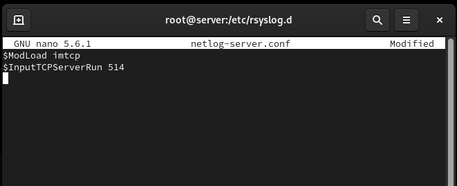
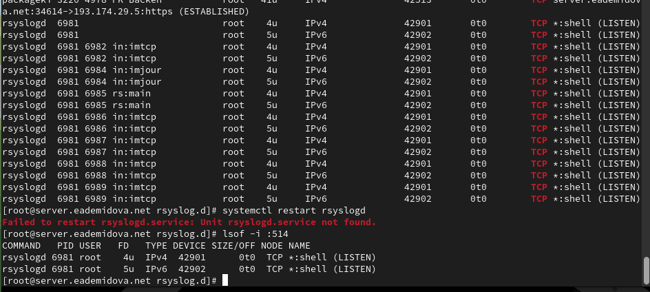
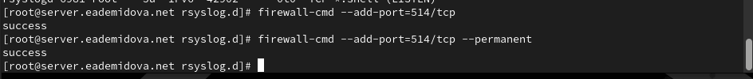
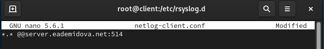
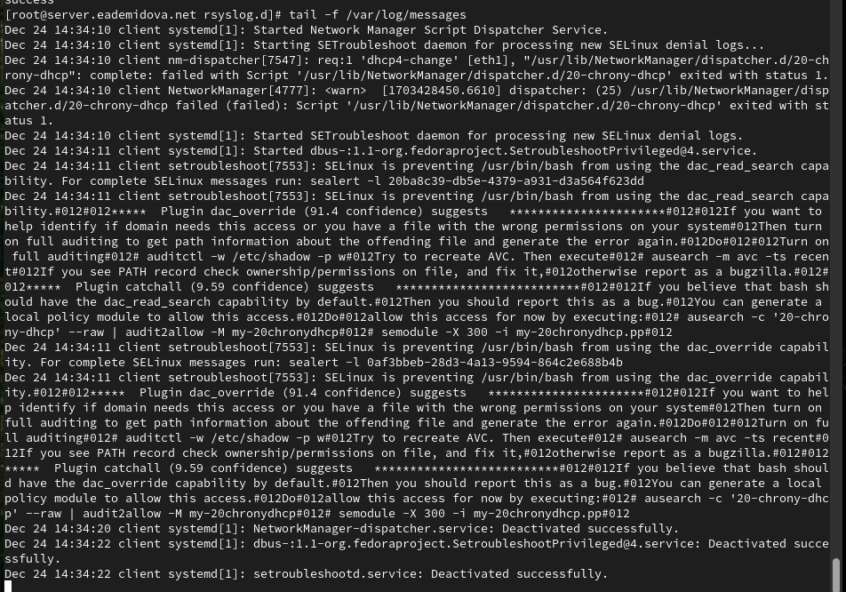
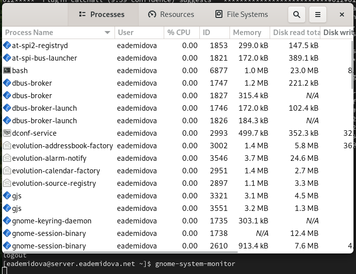
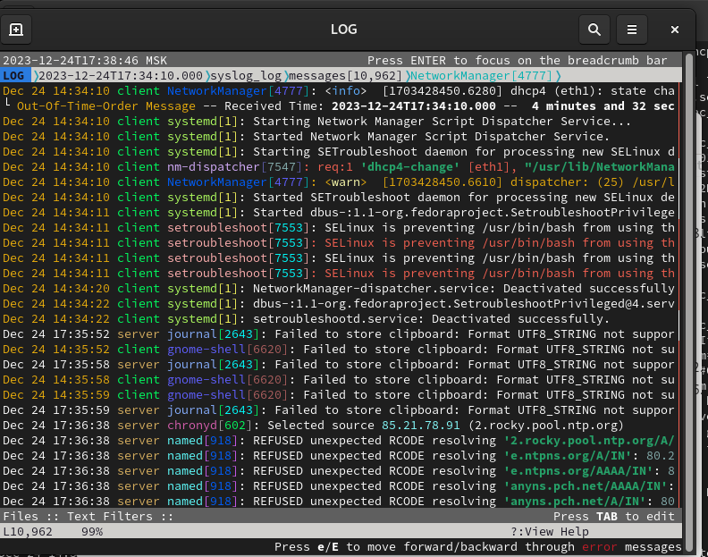
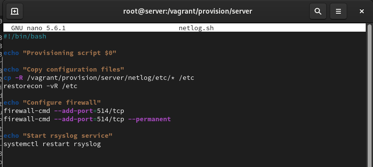
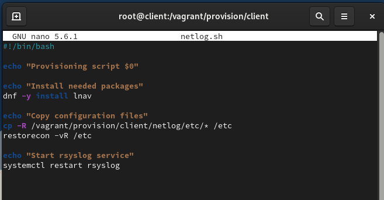

---
## Front matter
lang: ru-RU
title: Лабораторная работа № 15
subtitle: Настройка сетевого журналирования
author:
  - Демидова Е. А.
institute:
  - Российский университет дружбы народов, Москва, Россия
date: 18 декабря 2023 

## i18n babel
babel-lang: russian
babel-otherlangs: english

## Formatting pdf
toc: false
toc-title: Содержание
slide_level: 2
aspectratio: 169
section-titles: true
theme: metropolis
header-includes:
 - \metroset{progressbar=frametitle,sectionpage=progressbar,numbering=fraction}
 - '\makeatletter'
 - '\beamer@ignorenonframefalse'
 - '\makeatother'
---

# Вводная часть

## Цель работы

Получение навыков по работе с журналами системных событий.

## Задание

1. Настройте сервер сетевого журналирования событий.
2. Настройте клиент для передачи системных сообщений в сетевой журнал на сервере.
3. Просмотрите журналы системных событий с помощью нескольких программ. При наличии сообщений о некорректной работе сервисов исправьте
ошибки в настройках соответствующих служб.
4. Напишите скрипты для Vagrant, фиксирующие действия по установке и настройке сетевого сервера журналирования


# Выполнение лабораторной работы

## Настройка сервера сетевого журнала

На сервере создадим файл конфигурации сетевого хранения журналов:

```
cd /etc/rsyslog.d
touch netlog-server.conf
```

## Настройка сервера сетевого журнала

{#fig:001 width=70%}

## Настройка сервера сетевого журнала

{#fig:002 width=70%}

## Настройка сервера сетевого журнала



## Настройка клиента сетевого журнала

На клиенте создадим файл конфигурации сетевого хранения журналов:

```
cd /etc/rsyslog.d
touch netlog-client.conf
```

## Настройка клиента сетевого журнала

{#fig:004 width=70%}

## Настройка клиента сетевого журнала

```
systemctl restart rsyslog
```

## Просмотр журнала

{#fig:005 width=70%}

## Просмотр журнала

{#fig:006 width=60%}

## Просмотр журнала

```
dnf -y install lnav
```

## Просмотр журнала

{#fig:007 width=60%}

## Внесение изменений в настройки внутреннего окружения виртуальных машины

```
cd /vagrant/provision/server
mkdir -p /vagrant/provision/server/netlog/etc/rsyslog.d
cp -R /etc/rsyslog.d/netlog-server.conf /vagrant/provision/server/netlog/etc/rsyslog.d

touch netlog.sh
chmod +x netlog.sh
```

## Внесение изменений в настройки внутреннего окружения виртуальных машины

{#fig:008 width=70%}

## Внесение изменений в настройки внутреннего окружения виртуальных машины

```
cd /vagrant/provision//client
mkdir -p /vagrant/provision//client/netlog/etc/rsyslog.d
cp -R /etc/rsyslog.d/netlog-/client.conf /vagrant/provision//client/netlog/etc/rsyslog.d

touch netlog.sh
chmod +x netlog.sh
```

## Внесение изменений в настройки внутреннего окружения виртуальных машины

{#fig:009 width=70%}

## Внесение изменений в настройки внутреннего окружения виртуальных машины

```
server.vm.provision "server netlog",
  type: "shell",
  preserve_order: true,
  path: "provision/server/netlog.sh"
client.vm.provision "client netlog",
  type: "shell",
  preserve_order: true,
  path: "provision/client/netlog.sh"

```

# Заключение

## Выводы

В результате выполнения данной работы были приобретены практические навыки по работе с журналами системных событий.