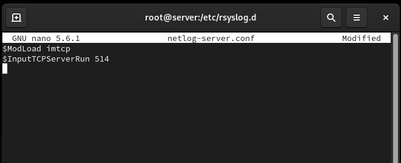
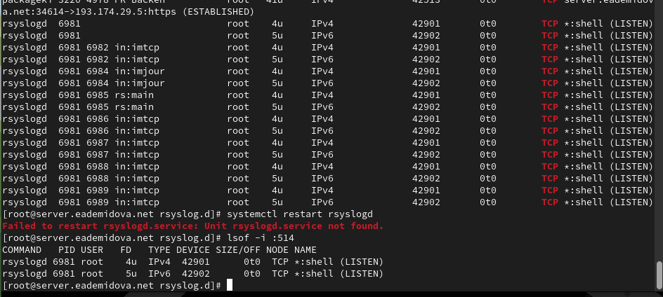
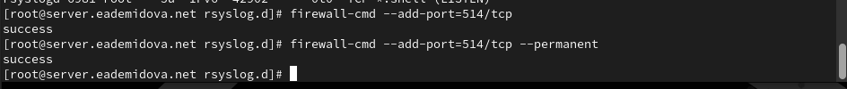
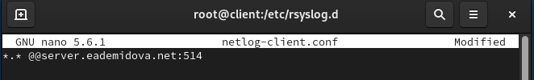
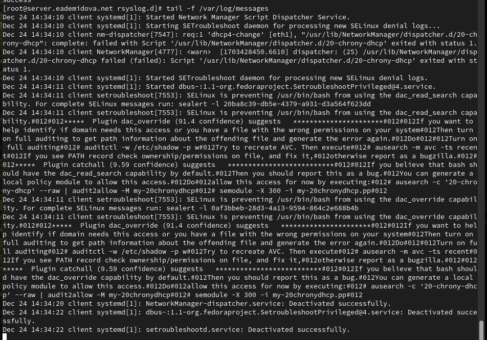
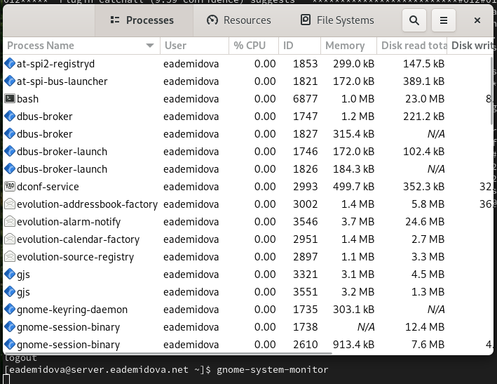
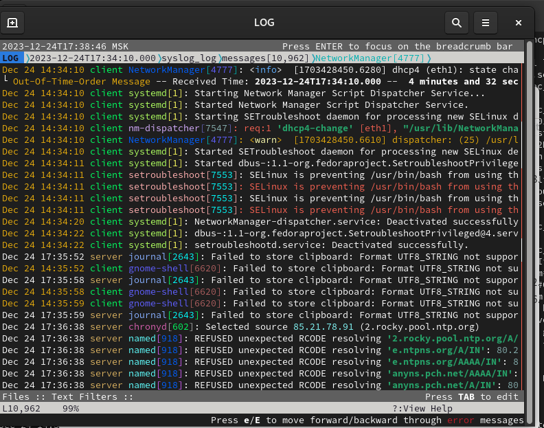
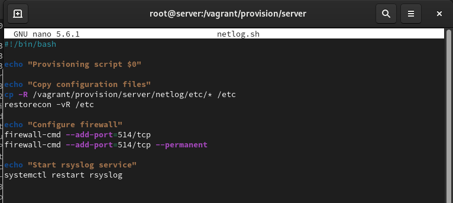
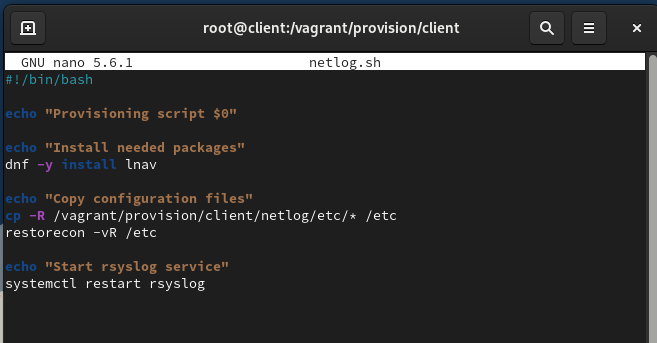

---
## Front matter
title: "Лабораторная работа № 15"
subtitle: "Настройка сетевого журналирования"
author: "Демидова Екатерина Алексеевна"

## Generic otions
lang: ru-RU
toc-title: "Содержание"

## Bibliography
bibliography: bib/cite.bib
csl: pandoc/csl/gost-r-7-0-5-2008-numeric.csl

## Pdf output format
toc: true # Table of contents
toc-depth: 2
lof: true # List of figures
lot: false # List of tables
fontsize: 12pt
linestretch: 1.5
papersize: a4
documentclass: scrreprt
## I18n polyglossia
polyglossia-lang:
  name: russian
  options:
	- spelling=modern
	- babelshorthands=true
polyglossia-otherlangs:
  name: english
## I18n babel
babel-lang: russian
babel-otherlangs: english
## Fonts
mainfont: PT Serif
romanfont: PT Serif
sansfont: PT Sans
monofont: PT Mono
mainfontoptions: Ligatures=TeX
romanfontoptions: Ligatures=TeX
sansfontoptions: Ligatures=TeX,Scale=MatchLowercase
monofontoptions: Scale=MatchLowercase,Scale=0.9
## Biblatex
biblatex: true
biblio-style: "gost-numeric"
biblatexoptions:
  - parentracker=true
  - backend=biber
  - hyperref=auto
  - language=auto
  - autolang=other*
  - citestyle=gost-numeric
## Pandoc-crossref LaTeX customization
figureTitle: "Рис."
tableTitle: "Таблица"
listingTitle: "Листинг"
lofTitle: "Список иллюстраций"
lotTitle: "Список таблиц"
lolTitle: "Листинги"
## Misc options
indent: true
header-includes:
  - \usepackage{indentfirst}
  - \usepackage{float} # keep figures where there are in the text
  - \floatplacement{figure}{H} # keep figures where there are in the text
---

# Цель работы

Получение навыков по работе с журналами системных событий.

# Задание

1. Настройте сервер сетевого журналирования событий.
2. Настройте клиент для передачи системных сообщений в сетевой журнал на сервере.
3. Просмотрите журналы системных событий с помощью нескольких программ. При наличии сообщений о некорректной работе сервисов исправьте
ошибки в настройках соответствующих служб.
4. Напишите скрипты для Vagrant, фиксирующие действия по установке и настройке сетевого сервера журналирования

# Выполнение лабораторной работы

## Настройка сервера сетевого журнала

Загрузим нашу операционную систему и перейдем в рабочий каталог с проектом:
```
cd /var/tmp/eademidova/vagrant
```
Затем запустим виртуальную машину server:
```
make server-up
```

На сервере создадим файл конфигурации сетевого хранения журналов:

```
cd /etc/rsyslog.d
touch netlog-server.conf
```

В файле конфигурации /etc/rsyslog.d/netlog-server.conf включим приём записей журнала по TCP-порту 514(рис. @fig:001):

{#fig:001 width=70%}

Перезапустим службу rsyslog и посмотрим, какие порты, связанные с rsyslog, прослушиваются(рис. @fig:002):

{#fig:002 width=70%}

На сервере настроим межсетевой экран для приёма сообщений по TCP-порту 514(@fig:003):

{#fig:003 width=70%}

## Настройка клиента сетевого журнала

На клиенте создадим файл конфигурации сетевого хранения журналов:

```
cd /etc/rsyslog.d
touch netlog-client.conf
```

На клиенте в файле конфигурации /etc/rsyslog.d/netlog-client.conf включим перенаправление сообщений журнала на 514 TCP-порт сервера(@fig:004):

{#fig:004 width=70%}

Перезапустим службу rsyslog:
```
systemctl restart rsyslog
```

## Просмотр журнала

На сервере просмотрим один из файлов журнала(@fig:005):

{#fig:005 width=70%}

На сервере под пользователем eademidova запустим графическую программу для просмотра журналов с помощью команды `gnome-system-monitor`(@fig:006):

{#fig:006 width=70%}

На сервере установите просмотрщик журналов системных сообщений lnav или его
аналог:
```
dnf -y install lnav
```
Просмотрим логи с помощью lnav на клиенте и на сервере(@fig:007):

{#fig:007 width=70%}

## Внесение изменений в настройки внутреннего окружения виртуальных машины

На виртуальной машине server перейдем в каталог для внесения изменений в настройки внутреннего окружения /vagrant/provision/server/, создадим в нём каталог netlog, в который поместим в соответствующие подкаталоги конфигурационные файлы, а также создадим исполняемый файл netlog.sh:

```
cd /vagrant/provision/server
mkdir -p /vagrant/provision/server/netlog/etc/rsyslog.d
cp -R /etc/rsyslog.d/netlog-server.conf /vagrant/provision/server/netlog/etc/rsyslog.d

touch netlog.sh
chmod +x netlog.sh
```

В каталоге /vagrant/provision/server создадим исполняемый файл netlog.sh и внесем скрипт(@fig:008):

{#fig:008 width=70%}

На виртуальной машине client перейдем в каталог для внесения изменений в настройки внутреннего окружения /vagrant/provision/client/, создадим в нём каталог netlog, в который поместим в соответствующие подкаталоги конфигурационные файлы, а также создадим исполняемый файл netlog.sh:

```
cd /vagrant/provision//client
mkdir -p /vagrant/provision//client/netlog/etc/rsyslog.d
cp -R /etc/rsyslog.d/netlog-/client.conf /vagrant/provision//client/netlog/etc/rsyslog.d

touch netlog.sh
chmod +x netlog.sh
```

В каталоге /vagrant/provision/client создадим исполняемый файл netlog.sh и внесем скрипт(@fig:009):

{#fig:009 width=70%}

Затем для отработки созданных скриптов в конфигурационном файле Vagrantfile необходимо добавить в соответствующих разделах конфигураций для сервера и клиента:

```
server.vm.provision "server netlog",
  type: "shell",
  preserve_order: true,
  path: "provision/server/netlog.sh"
client.vm.provision "client netlog",
  type: "shell",
  preserve_order: true,
  path: "provision/client/netlog.sh"

```

# Контрольные вопросы

1. Какой модуль rsyslog вы должны использовать для приёма сообщений от journald?
2. Как называется устаревший модуль, который можно использовать для включения приёма сообщений журнала в rsyslog?
3. Чтобы убедиться, что устаревший метод приёма сообщений из journald в rsyslog
не используется, какой дополнительный параметр следует использовать?
4. В каком конфигурационном файле содержатся настройки, которые позволяют вам настраивать работу журнала?
5. Каким параметром управляется пересылка сообщений из journald в rsyslog?
6. Какой модуль rsyslog вы можете использовать для включения сообщений из файла
журнала, не созданного rsyslog?
7. Какой модуль rsyslog вам нужно использовать для пересылки сообщений в базу данных MariaDB?
8. Какие две строки вам нужно включить в rsyslog.conf, чтобы позволить текущему журнальному серверу получать сообщения через TCP?
9. Как настроить локальный брандмауэр, чтобы разрешить приём сообщений журнала через порт TCP 514?

1. Для приёма сообщений от journald вам следует использовать модуль imjournal.
2. Устаревший модуль, который можно использовать для включения приёма сообщений журнала в rsyslog, называется imklog.
3. Чтобы убедиться, что устаревший метод приёма сообщений из journald не используется, следует использовать параметр "SystemCallFilter @include:omusrmsg.conf" в конфигурационном файле rsyslog.conf.
4. Настройки, позволяющие настраивать работу журнала, содержатся в конфигурационном файле rsyslog.conf.
5. Пересылка сообщений из journald в rsyslog управляется параметром "ForwardToSyslog" в файле конфигурации journald.conf.
6. Модуль rsyslog, который можно использовать для включения сообщений из файла журнала, не созданного rsyslog, называется imfile.
7. Для пересылки сообщений в базу данных MariaDB вам следует использовать модуль ommysql.
8. Для позволения текущему журнальному серверу получать сообщения через TCP, вам нужно включить две строки в rsyslog.conf:

    $ModLoad imtcp
    $InputTCPServerRun 514

9. Чтобы разрешить приём сообщений журнала через порт TCP 514 можно использовать следующую команду:

```
firewall-cmd --add-port=514/tcp
firewall-cmd --add-port=514/tcp --permanent
```

# Выводы

В результате выполнения данной работы были приобретены практические навыки по работе с журналами системных событий.
