---
## Front matter
lang: ru-RU
title: Лабораторная работа № 16
subtitle: Базовая защита от атак типа «brute force
author:
  - Демидова Е. А.
institute:
  - Российский университет дружбы народов, Москва, Россия
date: 18 декабря 2023 

## i18n babel
babel-lang: russian
babel-otherlangs: english

## Formatting pdf
toc: false
toc-title: Содержание
slide_level: 2
aspectratio: 169
section-titles: true
theme: metropolis
header-includes:
 - \metroset{progressbar=frametitle,sectionpage=progressbar,numbering=fraction}
 - '\makeatletter'
 - '\beamer@ignorenonframefalse'
 - '\makeatother'
---

# Вводная часть

## Цель работы

Получить навыки работы с программным средством Fail2ban для обеспечения базовой защиты от атак типа «brute force».

## Задание

1. Установите и настройте Fail2ban для отслеживания работы установленных на сервере служб.
2. Проверьте работу Fail2ban посредством попыток несанкционированного доступа с клиента на сервер через SSH.
3. Напишите скрипт для Vagrant, фиксирующий действия по установке и настройке Fail2ban.

# Выполнение лабораторной работы

## Защита с помощью Fail2ban

На сервере установим fail2ban:

```
dnf -y install fail2ban
```
Запустим сервер fail2ban:

```
systemctl start fail2ban
systemctl enable fail2ban
```

## Защита с помощью Fail2ban

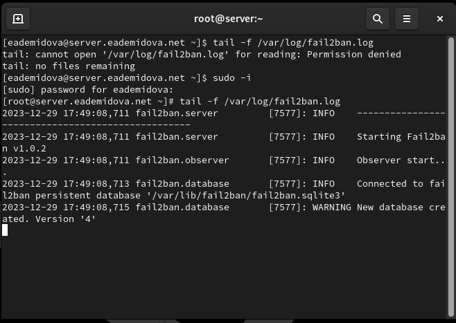{#fig:001 width=70%}

## Защита с помощью Fail2ban

```
touch /etc/fail2ban/jail.d/customisation.local
```

## Защита с помощью Fail2ban

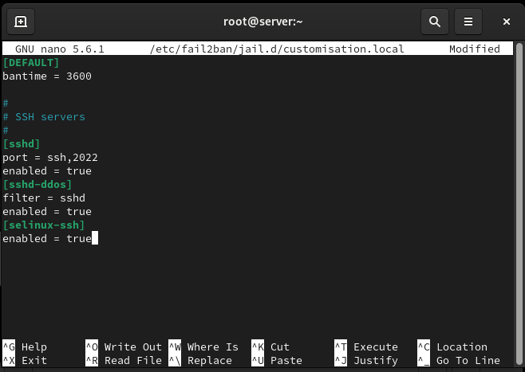{#fig:002 width=70%}

## Защита с помощью Fail2ban

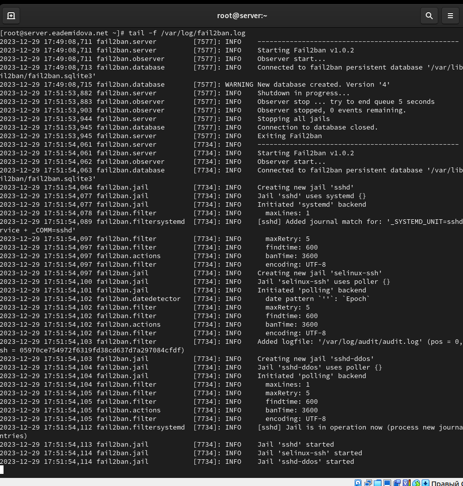{#fig:003 width=45%}

## Защита с помощью Fail2ban

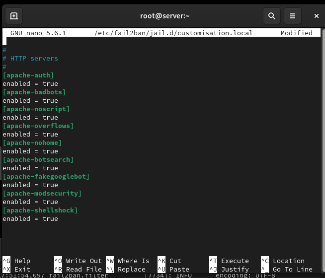{#fig:004 width=55%}

## Защита с помощью Fail2ban

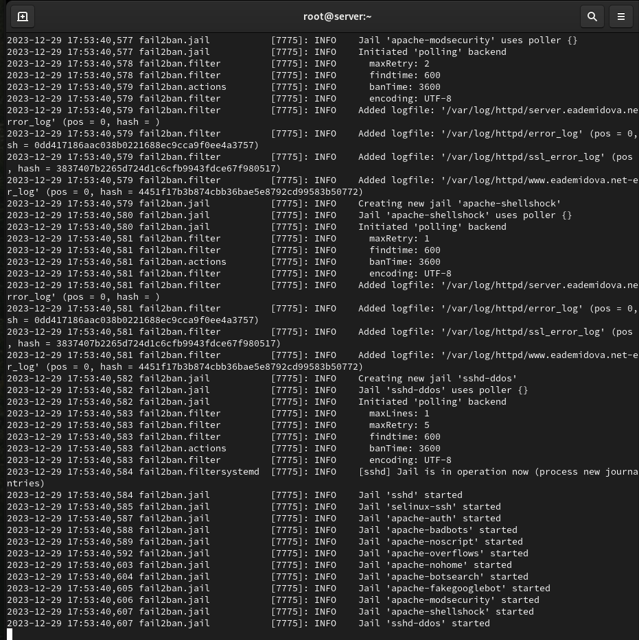{#fig:005 width=50%}

## Защита с помощью Fail2ban

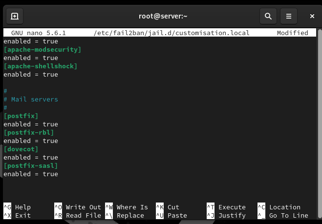{#fig:006 width=70%}

## Защита с помощью Fail2ban

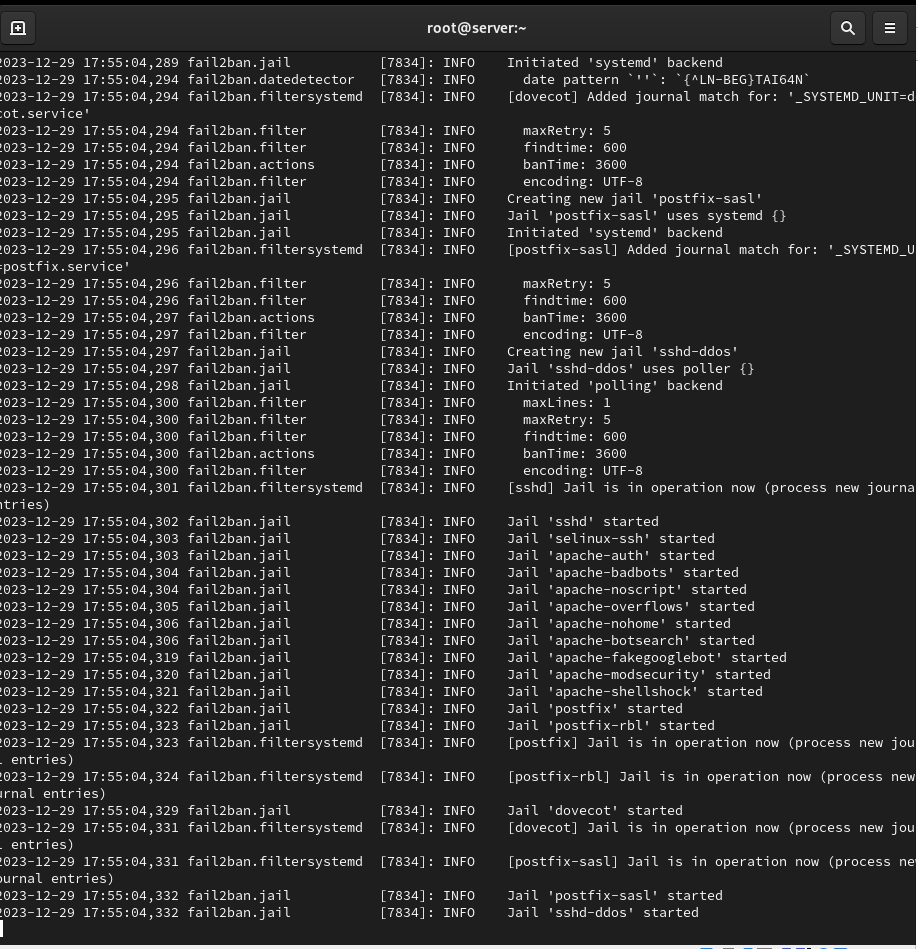{#fig:007 width=45%}

## Проверка работы Fail2ban

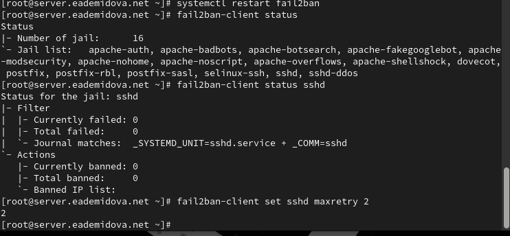{#fig:008 width=70%}

## Проверка работы Fail2ban

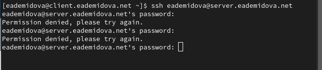{#fig:009 width=70%}

## Проверка работы Fail2ban

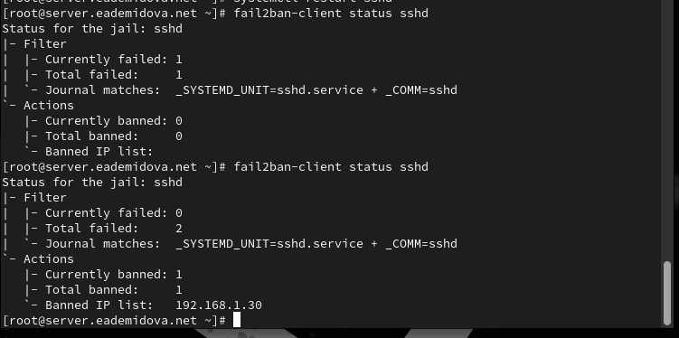{#fig:010 width=70%}

## Проверка работы Fail2ban

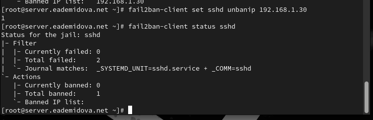{#fig:011 width=70%}

## Проверка работы Fail2ban

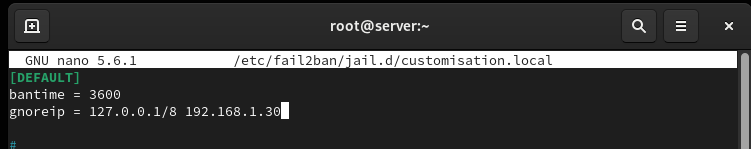{#fig:012 width=70%}

## Проверка работы Fail2ban

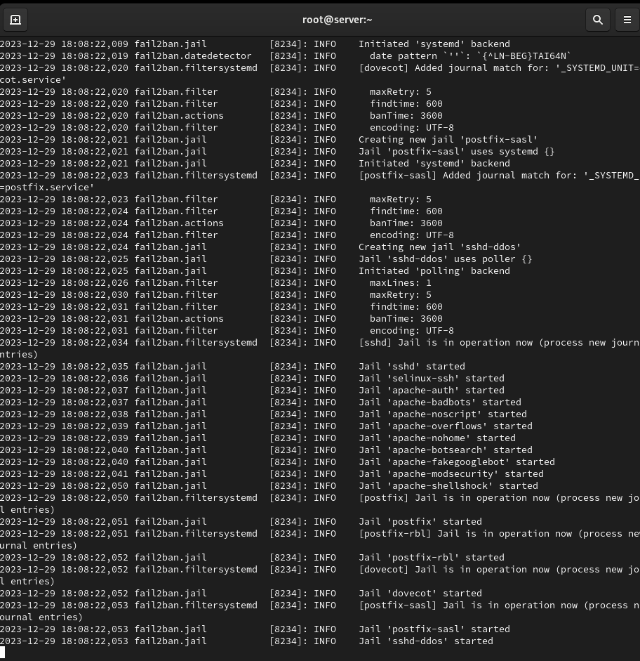{#fig:013 width=45%}

## Проверка работы Fail2ban

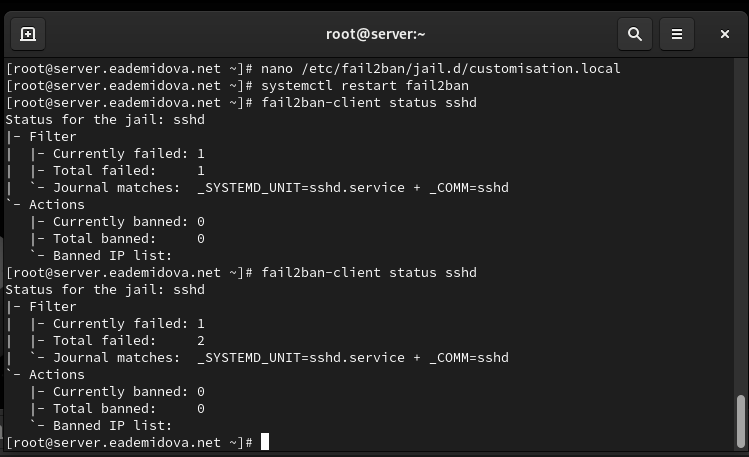{#fig:014 width=70%}

## Внесение изменений в настройки внутреннего окружения виртуальных машины

```
cd /vagrant/provision/server
mkdir -p /vagrant/provision/server/protect/etc/fail2ban/jail.d
cp -R /etc/fail2ban/jail.d/customisation.local 
/vagrant/provision/server/protect/etc/fail2ban/jail.d/

touch protect.sh
chmod +x protect.sh
```

## Внесение изменений в настройки внутреннего окружения виртуальных машины

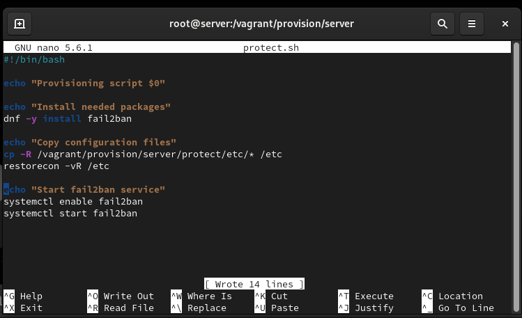{#fig:015 width=70%}

## Внесение изменений в настройки внутреннего окружения виртуальных машины

```
server.vm.provision "server protect",
  type: "shell",
  preserve_order: true,
  path: "provision/server/protect.sh"

```

# Заключение

## Выводы

В результате выполнения данной работы были приобретены практические навыки работы с программным средством Fail2ban для обеспечения базовой защиты от атак типа «brute force».