---
## Front matter
title: "Лабораторная работа № 16"
subtitle: "Базовая защита от атак типа «brute force"
author: "Демидова Екатерина Алексеевна"

## Generic otions
lang: ru-RU
toc-title: "Содержание"

## Bibliography
bibliography: bib/cite.bib
csl: pandoc/csl/gost-r-7-0-5-2008-numeric.csl

## Pdf output format
toc: true # Table of contents
toc-depth: 2
lof: true # List of figures
lot: false # List of tables
fontsize: 12pt
linestretch: 1.5
papersize: a4
documentclass: scrreprt
## I18n polyglossia
polyglossia-lang:
  name: russian
  options:
	- spelling=modern
	- babelshorthands=true
polyglossia-otherlangs:
  name: english
## I18n babel
babel-lang: russian
babel-otherlangs: english
## Fonts
mainfont: PT Serif
romanfont: PT Serif
sansfont: PT Sans
monofont: PT Mono
mainfontoptions: Ligatures=TeX
romanfontoptions: Ligatures=TeX
sansfontoptions: Ligatures=TeX,Scale=MatchLowercase
monofontoptions: Scale=MatchLowercase,Scale=0.9
## Biblatex
biblatex: true
biblio-style: "gost-numeric"
biblatexoptions:
  - parentracker=true
  - backend=biber
  - hyperref=auto
  - language=auto
  - autolang=other*
  - citestyle=gost-numeric
## Pandoc-crossref LaTeX customization
figureTitle: "Рис."
tableTitle: "Таблица"
listingTitle: "Листинг"
lofTitle: "Список иллюстраций"
lotTitle: "Список таблиц"
lolTitle: "Листинги"
## Misc options
indent: true
header-includes:
  - \usepackage{indentfirst}
  - \usepackage{float} # keep figures where there are in the text
  - \floatplacement{figure}{H} # keep figures where there are in the text
---

# Цель работы

Получить навыки работы с программным средством Fail2ban для обеспечения базовой защиты от атак типа «brute force».

# Задание

1. Установите и настройте сервер Samba.
2. Настройте на клиенте доступ к разделяемым ресурсам.
3. Напишите скрипты для Vagrant, фиксирующие действия по установке и настройке сервера Samba для доступа к разделяемым ресурсам во внутреннем окружении виртуальных машин server и client. Соответствующим образом необходимо внести изменения в Vagrantfile.

# Выполнение лабораторной работы

## Защита с помощью Fail2ban

Загрузим нашу операционную систему и перейдем в рабочий каталог с проектом:
```
cd /var/tmp/eademidova/vagrant
```
Затем запустим виртуальную машину server:
```
make server-up
```

На сервере установим fail2ban:

```
dnf -y install fail2ban
```
Запустим сервер fail2ban:

```
systemctl start fail2ban
systemctl enable fail2ban
```

В дополнительном терминале запустим просмотр журнала событий fail2ban(рис. @fig:001):

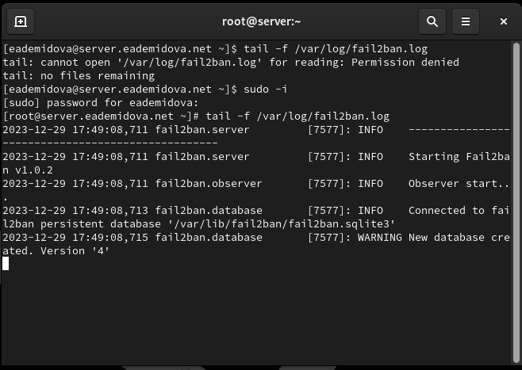{#fig:001 width=70%}

Создадим файл с локальной конфигурацией fail2ban:

```
touch /etc/fail2ban/jail.d/customisation.local
```

И в этом файле etc/fail2ban/jail.d/customisation.local зададим время блокирования на 1 час (время задаётся в секундах) и включим защиту SSH(рис. @fig:002):

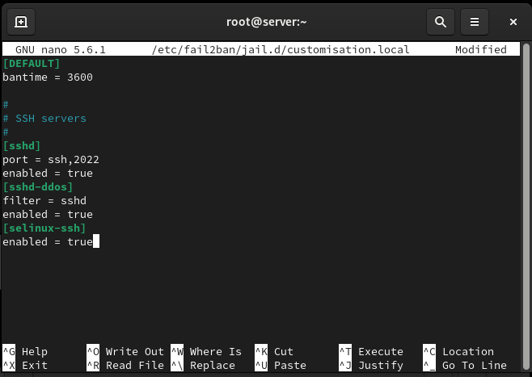{#fig:002 width=70%}

Перезапустим сервер fail2ban:

```
systemctl restart fail2ban
```

И посмотрим журнал событий(@fig:003):

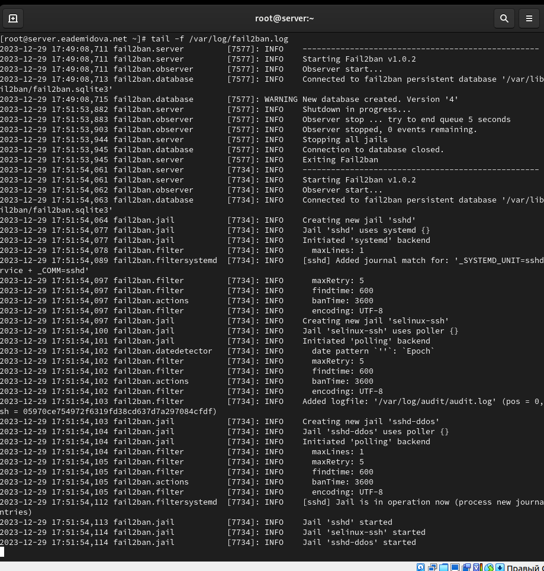{#fig:003 width=70%}

В файле /etc/fail2ban/jail.d/customisation.local включим защиту HTTP(@fig:004):

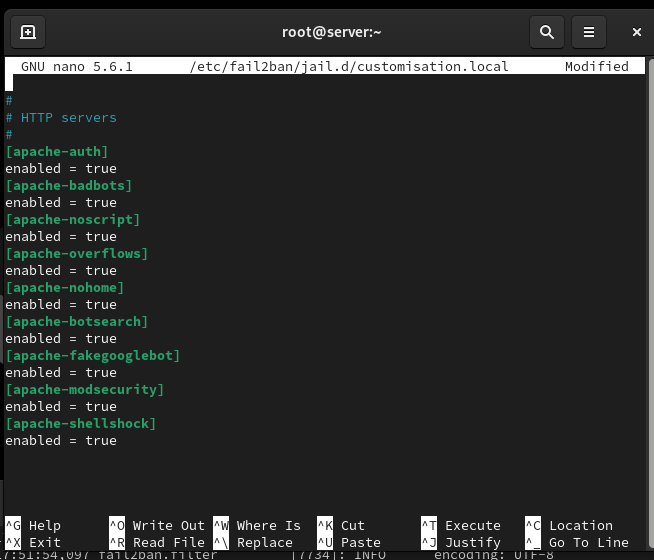{#fig:004 width=70%}

Перезапустим сервер fail2ban:

```
systemctl restart fail2ban
```

И посмотрим журнал событий(@fig:005):

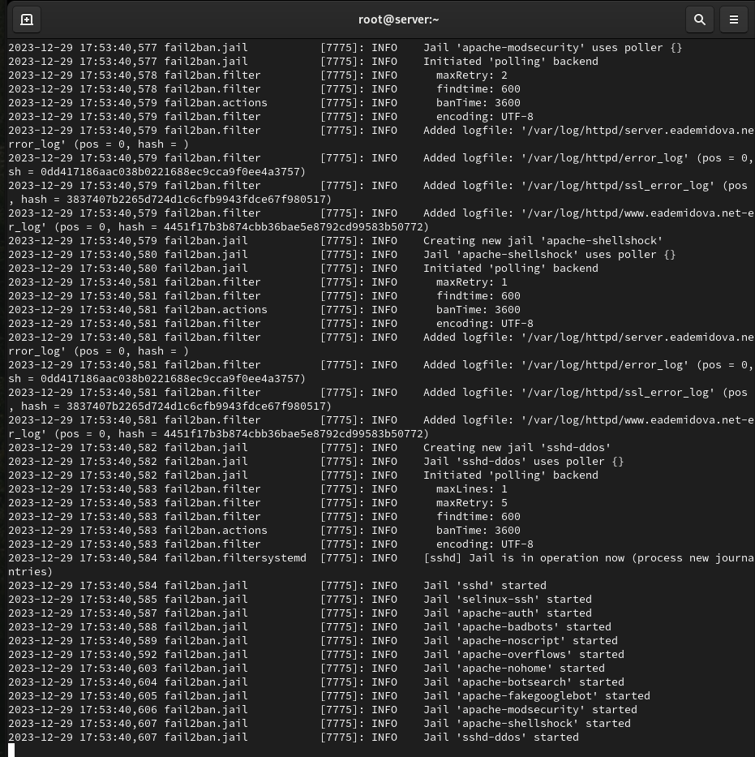{#fig:005 width=70%}

В файле /etc/fail2ban/jail.d/customisation.local включим защиту почты(@fig:006):

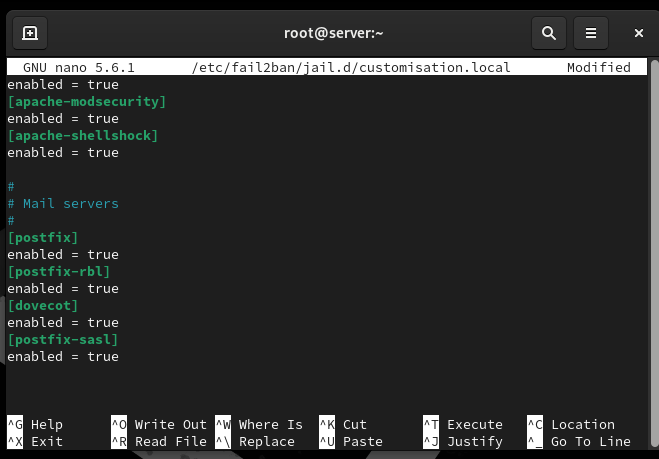{#fig:006 width=70%}

Перезапустим сервер fail2ban:

```
systemctl restart fail2ban
```

И посмотрим журнал событий(@fig:007):

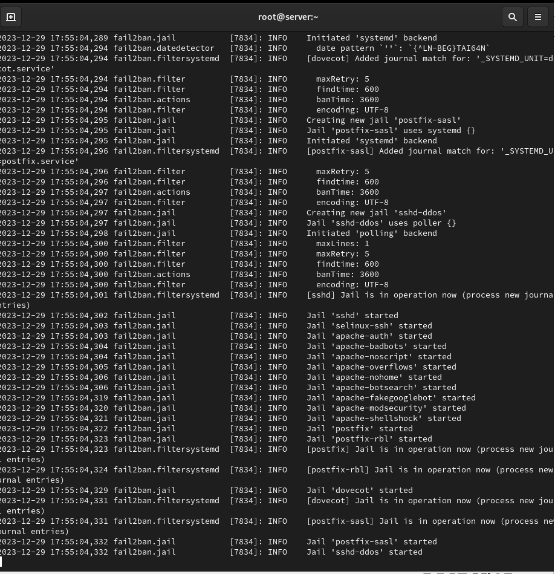{#fig:007 width=70%}

## Проверка работы Fail2ban

На сервере посмотрим статус fail2ban и статус защиты SSH в fail2ban, а затем установим максимальное количество ошибок для SSH, равное 2(@fig:008):

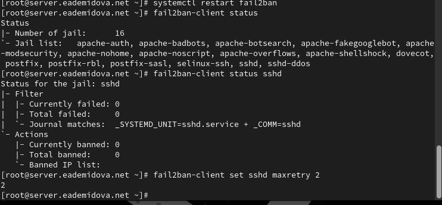{#fig:008 width=70%}

С клиента попытайтесь зайти по SSH на сервер с неправильным паролем(@fig:009):

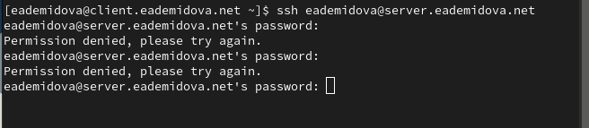{#fig:009 width=70%}

На сервере посмотрите статус защиты SSH, убедившись, что произошла блокировка адреса клиента(@fig:010):

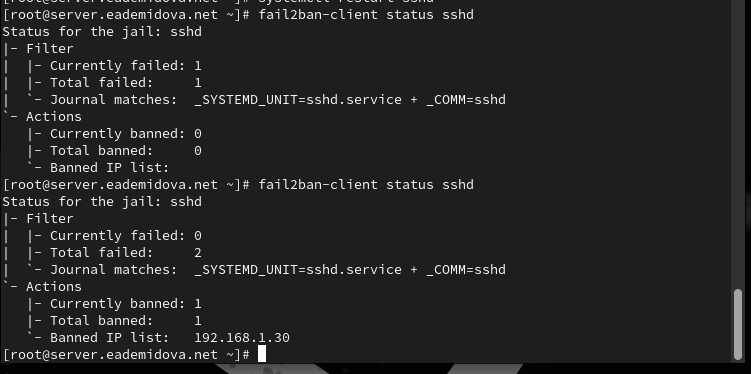{#fig:010 width=70%}

Разблокируем IP-адрес клиента и вновь посмотрим статус защиты SSH, убедившись, что блокировка с клиента снята(рис. @fig:011):

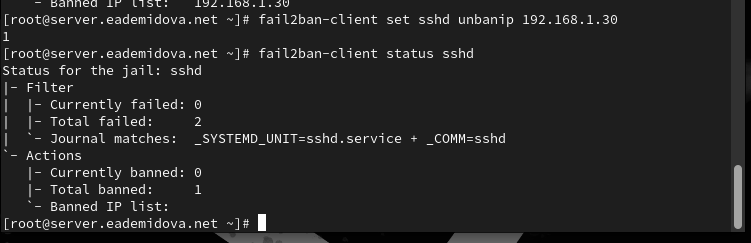{#fig:011 width=70%}

На сервере внесем изменение в конфигурационный файл /etc/fail2ban/jail.d/customisation.local, добавив в раздел по умолчанию игнорирование адреса клиента(рис. @fig:012):

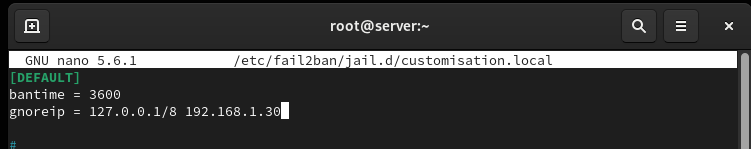{#fig:012 width=70%}

Перезапустим fail2ban и посмотрим журнал событий(@fig:013)

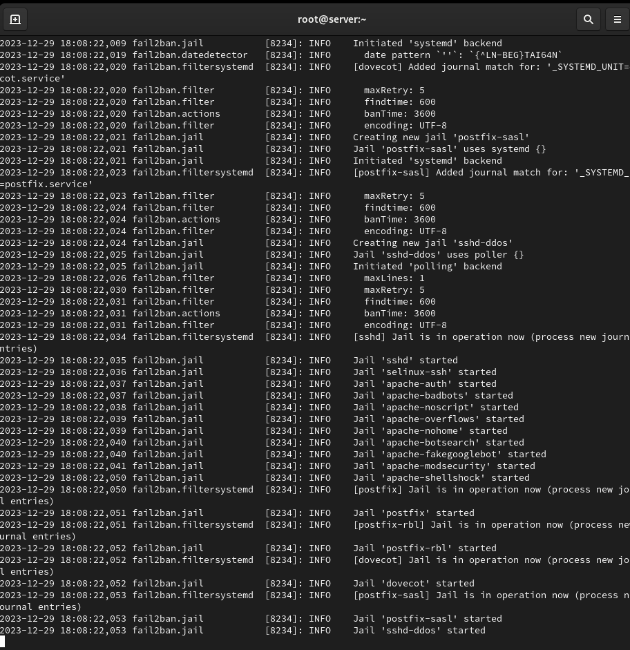{#fig:013 width=70%}

Вновь попытаемся войти с клиента на сервер с неправильным паролем и посмотрим статус защиты SSH(@fig:014):

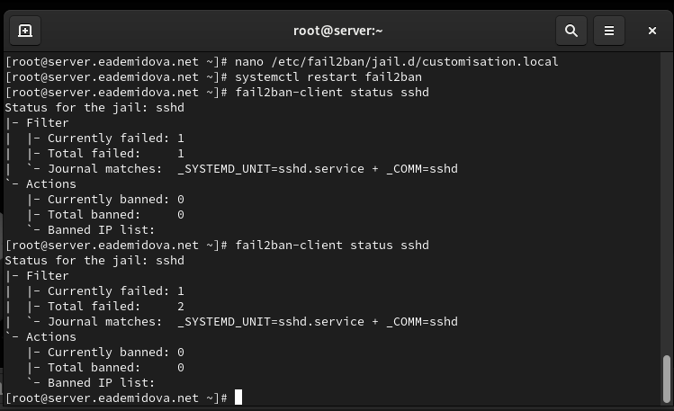{#fig:014 width=70%}

Теперь клиент не блокируется.

## Внесение изменений в настройки внутреннего окружения виртуальных машины

На виртуальной машине server перейдем в каталог для внесения изменений в настройки внутреннего окружения /vagrant/provision/server/, создадим в нём каталог protect, в который поместим в соответствующие подкаталоги конфигурационные файлы, а также создадим исполняемый файл protect.sh:

```
cd /vagrant/provision/server
mkdir -p /vagrant/provision/server/protect/etc/fail2ban/jail.d
cp -R /etc/fail2ban/jail.d/customisation.local /vagrant/provision/server/protect/etc/fail2ban/jail.d/

touch protect.sh
chmod +x protect.sh
```

В каталоге /vagrant/provision/server создадим исполняемый файл  smb.sh и внесем скрипт(@fig:015):

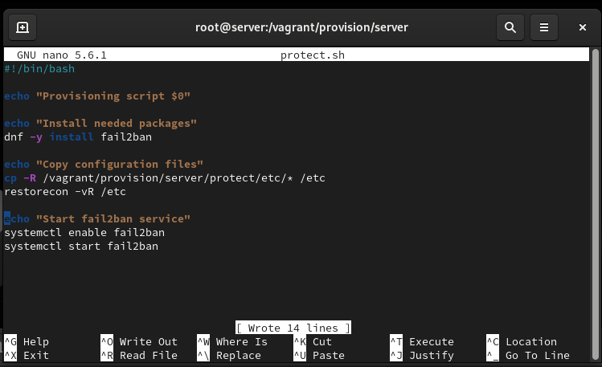{#fig:015 width=70%}

Затем для отработки созданных скриптов в конфигурационном файле Vagrantfile необходимо добавить в соответствующих разделах конфигураций для сервера:

```
server.vm.provision "server protect",
  type: "shell",
  preserve_order: true,
  path: "provision/server/protect.sh"
```

# Контрольные вопросы

1. Поясните принцип работы Fail2ban.
2. Настройки какого файла более приоритетны: jail.conf или jail.local?
3. Как настроить оповещение администратора при срабатывании Fail2ban?
4. Поясните построчно настройки по умолчанию в конфигурационном файле
/etc/fail2ban/jail.conf, относящиеся к веб-службе.
5. Поясните построчно настройки по умолчанию в конфигурационном файле
/etc/fail2ban/jail.conf, относящиеся к почтовой службе.
6. Какие действия может выполнять Fail2ban при обнаружении атакующего IP-адреса?
Где можно посмотреть описание действий для последующего использования в на-
стройках Fail2ban?
7. Как получить список действующих правил Fail2ban?
8. Как получить статистику заблокированных Fail2ban адресов?
9. Как разблокировать IP-адрес?

1. Fail2ban - это программное обеспечение, которое предотвращает атаки на сервер, анализируя лог-файлы и блокируя IP-адреса, с которых идут подозрительные или злонамеренные действия. Он работает следующим образом: 
   - Мониторит указанные лог-файлы на наличие заданных событий (например, неудачных попыток входа).
   - Когда число попыток превышает определенный порог, Fail2ban временно блокирует IP-адрес, добавляя правила в файрвол.
   - Заблокированный IP-адрес может быть разблокирован автоматически после определенного периода времени.

2. Настройки файла jail.local более приоритетны, чем настройки файла jail.conf. Если в файле jail.local определены одни и те же параметры, они будут использованы вместо параметров из jail.conf.

3. Чтобы настроить оповещение администратора при срабатывании Fail2ban, необходимо настроить отправку уведомлений по электронной почте или другим способом. Это можно сделать, изменяя настройки в файле jail.local, добавляя адрес электронной почты администратора и настройки SMTP-сервера.

4. Примеры настроек по умолчанию в конфигурационном файле /etc/fail2ban/jail.conf, относящиеся к веб-службе:
   - `[apache]` - секция, относящаяся к веб-серверу Apache.
   - `enabled = true` - включение проверки лог-файлов Apache.
   - `port = http,https` - указание портов для мониторинга.
   - `filter = apache-auth` - указание фильтра для обработки лог-файлов.
   - `logpath = /var/log/apache*/*error.log` - путь к лог-файлам Apache.
   - `maxretry = 5` - максимальное количество попыток до блокировки адреса.
   - `bantime = 600` - продолжительность блокировки в секундах.

5. Примеры настроек по умолчанию в конфигурационном файле /etc/fail2ban/jail.conf, относящиеся к почтовой службе:
   - `[postfix]` - секция, относящаяся к почтовому серверу Postfix.
   - `enabled = true` - включение проверки лог-файлов Postfix.
   - `port = smtp,ssmtp` - указание портов для мониторинга.
   - `filter = postfix` - указание фильтра для обработки лог-файлов.
   - `logpath = /var/log/mail.log` - путь к лог-файлам Postfix.
   - `maxretry = 3` - максимальное количество попыток до блокировки адреса.
   - `bantime = 3600` - продолжительность блокировки в секундах.

6. Fail2ban может выполнять различные действия при обнаружении атакующего IP-адреса, такие как блокировка адреса через файрвол, добавление правил в IP-таблицы, отправка уведомлений администратору и другие. Описание доступных действий можно найти в документации или руководстве Fail2ban.

7. Для получения списка действующих правил Fail2ban можно использовать команду: `fail2ban-client status`.

8. Для получения статистики заблокированных адресов Fail2ban можно использовать команду: `fail2ban-client status <jail-name>`, где `<jail-name>` - имя конкретного jail, например, "ssh" или "apache".

9. Разблокировать адрес момжно с помощью следующей команды

```
fail2ban-client set sshd unbanip <ip-адрес клиента>
```

# Выводы

В результате выполнения данной работы были приобретены практические навыки работы с программным средством Fail2ban для обеспечения базовой защиты от атак типа «brute force».

